# ARGUS Entity-Relationship Diagram

**Version:** 0.1  
**Database:** PostgreSQL  
**ORM:** SQLAlchemy 2

---

## 1. Overview

Все tenant-scoped таблицы имеют `tenant_id` и изолируются через PostgreSQL RLS (Row Level Security). Audit log — immutable append-only.

---

## 2. Mermaid ERD

```mermaid
erDiagram
    tenants ||--o{ users : "has"
    tenants ||--o{ subscriptions : "has"
    tenants ||--o{ targets : "has"
    tenants ||--o{ scans : "has"
    tenants ||--o{ scan_steps : "has"
    tenants ||--o{ scan_events : "has"
    tenants ||--o{ scan_timeline : "has"
    tenants ||--o{ assets : "has"
    tenants ||--o{ findings : "has"
    tenants ||--o{ tool_runs : "has"
    tenants ||--o{ evidence : "has"
    tenants ||--o{ reports : "has"
    tenants ||--o{ audit_logs : "has"
    tenants ||--o{ policies : "has"
    tenants ||--o{ usage_metering : "has"
    tenants ||--o{ provider_configs : "has"
    tenants ||--o{ provider_health : "has"
    tenants ||--o{ phase_inputs : "has"
    tenants ||--o{ phase_outputs : "has"
    tenants ||--o{ report_objects : "has"
    tenants ||--o{ screenshots : "has"

    targets ||--o{ scans : "targets"
    scans ||--o{ scan_steps : "has"
    scans ||--o{ scan_events : "has"
    scans ||--o{ scan_timeline : "has"
    scans ||--o{ assets : "belongs_to"
    scans ||--o{ findings : "has"
    scans ||--o{ tool_runs : "has"
    scans ||--o{ evidence : "has"
    scans ||--o{ reports : "has"
    scans ||--o{ phase_inputs : "has"
    scans ||--o{ phase_outputs : "has"
    scans ||--o{ report_objects : "has"
    scans ||--o{ screenshots : "has"

    reports ||--o{ findings : "has"
    reports ||--o{ report_objects : "has"

    tenants {
        uuid id PK
        varchar name
        timestamp created_at
        timestamp updated_at
    }

    users {
        uuid id PK
        uuid tenant_id FK
        varchar email
        varchar password_hash
        boolean is_active
        timestamp created_at
        timestamp updated_at
    }

    subscriptions {
        uuid id PK
        uuid tenant_id FK
        varchar plan
        varchar status
        timestamp valid_until
        timestamp created_at
        timestamp updated_at
    }

    targets {
        uuid id PK
        uuid tenant_id FK
        varchar url
        jsonb scope_config
        timestamp created_at
    }

    scans {
        uuid id PK
        uuid tenant_id FK
        uuid target_id FK
        varchar target_url
        varchar status
        int progress
        varchar phase
        jsonb options
        timestamp created_at
        timestamp updated_at
    }

    scan_steps {
        uuid id PK
        uuid tenant_id FK
        uuid scan_id FK
        varchar step_name
        varchar status
        int order_index
        timestamp created_at
        timestamp updated_at
    }

    scan_events {
        uuid id PK
        uuid tenant_id FK
        uuid scan_id FK
        varchar event
        varchar phase
        int progress
        text message
        jsonb data
        timestamp created_at
    }

    scan_timeline {
        uuid id PK
        uuid tenant_id FK
        uuid scan_id FK
        varchar phase
        int order_index
        jsonb entry
        timestamp created_at
    }

    assets {
        uuid id PK
        uuid tenant_id FK
        uuid scan_id FK
        varchar asset_type
        varchar value
        jsonb metadata
        timestamp created_at
    }

    findings {
        uuid id PK
        uuid tenant_id FK
        uuid scan_id FK
        uuid report_id FK
        varchar severity
        varchar title
        text description
        varchar cwe
        float cvss
        timestamp created_at
    }

    tool_runs {
        uuid id PK
        uuid tenant_id FK
        uuid scan_id FK
        varchar tool_name
        varchar status
        jsonb input_params
        text output_raw
        varchar output_object_key
        timestamp started_at
        timestamp finished_at
    }

    evidence {
        uuid id PK
        uuid tenant_id FK
        uuid scan_id FK
        uuid finding_id FK
        varchar object_key
        varchar content_type
        varchar description
        timestamp created_at
    }

    reports {
        uuid id PK
        uuid tenant_id FK
        uuid scan_id FK
        varchar target
        jsonb summary
        jsonb technologies
        timestamp created_at
    }

    audit_logs {
        uuid id PK
        uuid tenant_id FK
        varchar user_id
        varchar action
        varchar resource_type
        varchar resource_id
        jsonb details
        varchar ip_address
        timestamp created_at
    }

    policies {
        uuid id PK
        uuid tenant_id FK
        varchar policy_type
        jsonb config
        boolean enabled
        timestamp created_at
        timestamp updated_at
    }

    usage_metering {
        uuid id PK
        uuid tenant_id FK
        varchar metric_type
        int value
        jsonb metadata
        timestamp recorded_at
    }

    provider_configs {
        uuid id PK
        uuid tenant_id FK
        varchar provider_key
        boolean enabled
        jsonb config
        timestamp created_at
        timestamp updated_at
    }

    provider_health {
        uuid id PK
        uuid tenant_id FK
        varchar provider_key
        varchar status
        text last_error
        timestamp last_check_at
    }

    phase_inputs {
        uuid id PK
        uuid tenant_id FK
        uuid scan_id FK
        varchar phase
        jsonb input_data
        timestamp created_at
    }

    phase_outputs {
        uuid id PK
        uuid tenant_id FK
        uuid scan_id FK
        varchar phase
        jsonb output_data
        timestamp created_at
    }

    report_objects {
        uuid id PK
        uuid tenant_id FK
        uuid scan_id FK
        uuid report_id FK
        varchar format
        varchar object_key
        int size_bytes
        timestamp created_at
    }

    screenshots {
        uuid id PK
        uuid tenant_id FK
        uuid scan_id FK
        varchar object_key
        varchar url_or_email
        varchar content_type
        timestamp created_at
    }
```

---

## 3. Entity Descriptions

| Entity | Purpose |
|--------|---------|
| **tenants** | Top-level isolation; no tenant_id (root) |
| **users** | Tenant users; auth, roles |
| **subscriptions** | Plan, limits, billing |
| **targets** | Scan targets (URL, scope) |
| **scans** | Scan runs; status, phase, progress |
| **scan_steps** | Per-phase steps; status, order |
| **scan_events** | Event log for SSE; event, phase, progress, message, data |
| **scan_timeline** | Ordered timeline entries for report |
| **assets** | Discovered assets (subdomains, ports, tech) |
| **findings** | Vulnerability findings; severity, CWE, CVSS |
| **tool_runs** | Tool execution records; input, output, object_key |
| **evidence** | PoC files; object_key → MinIO |
| **reports** | Report metadata; summary, technologies |
| **audit_logs** | Append-only audit; action, resource, details |
| **policies** | Policy config (approval gates, scope) |
| **usage_metering** | Usage metrics (scans, tokens, etc.) |
| **provider_configs** | LLM provider config per tenant |
| **provider_health** | Provider status, last check |
| **phase_inputs** | Persisted phase input contracts |
| **phase_outputs** | Persisted phase output contracts |
| **report_objects** | Report artifacts in MinIO (PDF, HTML, etc.) |
| **screenshots** | Screenshot metadata; object_key, url_or_email |

---

## 4. Tenant-Scoped Tables (RLS)

Все таблицы ниже имеют `tenant_id` и защищаются RLS:

- users, subscriptions, targets, scans, scan_steps, scan_events, scan_timeline
- assets, findings, tool_runs, evidence, reports, audit_logs
- policies, usage_metering, provider_configs, provider_health
- phase_inputs, phase_outputs, report_objects, screenshots

---

## 5. RLS Policy Descriptions

### 5.1 Общий принцип

- **RLS enabled** на всех tenant-scoped таблицах.
- **Policy:** `tenant_id = current_setting('app.current_tenant_id')::uuid`
- **Service role:** для системных операций (migrations, Celery) — `SET ROLE` или bypass RLS.

### 5.2 Политики по таблицам

| Table | Policy | Description |
|-------|--------|-------------|
| **users** | `tenant_id = current_tenant` | User видит только пользователей своего tenant |
| **subscriptions** | `tenant_id = current_tenant` | Подписка только своего tenant |
| **targets** | `tenant_id = current_tenant` | Targets только своего tenant |
| **scans** | `tenant_id = current_tenant` | Scans только своего tenant |
| **scan_steps** | `tenant_id = current_tenant` | Steps только своих scans |
| **scan_events** | `tenant_id = current_tenant` | Events только своих scans |
| **scan_timeline** | `tenant_id = current_tenant` | Timeline только своих scans |
| **assets** | `tenant_id = current_tenant` | Assets только своих scans |
| **findings** | `tenant_id = current_tenant` | Findings только своих scans |
| **tool_runs** | `tenant_id = current_tenant` | Tool runs только своих scans |
| **evidence** | `tenant_id = current_tenant` | Evidence только своих scans |
| **reports** | `tenant_id = current_tenant` | Reports только своего tenant |
| **audit_logs** | `tenant_id = current_tenant` | Audit только своего tenant |
| **policies** | `tenant_id = current_tenant` | Policies только своего tenant |
| **usage_metering** | `tenant_id = current_tenant` | Usage только своего tenant |
| **provider_configs** | `tenant_id = current_tenant` | Provider config только своего tenant |
| **provider_health** | `tenant_id = current_tenant` | Health только своего tenant |
| **phase_inputs** | `tenant_id = current_tenant` | Phase inputs только своих scans |
| **phase_outputs** | `tenant_id = current_tenant` | Phase outputs только своих scans |
| **report_objects** | `tenant_id = current_tenant` | Report objects только своего tenant |
| **screenshots** | `tenant_id = current_tenant` | Screenshots только своих scans |

### 5.3 Audit Log

- **Immutable:** триггеры запрещают `UPDATE` и `DELETE` на `audit_logs`.
- **Append-only:** только `INSERT` разрешён.

---

## 6. Indexes (Recommended)

| Table | Index | Purpose |
|-------|-------|---------|
| users | (tenant_id, email) UNIQUE | Login lookup |
| scans | (tenant_id, status), (tenant_id, created_at) | List, filter |
| scan_events | (scan_id, created_at) | SSE ordering |
| findings | (scan_id), (report_id) | Report aggregation |
| audit_logs | (tenant_id, created_at) | Audit queries |

---

## 7. Related Documents

- [backend-architecture.md](./backend-architecture.md)
- [scan-state-machine.md](./scan-state-machine.md)
