# KEV-aware HPA — Operator Runbook

> Owner: SRE on-call. Last reviewed: 2026-04-22.

Self-sufficient runbook for the KEV-aware HorizontalPodAutoscaler (HPA) that scales the ARGUS Celery scan-worker pool in response to bursts of CISA-listed (Known Exploited Vulnerabilities) findings. Audience: on-call SRE with `kubectl` + Helm access to the cluster, no familiarity with the autoscaling code assumed. Every cited path, value key, and metric name has been verified against `main` at the date above; if `main` and this file disagree, the repository wins — patch this file in the same commit.

Shipped in:
- Cycle 6 / Batch 6 (B6-T03, B6-T04) — Prometheus Adapter rules + KEV-aware HPA template + kind CI gate.
- Cycle 7 / C7-T06 — production rollout signals (this document, alerting rules, helm-unittest gate, scrape verification in CI).

---

## 1. Overview

| Property | Value |
| -------- | ----- |
| HPA name (rendered) | `<release>-celery-kev` (default release: `argus-celery-kev`) |
| Scale target | `Deployment/<release>-celery` (the ARGUS Celery worker pool) |
| Sibling HPA | `<release>-celery` (CPU-based, `templates/hpa.yaml`) — Kubernetes union-max applies (`desiredReplicas = max(cpu_recommendation, kev_recommendation)`) |
| HPA template | `infra/helm/argus/templates/hpa-celery-worker-kev.yaml` |
| Adapter rules | `infra/helm/argus/templates/prometheus-adapter-rules.yaml` |
| Alert rules | `infra/helm/argus/templates/prometheusrule-kev-hpa.yaml` (this runbook is referenced from every `runbook_url` annotation) |
| Source counter | `argus_findings_emitted_total{kev_listed="true"}` — emitted by the backend `/metrics` endpoint via `record_finding_emitted` (`backend/src/core/observability.py`) |
| Derived external metric | `argus_kev_findings_emit_rate_5m` — synthesised by Prometheus Adapter as `sum(rate(argus_findings_emitted_total{kev_listed="true"}[5m]))` |
| Secondary external metric | `argus_celery_queue_depth{queue="argus.scans"}` — emitted by `backend/src/celery/metrics_updater.py::refresh_queue_depths` |
| Default replica band | `minReplicas: 2`, `maxReplicas: 20` (prod overlay raises to 4 / 40) |
| Anti-thrash | `scaleDown.stabilizationWindowSeconds: 300`, `scaleUp +100%/30s`, `scaleDown -50%/60s` |

**Business reason.** When CISA publishes a KEV burst (e.g. Microsoft Patch Tuesday + emergency advisory) the platform's scan-worker pool is the bottleneck on time-to-remediation: every backlogged scan delays the operator's remediation evidence. CPU-based autoscaling reacts to the symptom (queue saturation manifests as high CPU) only after the SLO is already burning. The KEV-aware HPA reacts to the leading indicator (KEV findings emitted by the enrichment pipeline) before the queue depth bites — at the cost of a second control loop with its own failure modes (this runbook).

**Non-goals.** This HPA does not scale the backend API tier (separate HPA, CPU-only) and does not throttle ingestion. If KEV findings arrive faster than the maximum scan-worker pool can drain, the queue depth will climb and the `KEVHPAReachedCeiling` alert (§5) is the operator's signal to raise `maxReplicas` or scale the node pool.

---

## 2. Architecture

```mermaid
flowchart LR
    cisa["CISA KEV catalog<br/>(public HTTPS)"]
    ingest["Celery beat<br/>kev_catalog_refresh_task<br/>(backend/src/celery/tasks/intel_refresh.py)"]
    db[("Postgres<br/>kev_catalog table<br/>(alembic 023)")]
    enrich["Enrichment pipeline<br/>(backend/src/findings/enrichment.py)"]
    counter["argus_findings_emitted_total<br/>{kev_listed=&quot;true&quot;}<br/>(backend /metrics)"]
    queue["argus_celery_queue_depth<br/>{queue=&quot;argus.scans&quot;}<br/>(metrics_updater.py)"]
    sm["Backend ServiceMonitor<br/>(templates/servicemonitor.yaml)"]
    prom[("Prometheus<br/>(scrape /metrics)")]
    adapter["Prometheus Adapter<br/>external.rules ConfigMap<br/>(templates/prometheus-adapter-rules.yaml)"]
    extapi["external.metrics.k8s.io/v1beta1<br/>argus_kev_findings_emit_rate_5m<br/>argus_celery_queue_depth"]
    hpa["HorizontalPodAutoscaler<br/>argus-celery-kev<br/>(templates/hpa-celery-worker-kev.yaml)"]
    cpuhpa["Sibling HPA<br/>argus-celery (CPU)"]
    dep["Deployment<br/>argus-celery (worker pool)"]
    alerts["PrometheusRule<br/>argus.kev-hpa group<br/>(templates/prometheusrule-kev-hpa.yaml)"]
    am["Alertmanager<br/>environment-scoped routes"]

    cisa --> ingest --> db
    db --> enrich --> counter
    enrich --> queue
    counter --> sm --> prom
    queue --> sm
    prom --> adapter --> extapi
    extapi --> hpa --> dep
    cpuhpa --> dep
    prom --> alerts --> am
```



The diagram renders natively in GitHub Markdown. To preview locally: `npx --yes @mermaid-js/mermaid-cli -i docs/operations/kev-hpa-runbook.md -o /tmp/runbook.svg`.

Trust boundaries:

- **CISA → ingest**: untrusted public HTTPS feed. ETag/If-None-Match honoured (`backend/src/findings/kev_client.py`); air-gap mode (`KevClient(airgap=True)`) short-circuits the fetch and falls back to the cached Postgres table.
- **Backend → Prometheus**: in-cluster pull only, scoped by ServiceMonitor namespace selector. No write path from outside the cluster can spoof the source counter.
- **Adapter → HPA**: aggregated APIServer (`external.metrics.k8s.io/v1beta1`) with RBAC. Operators wishing to side-channel-set the recommendation can edit the HPA `spec` directly (audit-logged) or (preferred) disable via `--set autoscaling.kevAware.enabled=false` (§7).

---

## 3. Configuration

All Helm values live under `autoscaling.kevAware` (HPA itself), `prometheusAdapter` (external metrics), and `kevHpa.alerts` (this runbook's alerting rules). Defaults in `infra/helm/argus/values.yaml`; production overlay in `infra/helm/argus/values-prod.yaml`.

### 3.1 HPA — `autoscaling.kevAware.*`

| Key | Default | Prod | Description |
| --- | ------- | ---- | ----------- |
| `enabled` | `false` | `true` | Master toggle. Renders the HPA only when this AND `prometheusAdapter.enabled` are true. |
| `minReplicas` | `2` | `4` | Floor — must be ≥ `hpa.celery.minReplicas` so union-max never collapses below the CPU floor. |
| `maxReplicas` | `20` | `40` | Ceiling — caps blast radius during a sustained KEV burst. |
| `kevEmitRateTarget` | `1` | `1` | Per-replica target rate (findings/sec) for `argus_kev_findings_emit_rate_5m`. Reaching 1/s sustained for ≥5m triggers a scale-up recommendation. |
| `queueDepthTarget` | `50` | `50` | Per-replica target depth of the `argus.scans` queue (the only queue whose backlog directly throttles KEV remediation). |
| `queueDepthQueueLabel` | `argus.scans` | `argus.scans` | Label value the queue-depth selector matches against (override only if the operator renames the hot queue). |

**Behavior policies are hard-coded in the template (R3 anti-thrash mandate; do NOT override without an SRE design review):**

| Behavior | Value | Why |
| -------- | ----- | --- |
| `scaleUp.policies[*]` | `+100% per 30s` | Fast catch-up under burst; 30s is the smallest period the API allows without tight-loop oscillation against the adapter scrape window. |
| `scaleUp.stabilizationWindowSeconds` | `0` (none) | Burst response must be immediate; smoothing lives on scaleDown. |
| `scaleDown.policies[*]` | `-50% per 60s` | Halve-back gradient — never collapses the pool in one tick. |
| `scaleDown.stabilizationWindowSeconds` | `300` | Smooths the metric tail after a burst so the HPA does not flap between max and min. |

### 3.2 Adapter — `prometheusAdapter.*`

| Key | Default | Description |
| --- | ------- | ----------- |
| `enabled` | `false` | Renders the `external.rules` ConfigMap consumed by Prometheus Adapter. The chart does NOT install the Adapter itself (cluster-scoped infra, owned by the platform team). |
| `configMap.name` | (auto) | Override only to match an existing ConfigMap convention. Adapter's `--config` flag must point at the rendered ConfigMap. |
| `rules.queueDepth.externalMetricName` | `argus_celery_queue_depth` | External-metric name. Do NOT rename without also updating the HPA's metric track. |
| `rules.kevEmitRate.externalMetricName` | `argus_kev_findings_emit_rate_5m` | External-metric name (5-minute rate of KEV finding emissions). |

### 3.3 Alerts — `kevHpa.alerts.*` (NEW in C7-T06)

| Key | Default | Description |
| --- | ------- | ----------- |
| `enabled` | `true` | Master toggle. The PrometheusRule renders only when this AND `prometheusAdapter.enabled` AND `autoscaling.kevAware.enabled` are all true (see §3.4 for the rationale). Disable when prometheus-operator CRDs are absent OR during a controlled rollback. |
| `sourceMetricName` | `argus_findings_emitted_total` | Source counter referenced by KEVHPATargetMetricMissing. Override only if the backend metric registry renames it. |
| `absentForWindow` | `5m` | `for:` AND `absent_over_time` window for KEVHPATargetMetricMissing. |
| `stuckFor` | `15m` | `for:` window for KEVHPAScalingStuck. |
| `flapWindow` | `30m` | Window for `changes()` in KEVHPAFlappingDetected. |
| `flapThreshold` | `5` | Replica-change count within `flapWindow` that trips the alert. |
| `ceilingFor` | `10m` | `for:` window for KEVHPAReachedCeiling. |
| `latencyFor` | `10m` | `for:` window for KEVHPAMetricLatencyHigh. |
| `latencyWindow` | `10m` | `quantile_over_time` window. |
| `latencyThresholdSeconds` | `30` | p99 scrape duration ceiling. |
| `runbookUrl` | (this file) | Embedded into every alert's `runbook_url` annotation. |
| `additionalLabels` | `{}` | Merged into every alert's labels (use for Alertmanager routing keys). |

### 3.4 Alert routing and chart-side render gate (no false positives on dev/staging)

Two layers keep the alerts off the wrong pager:

1. **Chart-side render gate (silences the rule entirely).** The PrometheusRule
   only renders when ALL THREE chart toggles are true:
   `kevHpa.alerts.enabled` (default `true`) AND `prometheusAdapter.enabled`
   (default `false`) AND `autoscaling.kevAware.enabled` (default `false`).
   Dev/staging clusters that ship the chart at defaults emit zero
   PrometheusRule documents, so `KEVHPATargetMetricMissing` cannot fire on a
   cluster where the source counter is genuinely absent because the KEV
   pipeline was never wired up. To enable the alerts on staging, flip all
   three (mirroring production) — see §4.2 for the exact `--set` flags.
2. **Alertmanager-side environment routing (lets the rule fire visibly without paging).**
   Every alert carries an `environment: <Values.config.environment>` label.
   The production Alertmanager route MUST filter on `environment="production"`
   so staging deploys with the full pipeline enabled emit alerts visible in
   Prometheus / Grafana WITHOUT paging on-call.

Sample Alertmanager route:

```yaml
route:
  routes:
    - matchers:
        - argus_alert_group="kev-hpa"
        - environment="production"
      receiver: "sre-pagerduty"
      group_wait: 30s
      repeat_interval: 4h
    - matchers:
        - argus_alert_group="kev-hpa"
        - environment=~"dev|staging"
      receiver: "sre-slack-noisy"
      group_wait: 5m
      repeat_interval: 24h
```

---

## 4. Staging soak procedure

Run this BEFORE flipping `autoscaling.kevAware.enabled: true` in `values-prod.yaml`. Expected wall time: ~30 min active + 1–2 weeks passive observation.

### 4.1 Prerequisites

```powershell
# Tooling check (Windows / PowerShell shown; *nix equivalents in parens).
helm version --short                    # >= v3.14
kubectl version --client --short        # >= v1.27 (Chart.yaml floor)
kubectl config current-context          # MUST be the staging context
```

```bash
# *nix equivalent
helm version --short
kubectl version --client --short
kubectl config current-context
```

### 4.2 Deploy to staging

```bash
# Apply chart with KEV-aware HPA + alerts enabled. The values-staging
# overlay leaves `prometheusAdapter.enabled` false by default — we
# override per-soak so the chart does not pollute the steady-state
# staging values file.
helm upgrade --install argus infra/helm/argus \
  --namespace argus-staging \
  --values   infra/helm/argus/values-staging.yaml \
  --set      prometheusAdapter.enabled=true \
  --set      autoscaling.kevAware.enabled=true \
  --set      kevHpa.alerts.enabled=true \
  --set      config.environment=staging \
  --wait --timeout 5m

# Verify the HPA landed.
kubectl get hpa -n argus-staging argus-celery-kev -o wide
```

Pass-criterion checkpoint A: `kubectl get hpa argus-celery-kev` reports `MINPODS=2 MAXPODS=20` and `TARGETS` shows two External tracks (not `<unknown>`).

### 4.3 Inject synthetic KEV findings

The repo does not yet ship a first-party seed CLI. Until one lands (carried in `ai_docs/develop/issues/ISS-cycle7-carry-over.md`), use the same pushgateway pattern the kind CI gate uses (`backend/tests/integration/k8s/test_kev_aware_hpa.py`):

```bash
# 50 synthetic KEV findings — pushed as a single counter sample.
# Job label `kev_staging_soak` is distinct from CI (`kev_burst_test`)
# so neither pipeline races the other.
NS=argus-staging
PUSHGW=prometheus-pushgateway.monitoring.svc.cluster.local:9091

kubectl run kev-staging-soak \
  --namespace "${NS}" \
  --rm --restart=Never --quiet \
  --image=curlimages/curl:8.11.0 \
  --command -- \
  sh -c "printf '# TYPE argus_findings_emitted_total counter\nargus_findings_emitted_total{kev_listed=\"true\",tier=\"opensource\",severity=\"critical\",namespace=\"${NS}\"} 50\n' | curl --silent --show-error --fail --max-time 10 -X POST --data-binary @- http://${PUSHGW}/metrics/job/kev_staging_soak"
```

Wait 5–7 min for the Adapter's 5m rate window to fill. Verify the external metric:

```bash
kubectl get --raw \
  "/apis/external.metrics.k8s.io/v1beta1/namespaces/${NS}/argus_kev_findings_emit_rate_5m" \
  | jq '.items[] | {metricName, value, timestamp}'
```

### 4.4 Observe scale-up

```bash
# Tail HPA status every 30s.
kubectl get hpa -n argus-staging argus-celery-kev -w
# In another shell, watch desired vs current.
watch -n 30 'kubectl get hpa -n argus-staging argus-celery-kev \
  -o jsonpath="{.status.currentReplicas} -> {.status.desiredReplicas}" && echo'
```

Pass-criterion checkpoint B: within 15 min, `desiredReplicas` reaches at least `N/10 = 5` (50 findings ÷ 10) AND `currentReplicas` follows.

### 4.5 Drain

```bash
# Reset the burst counter to 0 (pushgateway delete-job preserves the
# job-bucket; deleting it removes ALL of its samples in one round-trip).
NS=argus-staging
PUSHGW=prometheus-pushgateway.monitoring.svc.cluster.local:9091

kubectl run kev-staging-drain \
  --namespace "${NS}" \
  --rm --restart=Never --quiet \
  --image=curlimages/curl:8.11.0 \
  --command -- \
  curl --silent --show-error --fail --max-time 10 \
    -X DELETE "http://${PUSHGW}/metrics/job/kev_staging_soak"
```

### 4.6 Confirm scale-down

Wait `2 × stabilizationWindowSeconds = 2 × 300s = 10 min`. Then:

```bash
kubectl get hpa -n argus-staging argus-celery-kev \
  -o jsonpath='{.status.currentReplicas} -> {.status.desiredReplicas}{"\n"}'
```

Pass-criterion checkpoint C: `currentReplicas` collapsed back to `minReplicas` (default 2). If not, see §5 (KEVHPAScalingStuck) playbook.

### 4.7 Soak pass / fail criteria

The soak PASSES iff ALL of the following hold over a 1–2 week observation window:

- No `KEVHPATargetMetricMissing` fires (alerts visible in Prometheus, paging suppressed by `environment=staging`).
- No `KEVHPAScalingStuck` fires.
- No `KEVHPAFlappingDetected` fires under organic staging load.
- `KEVHPAReachedCeiling` fires only during deliberate burst tests AND clears within `2 × ceilingFor = 20 min` of drain.
- `KEVHPAMetricLatencyHigh` does not fire — if it does, fix backend `/metrics` registry size or scrape interval BEFORE flipping prod.

If any criterion fails, file a Cycle 7 follow-up issue (template: `ai_docs/develop/issues/ISS-cycle7-carry-over.md`) and DO NOT proceed to prod rollout.

---

## 5. Alert response playbooks

Pager arrives with `argus_alert_group="kev-hpa"`. Read this section top-down — the playbooks are listed in the same order as the rules in `templates/prometheusrule-kev-hpa.yaml`.

### KEVHPATargetMetricMissing

**Severity**: `critical`. **For**: 5m. **Expression**: `absent_over_time(argus_findings_emitted_total{kev_listed="true"}[5m])`.

**Page-time SRE checklist (5 commands max):**

```bash
# 1. Confirm the source counter is genuinely absent (not just a graph hiccup).
kubectl get --raw \
  '/api/v1/namespaces/monitoring/services/prometheus-server:80/proxy/api/v1/query?query=argus_findings_emitted_total%7Bkev_listed%3D%22true%22%7D' \
  | jq '.data.result | length'

# 2. Check the backend ServiceMonitor's target is up.
kubectl get servicemonitor -n argus-prod -o yaml argus-backend
kubectl get --raw \
  '/api/v1/namespaces/monitoring/services/prometheus-server:80/proxy/api/v1/targets' \
  | jq '.data.activeTargets[] | select(.labels.service | test("argus-backend")) | {health, lastError, lastScrape}'

# 3. Spot-check a backend pod's /metrics directly.
POD="$(kubectl get pod -n argus-prod -l app.kubernetes.io/component=backend -o jsonpath='{.items[0].metadata.name}')"
kubectl exec -n argus-prod "${POD}" -- wget -qO- http://localhost:9100/metrics | grep '^argus_findings_emitted_total'

# 4. Check backend pod restarts / crashloops (a fresh pod has zero counter samples until first emit).
kubectl get pods -n argus-prod -l app.kubernetes.io/component=backend

# 5. Inspect the enrichment pipeline error rate.
kubectl logs -n argus-prod -l app.kubernetes.io/component=backend --tail=200 | grep -iE 'kev|enrich|finding' | tail -50
```

**Common root causes:**

- Backend pods crashlooped after a recent deploy (look for OOMKilled or readiness-probe failures).
- ServiceMonitor selector drift (e.g. label rename in the chart that did not propagate to the operator's selector).
- Prometheus retention dropped the series after a long quiet window (verify `--storage.tsdb.retention.time`).
- KEV ingest pipeline halted (Postgres `kev_catalog` table empty; the daily Celery beat task `kev_catalog_refresh_task` is failing — see `backend/src/celery/tasks/intel_refresh.py`).

**Mitigations:**

- If backend is healthy but Prometheus is not seeing the metric, restart the Prometheus pod to re-trigger discovery.
- If the KEV ingest pipeline is dead, manually trigger `kubectl exec celery -- celery -A src.celery.app call argus.intel.refresh`.
- The HPA falls back to the CPU sibling automatically — this alert is critical because the pool is now blind to KEV bursts, NOT because the pool is unscaled.

**Escalation:** if not resolved within 30 min → backend on-call (chart owner) for a deeper enrichment-pipeline review.

---

### KEVHPAScalingStuck

**Severity**: `warning`. **For**: 15m. **Expression**: HPA `currentReplicas != desiredReplicas` for the named HPA.

**Page-time SRE checklist:**

```bash
# 1. Snapshot the HPA's reasoning.
kubectl describe hpa -n argus-prod argus-celery-kev | head -60

# 2. Check ResourceQuota and LimitRange in the namespace.
kubectl get resourcequota,limitrange -n argus-prod

# 3. Inspect Pending pods + scheduler reasons.
kubectl get pods -n argus-prod -l app.kubernetes.io/component=celery-worker --field-selector=status.phase=Pending
kubectl get events -n argus-prod --sort-by=.lastTimestamp | tail -30

# 4. PDB blocking scale-down?
kubectl get pdb -n argus-prod

# 5. Readiness-probe / image-pull failures on new replicas?
kubectl get pods -n argus-prod -l app.kubernetes.io/component=celery-worker -o wide
```

**Common root causes:**

- Namespace `ResourceQuota` exhausted (CPU/memory request sum > quota).
- Cluster autoscaler unable to add nodes (cloud quota, taint mismatch, reserved instance pool empty).
- `PodDisruptionBudget` with `minAvailable` blocks scale-down during a node-rotation.
- Image pull failure on a fresh replica (sigstore verify-init container failing).

**Mitigations:**

- Quota: bump via `kubectl edit resourcequota` after platform-team approval.
- Cluster: file a cluster-autoscaler ticket; if urgent, taint-cordon non-critical nodes to free room.
- PDB: short-term `kubectl patch pdb argus-celery --patch '{"spec":{"minAvailable":1}}'` — reset post-incident.

**Escalation:** platform on-call for cluster-autoscaler issues; backend on-call for image-pull failures.

---

### KEVHPAFlappingDetected

**Severity**: `warning`. **For**: 5m (after `flapWindow=30m` of replica changes >5).

**Page-time SRE checklist:**

```bash
# 1. Replica history (last 30m).
kubectl get --raw \
  '/api/v1/namespaces/monitoring/services/prometheus-server:80/proxy/api/v1/query_range?query=kube_horizontalpodautoscaler_status_current_replicas%7Bhorizontalpodautoscaler%3D%22argus-celery-kev%22%7D&start='"$(date -u -d '30 minutes ago' +%s)"'&end='"$(date -u +%s)"'&step=30s' \
  | jq '.data.result[0].values'

# 2. KEV emit-rate variance.
kubectl get --raw \
  '/api/v1/namespaces/monitoring/services/prometheus-server:80/proxy/api/v1/query?query=stddev_over_time(argus_kev_findings_emit_rate_5m%5B30m%5D)' \
  | jq '.data.result'

# 3. Adapter scrape interval.
kubectl get cm -n monitoring prometheus-adapter -o jsonpath='{.data.config\.yaml}' | head -20

# 4. HPA conditions.
kubectl get hpa -n argus-prod argus-celery-kev -o jsonpath='{.status.conditions}' | jq

# 5. Sibling CPU HPA replicas (oscillation may originate there).
kubectl get hpa -n argus-prod argus-celery -o jsonpath='{.status.currentReplicas}'
```

**Common root causes:**

- Adapter scrape interval shorter than the 5m rate window's settling time.
- Source metric has sub-window oscillation (e.g. ingest pipeline batches every 60s).
- `kevEmitRateTarget` set too tight against organic noise.

**Mitigations:**

- Raise `autoscaling.kevAware.kevEmitRateTarget` from 1 to 2 (per-replica) — gives the rate more headroom before recommending a scale.
- Extend the metric rate window: bump `prometheusAdapter.rules.kevEmitRate.metricsQuery` from `[5m]` to `[10m]` (chart-side change, requires release).
- Verify Adapter is not flapping its own pod (check `kubectl get pods -n monitoring -l app.kubernetes.io/name=prometheus-adapter`).

**Escalation:** SRE design review — flapping under organic load means the anti-thrash policy needs tuning, not a one-off mitigation.

---

### KEVHPAReachedCeiling

**Severity**: `warning`. **For**: 10m. **Expression**: `currentReplicas == maxReplicas`.

**Page-time SRE checklist:**

```bash
# 1. Confirm we're truly at the cap (not a graph artifact).
kubectl get hpa -n argus-prod argus-celery-kev -o jsonpath='{.status.currentReplicas} == {.spec.maxReplicas}{"\n"}'

# 2. Queue depth — if the queue is also growing, scale-up is genuinely throttled by the cap.
kubectl get --raw \
  '/api/v1/namespaces/monitoring/services/prometheus-server:80/proxy/api/v1/query?query=argus_celery_queue_depth%7Bqueue%3D%22argus.scans%22%7D' \
  | jq '.data.result'

# 3. Node pool capacity headroom.
kubectl describe nodes | grep -A2 'Allocated resources'

# 4. Sibling CPU HPA — also at its cap?
kubectl get hpa -n argus-prod argus-celery -o jsonpath='{.status.currentReplicas} / {.spec.maxReplicas}{"\n"}'

# 5. KEV emit-rate trend — burst still rising or plateaued?
kubectl get --raw \
  '/api/v1/namespaces/monitoring/services/prometheus-server:80/proxy/api/v1/query?query=argus_kev_findings_emit_rate_5m' \
  | jq '.data.result'
```

**Common root causes:**

- Genuine sustained KEV burst exceeding `maxReplicas × kevEmitRateTarget`.
- `maxReplicas` set too low for current production load.
- Node pool exhausted — even at `maxReplicas` the cluster autoscaler can't add nodes.

**Mitigations:**

- Short-term: `helm upgrade ... --set autoscaling.kevAware.maxReplicas=60` (10× safety factor).
- Medium-term: scale the underlying node pool (cloud-provider IaC change).
- Investigate ingest backpressure: if the queue is growing AND the rate is plateaued at the per-replica target, the cap is the genuine bottleneck.

**Escalation:** capacity planning — the cap represents an explicit SLO ceiling decision; raising it requires platform-team sign-off.

---

### KEVHPAMetricLatencyHigh

**Severity**: `warning`. **For**: 10m. **Expression**: `quantile_over_time(0.99, scrape_duration_seconds{service=~".*argus.*", endpoint=~"metrics.*"}[10m]) > 30`.

**Page-time SRE checklist:**

```bash
# 1. Per-target scrape duration (find the offending pod).
kubectl get --raw \
  '/api/v1/namespaces/monitoring/services/prometheus-server:80/proxy/api/v1/query?query=topk(5,scrape_duration_seconds%7Bservice%3D~%22.%2Aargus.%2A%22%7D)' \
  | jq '.data.result'

# 2. Backend pod CPU / memory.
kubectl top pods -n argus-prod -l app.kubernetes.io/component=backend

# 3. /metrics registry size (sample one pod).
POD="$(kubectl get pod -n argus-prod -l app.kubernetes.io/component=backend -o jsonpath='{.items[0].metadata.name}')"
kubectl exec -n argus-prod "${POD}" -- wget -qO- http://localhost:9100/metrics | wc -l

# 4. Network path latency (Prometheus pod → backend service).
PROM="$(kubectl get pod -n monitoring -l app.kubernetes.io/name=prometheus,app.kubernetes.io/component=server -o jsonpath='{.items[0].metadata.name}')"
kubectl exec -n monitoring "${PROM}" -- wget --timeout=5 -qO- http://argus-backend.argus-prod.svc.cluster.local:9100/metrics | head -5

# 5. Prometheus's own scrape budget.
kubectl get --raw \
  '/api/v1/namespaces/monitoring/services/prometheus-server:80/proxy/api/v1/query?query=prometheus_target_interval_length_seconds_sum' \
  | jq '.data.result | length'
```

**Common root causes:**

- Backend pods CPU-saturated — `/metrics` rendering is starved by request handling.
- `/metrics` registry has ballooned (a recent deploy added a high-cardinality label).
- Cross-AZ network blip between Prometheus pod and backend pods.

**Mitigations:**

- Bump backend CPU limits temporarily (`kubectl patch deployment argus-backend --patch ...`).
- Investigate registry growth — if a label exploded, the offending counter is usually in `git diff` against the last known-good release.
- Restart Prometheus to clear stuck scrape connections.

**Escalation:** backend on-call for registry growth; platform on-call for network issues.

---

## 6. Production rollout signals

The first 24h after flipping `autoscaling.kevAware.enabled: true` in production are the highest-risk window. The on-call must watch the following surfaces:

### 6.1 Surfaces to watch

| Surface | Where | What "good" looks like |
| ------- | ----- | ---------------------- |
| HPA status | `kubectl get hpa -n argus-prod argus-celery-kev -w` | `desiredReplicas` and `currentReplicas` move in lockstep; no `ScalingActive=False` condition. |
| Prometheus alerts | Alertmanager UI, filter `argus_alert_group="kev-hpa"` | Zero alerts firing. |
| Sibling HPA | `kubectl get hpa -n argus-prod argus-celery` | Stays in its normal CPU band. |
| Worker pod count | `kubectl get pods -n argus-prod -l app.kubernetes.io/component=celery-worker --watch` | No crashloops, no `Pending` for >2 min. |
| External metrics | `kubectl get --raw /apis/external.metrics.k8s.io/v1beta1/namespaces/argus-prod/argus_kev_findings_emit_rate_5m` | `items[]` non-empty, `value` is a sane number (not `0` or `inf`). |
| Adapter health | `kubectl logs -n monitoring -l app.kubernetes.io/name=prometheus-adapter --tail=50` | No repeated `failed to find sample for ...` messages. |
| Scan SLO | Existing Grafana panel: scan-completion p95 | No regression vs the 7-day baseline. |
| Queue depth | `argus_celery_queue_depth{queue="argus.scans"}` | Stays bounded — does not climb monotonically. |

### 6.2 Synthetic burst rehearsal (pre-rollout)

Before flipping prod, run §4.3 + §4.4 + §4.5 against a STAGING environment that mirrors prod values. Confirm:

- Scale-up reaches `≥ N/10` replicas within 15 min.
- Scale-down completes within `2 × stabilizationWindowSeconds`.
- Zero alerts fire (production-suppression filter is `environment=production` — staging never pages).

### 6.3 First-24h dashboards (operator-built)

The repo does not yet ship a Grafana dashboard JSON. Operators should build a `kev-hpa-overview` dashboard with at minimum the following panels:

- `argus_findings_emitted_total{kev_listed="true"}` rate, 5m window.
- `argus_kev_findings_emit_rate_5m` (Adapter-derived).
- `argus_celery_queue_depth{queue="argus.scans"}`.
- `kube_horizontalpodautoscaler_status_current_replicas{horizontalpodautoscaler="argus-celery-kev"}` vs `..._desired_replicas`.
- `kube_horizontalpodautoscaler_spec_max_replicas` (constant — visualised as an annotation).
- p99 `scrape_duration_seconds{service=~".*argus.*"}`.

A future ticket should land the dashboard JSON under `infra/helm/argus/grafana/` and wire it into the chart via a `grafana_dashboard` ConfigMap label.

---

## 7. Rollback procedure

If any of §5's alerts fires AND the playbook mitigations do not stabilise the HPA within 30 min — OR the on-call is uncomfortable with the new control loop — disable the KEV-aware HPA and revert to the CPU-only sibling. The sibling has been the production scaler for the entire pre-Cycle-6 lifetime of the platform.

### 7.1 Disable the HPA (chart-driven, durable)

```bash
# This is the durable rollback. It removes the HPA object from the cluster
# and the Adapter rules ConfigMap loses its consumer. The sibling CPU HPA
# (`argus-celery`) keeps the worker pool sized.
helm upgrade --install argus infra/helm/argus \
  --namespace argus-prod \
  --values   infra/helm/argus/values-prod.yaml \
  --set      autoscaling.kevAware.enabled=false \
  --set      kevHpa.alerts.enabled=false \
  --wait --timeout 5m
```

### 7.2 Verify the rollback

```bash
# 1. The HPA object MUST be gone.
kubectl get hpa -n argus-prod argus-celery-kev 2>&1 | grep -E 'NotFound|not found'
# Expected: a "NotFound" / "not found" message.

# 2. The CPU sibling HPA remains.
kubectl get hpa -n argus-prod argus-celery -o jsonpath='{.status.currentReplicas}{"\n"}'

# 3. The PrometheusRule MUST be gone (alerts can no longer fire).
kubectl get prometheusrule -n argus-prod argus-kev-hpa-alerts 2>&1 | grep -E 'NotFound|not found'

# 4. Deployment replica count is back under CPU control.
kubectl get deployment -n argus-prod argus-celery -o jsonpath='{.spec.replicas} (current) / {.status.readyReplicas} (ready){"\n"}'
```

### 7.3 SLO impact window

Disabling the KEV-aware HPA reverts the worker pool to CPU-only autoscaling. Empirically, this means:

- KEV-burst response latency degrades from O(minutes) to O(tens of minutes) — the CPU HPA only reacts after the queue saturates.
- Time-to-remediation SLO for KEV-listed CVEs may slip by 10–30 min during a publication burst (e.g. Patch Tuesday + zero-day advisory).
- All other workloads (non-KEV scans, ingest, reports) are unaffected — they were never on the KEV-aware HPA's path.

The rollback is REVERSIBLE without data loss: re-enable with `--set autoscaling.kevAware.enabled=true --set kevHpa.alerts.enabled=true` and the HPA re-binds within ~30s.

### 7.4 Imperative escape hatch (use ONLY if Helm is wedged)

If `helm upgrade` is failing for unrelated reasons (e.g. a sub-chart is broken) and the HPA must be removed NOW, the imperative path:

```bash
kubectl delete hpa -n argus-prod argus-celery-kev
kubectl delete prometheusrule -n argus-prod argus-kev-hpa-alerts
```

This is a STATE DRIFT. Schedule a `helm upgrade` to reconcile before the next chart roll-forward — otherwise the next deploy will recreate the HPA and your incident reverts.

---

## 8. Cross-references

- **Plan**: `ai_docs/develop/plans/2026-04-22-argus-cycle7.md` — section "C7-T06" (the canonical task spec this runbook implements).
- **Carry-over**: `ai_docs/develop/issues/ISS-cycle7-carry-over.md` — section "KEV-HPA prod rollout" (the live tracker; no dedicated ISS-T26-002 file exists).
- **HPA template**: `infra/helm/argus/templates/hpa-celery-worker-kev.yaml`.
- **Adapter rules template**: `infra/helm/argus/templates/prometheus-adapter-rules.yaml`.
- **Alert rules template**: `infra/helm/argus/templates/prometheusrule-kev-hpa.yaml`.
- **Helm-unittest suite**: `infra/helm/argus/tests/test_kev_hpa_alerts.yaml`.
- **CI gates**:
  - `.github/workflows/kev-hpa-kind.yml` — runtime smoke (kind cluster, scrape verification + scale roundtrip).
  - `.github/workflows/helm-validation.yml` — render-only matrix (kubeconform + helm-unittest).
- **Backend metric source**: `backend/src/core/observability.py::record_finding_emitted`.
- **Queue-depth metric source**: `backend/src/celery/metrics_updater.py::refresh_queue_depths`.
- **Integration test** (the canonical scale-up/down behavioural assertion): `backend/tests/integration/k8s/test_kev_aware_hpa.py`.
- **KEV ingest pipeline**: `backend/src/findings/kev_client.py` (CISA fetcher) + `backend/src/celery/tasks/intel_refresh.py` (daily beat task).
- **Sibling CPU HPA**: `infra/helm/argus/templates/hpa.yaml` (the rollback fallback in §7).

---

## 9. History

- **2026-04-22** — Initial runbook (C7-T06).
