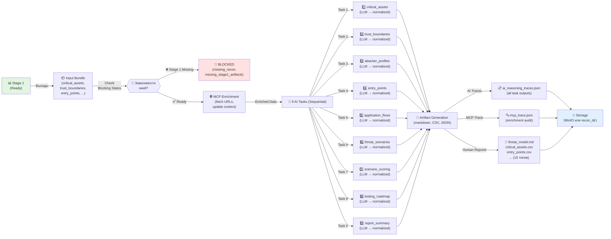

# Recon Stage 2 Flow: Threat Modeling (TM-010)

Документ описывает полный flow Stage 2 — аркестрация потока угроз (threat modeling) с использованием выходов Stage 1 как входов.

**Дата обновления:** 2026-03-19  
**Статус:** ✅ Production-Ready  
**Связанный документ:** `recon-stage1-flow.md`

---

## 1. Обзор Stage 2 Threat Modeling

Stage 2 (Threat Modeling) — второй этап пентеста, который:

1. **Проверяет зависимости** от Stage 1 (блокирующие состояния)
2. **Загружает bundle входов** из DB-артефактов или файловой системы
3. **Обогащает данные через MCP** (fetch URLs, обновление контекста)
4. **Выполняет 9 AI-задач** последовательно (с кэшированием и fallback)
5. **Генерирует 16 финальных артефактов** (markdown, CSV, JSON traces, machine-readable)
6. **Сохраняет результаты** в DB или MinIO

---

## 2. Flow Диаграмма (Mermaid)



---

## 3. Блокирующие состояния (Dependency Check)

Перед выполнением Stage 2 система проверяет готовность Stage 1:

### 3.1 Блокирующие причины

| Причина | Описание | Решение |
|---------|---------|---------|
| `missing_recon` | Stage 1 не выполнена вообще | Запустить Stage 1 сначала |
| `missing_stage1_artifacts` | Отсутствуют критичные артефакты Stage 1 | Переиспользовать Stage 1 |
| `insufficient_entry_points` | Слишком мало точек входа обнаружено | Расширить scope в Stage 1 |
| `insufficient_critical_assets` | Нет критичных активов в бандле | Уточнить целевые сервисы |

### 3.2 Реализация проверки

**Файл:** `backend/src/recon/threat_modeling/dependency_check.py`

```python
BLOCKED_MISSING_RECON = "missing_recon"
BLOCKED_MISSING_ARTIFACTS = "missing_stage1_artifacts"

async def check_stage1_readiness(engagement_id: str, db: AsyncSession) -> tuple[bool, str | None]:
    """
    Returns (is_ready, blocking_reason).
    Checks:
    - Stage 1 run exists
    - Critical artifact files present
    - Entry points & assets > threshold
    """
```

---

## 4. Загрузка входного bundle

### 4.1 Источники данных

Input Bundle может быть загружен из:

1. **DB Artifacts** (стандартный путь для production)
   - `backend/src/recon/threat_modeling/input_loader.py` → `load_threat_model_input_bundle_from_artifacts()`
   - Загружает из таблицы `artifacts` по `stage_id`, `artifact_type`, `engagement_id`

2. **File System** (для локальной разработки/тестирования)
   - Если указан `--recon-dir`, ищет файлы в папке
   - Поддержка для `critical_assets.csv`, `entry_points.csv`, и т.д.

### 4.2 Структура Bundle

**Модель:** `app/schemas/threat_modeling/schemas.py` → `ThreatModelInputBundle`

```python
class ThreatModelInputBundle(BaseModel):
    """Input for threat modeling tasks from Stage 1 outputs."""
    
    # From Stage 1 enrichment
    critical_assets: list[CriticalAsset]
    trust_boundaries: list[TrustBoundary]
    entry_points: list[EntryPoint]
    application_flows: list[ApplicationFlow]
    
    # From recon (scanning/MCP)
    urls: list[str]
    hostnames: list[str]
    headers_tls_info: dict[str, Any]
    
    # Metadata
    run_id: str
    job_id: str
    trace_id: str
    created_at: datetime
```

---

## 5. MCP Обогащение (MCP Enrichment)

После загрузки bundle, Stage 2 может обогатить данные через MCP:

### 5.1 Разрешенные MCP операции для Stage 2

**Файл:** `backend/src/recon/threat_modeling/mcp_enrichment.py`

| Операция | Назначение | Параметры |
|----------|-----------|----------|
| `fetch_url` | Получить содержимое страницы | `url`, `timeout=5s` |
| `get_headers` | Получить headers сервера | `hostname`, `port` |
| `dns_query` | DNS resolve | `hostname` |
| `check_service` | Проверить сервис (ping, port scan) | `hostname`, `port` |

### 5.2 Policy & Audit

- **Policy:** fail-closed (денай по умолчанию)
- **Audit Log:** `mcp_trace.json` содержит все MCP вызовы с:
  - `run_id`, `job_id`, `trace_id`
  - `operation`, `status`, `timestamp`
  - `response` или `error_reason`

---

## 6. 9 AI-задач (Sequential Execution)

Задачи выполняются **последовательно** — каждая может использовать выход предыдущей.

### 6.1 Список задач и контракты

| # | Название | Input | Output | Файлы |
|----|----------|-------|--------|-------|
| 1️⃣ | **critical_assets** | bundle.critical_assets | список активов с приоритетом | `ai_tm_critical_assets_{raw,normalized}.json` |
| 2️⃣ | **trust_boundaries** | bundle + task 1 output | границы доверия | `ai_tm_trust_boundaries_{raw,normalized}.json` |
| 3️⃣ | **attacker_profiles** | bundle + tasks 1-2 | профили атакующих | `ai_tm_attacker_profiles_{raw,normalized}.json` |
| 4️⃣ | **entry_points** | bundle.entry_points + task 1-3 | точки входа с оценкой | `ai_tm_entry_points_{raw,normalized}.json` |
| 5️⃣ | **application_flows** | bundle.flows + tasks 1-4 | потоки приложения | `ai_tm_application_flows_{raw,normalized}.json` |
| 6️⃣ | **threat_scenarios** | все выше + bundle | сценарии угроз | `ai_tm_threat_scenarios_{raw,normalized}.json` |
| 7️⃣ | **scenario_scoring** | task 6 output | оценка угроз (CVSS-like) | `ai_tm_scenario_scoring_{raw,normalized}.json` |
| 8️⃣ | **testing_roadmap** | tasks 1-7 | план тестирования | `ai_tm_testing_roadmap_{raw,normalized}.json` |
| 9️⃣ | **report_summary** | все выше | итоговый отчет | `ai_tm_report_summary_{raw,normalized}.json` |

### 6.2 Для каждой задачи генерируются файлы

```
ai_tm_<task_name>_raw.json              # Raw LLM output
ai_tm_<task_name>_normalized.json       # Валидированный Pydantic output
ai_tm_<task_name>_input_bundle.json     # Input payload (для воспроизводимости)
ai_tm_<task_name>_validation.json       # Результаты валидации
ai_tm_<task_name>_rendered_prompt.md    # Отображенный шаблон промпта
```

### 6.3 Fallback & Кэширование

- **LLM недоступен:** используется rule-based fallback (из bundle)
- **Повторный запуск:** проверяет сохраненные выходы, пропускает уже завершенные задачи
- **Timeout:** если задача > 60s, логируется timeout, продолжается с fallback

---

## 7. Артефакты Stage 2 (16 типов)

### 7.1 Структурированные JSON (9 типов — нормализованные AI выходы)

Файлы артефактов, которые хранятся в DB/MinIO:

```
artifact_type: "ai_tm_critical_assets_normalized"
artifact_type: "ai_tm_trust_boundaries_normalized"
artifact_type: "ai_tm_attacker_profiles_normalized"
artifact_type: "ai_tm_entry_points_normalized"
artifact_type: "ai_tm_application_flows_normalized"
artifact_type: "ai_tm_threat_scenarios_normalized"
artifact_type: "ai_tm_scenario_scoring_normalized"
artifact_type: "ai_tm_testing_roadmap_normalized"
artifact_type: "ai_tm_report_summary_normalized"
```

### 7.2 Человекочитаемые отчеты (2 типа)

| Артефакт | Содержание | Формат |
|----------|-----------|--------|
| **threat_model.md** | Интегрированный отчет угроз (markdown) | Markdown |
| **critical_assets.csv** | Критичные активы в табличном виде | CSV |
| **entry_points.csv** | Точки входа | CSV |
| **trust_boundaries.md** | Диаграмма границ доверия | Markdown |
| **attacker_profiles.csv** | Профили атакующих | CSV |
| **application_flows.md** | Потоки приложения | Markdown |
| **threat_scenarios.csv** | Сценарии угроз с оценкой | CSV |
| **testing_priorities.md** | Приоритеты тестирования | Markdown |
| **evidence_gaps.md** | Пробелы в доказательствах | Markdown |

### 7.3 Служебные trace-файлы (1 тип)

| Артефакт | Содержание |
|----------|-----------|
| **ai_reasoning_traces.json** | Все 9 нормализованных выходов + метаданные |
| **mcp_trace.json** | Audit log всех MCP вызовов (если применимо) |

### 7.4 Маппинг artifact_type → filename

```python
ARTIFACT_TYPE_TO_FILENAME = {
    "threat_model": "threat_model.md",
    "critical_assets": "critical_assets.csv",
    "entry_points": "entry_points.csv",
    "attacker_profiles": "attacker_profiles.csv",
    "trust_boundaries": "trust_boundaries.md",
    "trust_boundaries_md": "trust_boundaries.md",
    "application_flows": "application_flows.md",
    "threat_scenarios": "threat_scenarios.csv",
    "testing_priorities": "testing_priorities.md",
    "evidence_gaps": "evidence_gaps.md",
    # JSON normalized outputs
    "ai_tm_critical_assets_normalized": "ai_tm_critical_assets_normalized.json",
    # ... (все 9 задач)
    "ai_reasoning_traces": "ai_reasoning_traces.json",
    "mcp_trace": "mcp_trace.json",
    "threat_model_json": "threat_model.json",
    "ai_tm_priority_hypotheses": "ai_tm_priority_hypotheses.json",
    "ai_tm_application_flows": "ai_tm_application_flows.json",
    "stage2_inputs": "stage2_inputs.json",
}
```

---

### 7.5 Stage 3 Machine-Readable Artifacts

Четыре JSON-артефакта для машинной обработки (Stage 3, Vulnerability Analysis). Схемы: `backend/app/schemas/threat_modeling/stage2_artifacts.py`.

#### 7.5.1 threat_model.json

Унифицированная модель угроз (`ThreatModelUnified`):

| Поле | Тип | Описание |
|------|-----|----------|
| `critical_assets` | `list[Stage3CriticalAsset]` | Критичные активы (id, name, type, source) |
| `trust_boundaries` | `list[Stage3TrustBoundary]` | Границы доверия (id, name, components, source) |
| `entry_points` | `list[Stage3EntryPoint]` | Точки входа (id, name, component_id, type, source) |
| `attacker_profiles` | `list[AttackerProfile]` | Профили атакующих |
| `threat_scenarios` | `list[Stage3ThreatScenario]` | Сценарии угроз (id, priority, entry_point_id, attacker_profile_id, description) |

#### 7.5.2 ai_tm_priority_hypotheses.json

Приоритизированные гипотезы (`AiTmPriorityHypotheses`). Корневой объект: `{ "hypotheses": [...] }`.

Схема элемента `PriorityHypothesis`:

| Поле | Тип | Описание |
|------|-----|----------|
| `id` | `str` | Идентификатор гипотезы |
| `hypothesis_text` | `str` | Текст гипотезы |
| `priority` | `PriorityLevel` | Приоритет (high/medium/low) |
| `confidence` | `float` | Уверенность 0.0–1.0 |
| `related_asset_id` | `str \| null` | Связанный актив |
| `source_artifact` | `str` | Исходный артефакт |

#### 7.5.3 ai_tm_application_flows.json

Нормализованные потоки приложения — массив `Stage3ApplicationFlow` (extends `ApplicationFlow`):

- `id`, `source`, `sink`, `data_type`, `description`

#### 7.5.4 stage2_inputs.json

Traceability-копия входов Stage 1. Структура соответствует `Stage2InputsArtifact`:

| Поле | Тип | Описание |
|------|-----|----------|
| `metadata` | `object` | `generated_at`, `engagement_id`, `target_id`, `job_id`, `run_id` |
| `bundle` | `ThreatModelInputBundle` | Полный bundle входов Stage 1 (critical_assets, trust_boundaries, entry_points, urls, hostnames, …) |

#### 7.5.5 Хранение (MinIO и файловая система)

**MinIO bucket:** `stage2-artifacts`  
**Object key pattern:** `{scan_id}/{filename}` (scan_id = job_id)

```
s3://stage2-artifacts/
  └── {scan_id}/
      ├── threat_model.json
      ├── ai_tm_priority_hypotheses.json
      ├── ai_tm_application_flows.json
      └── stage2_inputs.json
```

**File layout (локально):**

```
artifacts/
  └── stage2/
      └── {scan_id}/
          ├── threat_model.json
          ├── ai_tm_priority_hypotheses.json
          ├── ai_tm_application_flows.json
          └── stage2_inputs.json
```

**Реализация:**
- Схемы: `backend/app/schemas/threat_modeling/stage2_artifacts.py`
- Генерация: `backend/src/recon/threat_modeling/artifacts.py` (`generate_threat_model_json`, `generate_priority_hypotheses_json`, `generate_application_flows_json`, `generate_stage2_inputs_json`)
- Загрузка в MinIO: `backend/src/recon/stage2_storage.py` (`upload_stage2_artifacts`)

---

## 8. Integration Points (API, CLI, MCP)

### 8.1 REST API

**Базовый путь:** `/recon/engagements/{engagement_id}/threat-modeling/`

#### POST: Создание run без выполнения

```
POST /recon/engagements/{engagement_id}/threat-modeling/runs
Content-Type: application/json

{
  "target_id": "target-123",
  "job_id": "job-456"
}

Response 201:
{
  "id": "tm-run-789",
  "run_id": "tm-run-789",
  "engagement_id": "engagement-123",
  "status": "pending",
  "created_at": "2026-03-12T10:00:00Z"
}
```

#### POST: Trigger (создание + выполнение одновременно) — **Stage 2 Trigger**

```
POST /recon/engagements/{engagement_id}/threat-modeling/trigger
Content-Type: application/json

{
  "target_id": "target-123",
  "job_id": "job-456",
  "recon_dir": "/path/to/recon"  # optional
}

Response 200/202:
{
  "run_id": "tm-run-789",
  "status": "running" | "completed" | "blocked",
  "blocking_reason": null | "missing_recon",
  "artifact_refs": [
    { "artifact_type": "threat_model", "filename": "threat_model.md" },
    { "artifact_type": "ai_tm_critical_assets_normalized", "filename": "..." },
    ...
  ]
}
```

#### GET: Загрузить input bundle для анализа

```
GET /recon/engagements/{engagement_id}/threat-modeling/runs/{run_id}/input-bundle

Response 200:
{
  "critical_assets": [...],
  "trust_boundaries": [...],
  "entry_points": [...],
  "urls": [...],
  "trace_id": "trace-789"
}
```

#### GET: Получить AI traces

```
GET /recon/engagements/{engagement_id}/threat-modeling/runs/{run_id}/ai-traces

Response 200:
{
  "task_outputs": {
    "critical_assets": {...normalized output...},
    "trust_boundaries": {...},
    ...
  }
}
```

#### GET: Получить MCP trace

```
GET /recon/engagements/{engagement_id}/threat-modeling/runs/{run_id}/mcp-traces

Response 200:
{
  "invocations": [
    { "operation": "fetch_url", "status": "success", "timestamp": "...", ... },
    ...
  ]
}
```

#### GET: Скачать артефакт

```
GET /recon/engagements/{engagement_id}/threat-modeling/runs/{run_id}/artifacts/{artifact_type}/download

Response 200:
Content-Type: text/markdown | text/csv | application/json
[файл содержимое]
```

---

### 8.2 CLI

**Команда:** `argus-recon threat-modeling run`

```bash
# Минимальный запуск (использует DB)
argus-recon threat-modeling run --engagement eng-123

# С явным recon-dir (file-based)
argus-recon threat-modeling run \
  --engagement eng-123 \
  --target target-456 \
  --recon-dir ./pentest_reports_svalbard/recon

# Результат
Created run tm-run-789 (job_id=job-456)
Threat modeling completed.
  Status: completed
  Artifacts: 16
```

**Реализация:** `backend/src/recon/cli/commands/threat_modeling.py`

---

### 8.3 MCP Integration (ARGUS MCP Server)

Cursor или другие MCP-клиенты могут вызвать Stage 2 через MCP:

```python
mcp_client.call_tool("argus_threat_modeling_trigger", {
    "engagement_id": "eng-123",
    "target_id": "target-456",
})

# Результат — job_id, artifact refs, blocking_reason
```

---

## 9. Хранение артефактов

### 9.1 MinIO (cloud/production)

**Основной bucket** `argus-reports`:

```
s3://argus-reports/
  └── threat_modeling/
      └── {engagement_id}/
          └── {run_id}/
              ├── threat_model.md
              ├── critical_assets.csv
              ├── ai_tm_critical_assets_normalized.json
              ├── ai_reasoning_traces.json
              ├── mcp_trace.json
              └── ... (все артефакты)
```

**Bucket Stage 3 machine-readable** `stage2-artifacts` (см. раздел 7.5):

```
s3://stage2-artifacts/
  └── {scan_id}/
      ├── threat_model.json
      ├── ai_tm_priority_hypotheses.json
      ├── ai_tm_application_flows.json
      └── stage2_inputs.json
```

Object key pattern: `{scan_id}/{filename}` (scan_id = job_id).

### 9.2 File System (локально)

```
pentest_reports_{engagement_id}/
  └── recon/
      └── threat_modeling/
          └── {run_id}/
              ├── threat_model.md
              ├── critical_assets.csv
              ├── ai_tm_critical_assets_normalized.json
              ├── ai_reasoning_traces.json
              ├── mcp_trace.json
              └── ...
```

### 9.3 DB (Metdata)

Таблица `artifacts`:
- `artifact_type` (varchar, indexed)
- `filename` (varchar)
- `content_type` (e.g., `application/json`, `text/csv`)
- `file_size` (bytes)
- `storage_location` (MinIO path или local FS path)
- `engagement_id`, `run_id` (foreign keys)
- `created_at`, `updated_at`

---

## 10. Процесс выполнения (High-Level)

```
Stage 2 Threat Modeling Pipeline
├── 1. Validate Request
│   ├── Check engagement_id exists
│   ├── Check authorization
│   └── Parse optional recon_dir
│
├── 2. Dependency Check
│   ├── Run check_stage1_readiness()
│   ├── If blocking → return 400 with reason
│   └── If ready → continue
│
├── 3. Create ThreatModelRun
│   ├── Insert into DB with status="pending"
│   ├── Assign run_id, job_id
│   └── Set trace_id
│
├── 4. Load Input Bundle
│   ├── Load from DB artifacts OR file system
│   ├── Validate schema
│   └── Persist to cache
│
├── 5. MCP Enrichment (Optional)
│   ├── For each URL/hostname in bundle
│   ├── Call MCP operations (with policy check)
│   ├── Update bundle with MCP results
│   └── Persist mcp_trace
│
├── 6. Execute 9 AI Tasks (Sequential)
│   ├── For each task (1-9):
│   │   ├── Load task definition + prompt template
│   │   ├── Render prompt with bundle + prior outputs
│   │   ├── Call LLM (with timeout)
│   │   ├── Extract JSON from response
│   │   ├── Validate with Pydantic
│   │   ├── On validation error: fallback to rule-based
│   │   ├── Persist raw, normalized, validation files
│   │   └── Continue to next task
│   └── Collect all outputs
│
├── 7. Generate Artifacts
│   ├── From normalized outputs: create CSV exports
│   ├── From outputs: generate markdown reports
│   ├── Compile ai_reasoning_traces.json
│   └── Create threat_model.md summary
│
├── 8. Persist Artifacts
│   ├── Write to MinIO or file system
│   ├── Create DB entries in artifacts table
│   ├── Store artifact_refs
│   └── Update run status="completed"
│
└── 9. Return Response
    ├── HTTP 200 with run_id, status, artifact_refs
    ├── CLI: print success + artifact count
    └── MCP: return structured result
```

---

## 11. Отслеживание (Traceability)

### 11.1 Trace ID & Linkage

Каждый Stage 2 run получает:

- **run_id**: уникальный ID run (e.g., `tm-run-789`)
- **job_id**: связан с Stage 1 job (e.g., `job-456`)
- **trace_id**: корреляция для логирования (e.g., `trace-xyz123`)

### 11.2 Где это используется

| Файл | Содержит |
|------|----------|
| `ai_tm_*_raw.json` | `trace_id`, `run_id`, `job_id` в метаданных |
| `ai_reasoning_traces.json` | Все task outputs + trace_id |
| `mcp_trace.json` | MCP invocations с trace_id |
| DB artifacts | `run_id` в поле метаданных |

---

## 12. Обработка ошибок & Edge Cases

### 12.1 Блокирующие ошибки (HTTP 400 или 422)

| Сценарий | Ответ | Действие |
|----------|-------|---------|
| Stage 1 отсутствует | `{"blocking_reason": "missing_recon"}` | Запустить Stage 1 |
| Недостаточно assets | `{"blocking_reason": "insufficient_critical_assets"}` | Расширить scope |
| LLM ключ не установлен | 500 Internal Error + fallback | Используется rule-based |
| MCP операция заблокирована | Логируется, продолжается | Audit log дополняется |

### 12.2 Timeout & Retry

- **Per-task timeout:** 60 сек
- **Retry logic:** нет встроенного retry, но может быть re-triggered вручную
- **Graceful degradation:** если LLM недоступен → fallback правила

---

## 13. Related Documentation

- **Stage 1 Flow:** `recon-stage1-flow.md`
- **API Contract:** `frontend-api-contract.md` (endpoints `/threat-modeling/`)
- **Threat Modeling Schemas:** `backend/app/schemas/threat_modeling/schemas.py`
- **Stage 2 Machine-Readable Schemas:** `backend/app/schemas/threat_modeling/stage2_artifacts.py`
- **AI Task Registry:** `backend/src/recon/threat_modeling/ai_task_registry.py`
- **MCP Policy:** `backend/src/recon/mcp/policy.py`

---

## 14. Примеры использования

### 14.1 Python (Programmatic)

```python
from src.recon.threat_modeling.pipeline import execute_threat_modeling_run
from src.db.session import async_session_factory

async def run_stage2():
    async with async_session_factory() as db:
        result = await execute_threat_modeling_run(
            engagement_id="eng-123",
            run_id="tm-run-789",
            job_id="job-456",
            target_id="target-456",
            db=db,
        )
        print(f"Status: {result.status}")
        for artifact_ref in result.artifact_refs:
            print(f"  - {artifact_ref.artifact_type}: {artifact_ref.filename}")
```

### 14.2 cURL (REST API)

```bash
# Trigger Stage 2
curl -X POST http://localhost:8000/recon/engagements/eng-123/threat-modeling/trigger \
  -H "Content-Type: application/json" \
  -d '{
    "target_id": "target-456",
    "job_id": "job-456"
  }'

# Получить input bundle
curl http://localhost:8000/recon/engagements/eng-123/threat-modeling/runs/tm-run-789/input-bundle

# Скачать артефакт
curl http://localhost:8000/recon/engagements/eng-123/threat-modeling/runs/tm-run-789/artifacts/threat_model/download \
  -o threat_model.md
```

### 14.3 Command Line

```bash
# Запустить Stage 2
argus-recon threat-modeling run --engagement eng-123 --recon-dir ./pentest_reports_svalbard/recon

# Результат
Created run tm-run-789 (job_id=job-456)
Threat modeling completed.
  Status: completed
  Artifacts: 16
```

---

**Версия документа:** 1.1  
**Последнее обновление:** 2026-03-19  
**Автор:** ARGUS Documentation Agent  
**Лицензия:** As per project LICENSE
