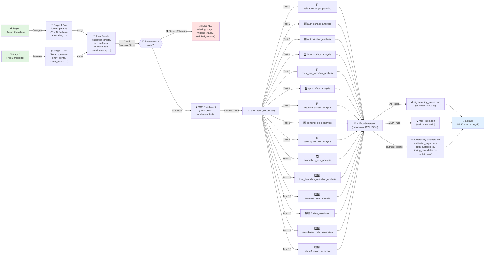

# Recon Stage 3 Flow: Vulnerability Analysis (VA-006)

Документ описывает полный flow Stage 3 — анализ уязвимостей с использованием выходов Stage 1 и Stage 2 как входов.

**Дата обновления:** 2026-03-13  
**Статус:** ✅ Production-Ready  
**Связанные документы:** `recon-stage1-flow.md`, `recon-stage2-flow.md`

---

## 1. Обзор Stage 3 Vulnerability Analysis

Stage 3 (Vulnerability Analysis) — третий этап пентеста, который:

1. **Проверяет зависимости** от Stage 1 и Stage 2 (блокирующие состояния)
2. **Загружает bundle входов** из DB-артефактов или файловой системы (Stage 1+2 выходы)
3. **Обогащает данные через MCP** (fetch URLs, обновление контекста)
4. **Выполняет 15 AI-задач** последовательно (с кэшированием и fallback)
5. **Генерирует 17 финальных артефактов** (markdown, CSV, JSON traces)
6. **Сохраняет результаты** в DB или MinIO

---

## 2. Flow Диаграмма (Mermaid)



---

## 3. Блокирующие состояния (Dependency Check)

Перед выполнением Stage 3 система проверяет готовность Stage 1 и Stage 2:

### 3.1 Блокирующие причины

| Причина | Описание | Решение |
|---------|---------|---------|
| `blocked_missing_stage1` | Stage 1 не выполнена вообще | Запустить Stage 1 сначала |
| `blocked_missing_stage2` | Stage 2 не выполнена | Запустить Stage 2 сначала |
| `blocked_unlinked_stage_artifacts` | Нет связи между Stage 1 и Stage 2 артефактами | Переиспользовать Stage 1/2 |
| `blocked_stage3_not_ready` | Coverage score < 0.3 | Расширить scope в Stage 1 |

### 3.2 Реализация проверки

**Файл:** `backend/src/recon/vulnerability_analysis/dependency_check.py`

```python
BLOCKED_MISSING_STAGE1 = "blocked_missing_stage1"
BLOCKED_MISSING_STAGE2 = "blocked_missing_stage2"
BLOCKED_UNLINKED_STAGE_ARTIFACTS = "blocked_unlinked_stage_artifacts"
BLOCKED_STAGE3_NOT_READY = "blocked_stage3_not_ready"

async def check_stage1_and_stage2_readiness(
    engagement_id: str, 
    recon_dir: Path | None = None, 
    db: AsyncSession | None = None
) -> tuple[bool, str | None]:
    """
    Returns (is_ready, blocking_reason).
    Checks:
    - Stage 1 artifacts present (routes, params, API, JS, anomalies)
    - Stage 2 artifacts present (threat model, threat scenarios)
    - Stage 3 readiness score >= 0.3
    """
```

---

## 4. Загрузка входного bundle

### 4.1 Источники данных

Input Bundle собирается из Stage 1 и Stage 2:

1. **Stage 1 outputs** (обязательные):
   - `stage2_structured.json` — структурированные реконовые данные
   - `stage3_readiness.json` — readiness score и рекомендации
   - `route_classification.csv` — классификация маршрутов
   - `endpoint_inventory.csv` — inventory endpoints
   - `params_inventory.csv` — inventory параметров
   - `api_surface.csv` — API endpoints
   - `js_findings.md` или `ai_js_findings_analysis_normalized.json` (опционально)
   - `anomaly_validation.md` или `anomaly_validation.csv` (опционально)

2. **Stage 2 outputs** (обязательные):
   - `threat_model.md` — интегрированный отчет угроз
   - `ai_tm_critical_assets_normalized.json` — критичные активы
   - `ai_tm_threat_scenarios_normalized.json` — сценарии угроз
   - `ai_tm_testing_roadmap_normalized.json` — план тестирования

### 4.2 Структура Bundle

**Модель:** `app/schemas/vulnerability_analysis/schemas.py` → `VulnerabilityAnalysisInputBundle`

```python
class VulnerabilityAnalysisInputBundle(BaseModel):
    """Aggregated Stage 1 + Stage 2 data for vulnerability analysis."""
    
    # Stage 2 outputs
    critical_assets: list[CriticalAsset]
    trust_boundaries: list[TrustBoundary]
    attacker_profiles: list[AttackerProfile]
    entry_points: list[EntryPoint]
    application_flows: list[ApplicationFlow]
    threat_scenarios: list[ThreatScenario]
    testing_roadmap: list[TestingRoadmapItem]
    
    # Stage 1 inventory/reconnaissance data
    route_inventory: list[dict[str, Any]]           # Из route_classification.csv
    params_inventory: list[dict[str, Any]]          # Из params_inventory.csv
    forms_inventory: list[dict[str, Any]]           # Из HTML forms
    api_surface: list[dict[str, Any]]               # Из api_surface.csv
    js_findings: list[dict[str, Any]]               # Из JS analysis
    headers_tls: dict[str, Any] | None              # Из TLS handshakes
    anomalies: list[dict[str, Any]]                 # Из anomaly_validation
    
    # Additional context
    priority_hypotheses: list[dict[str, Any]]       # High-priority testing targets
    intel_findings: list[dict[str, Any]]            # External intelligence
    stage3_readiness: Stage3ReadinessResult | None  # Coverage score и recommendations
```

---

## 5. MCP Обогащение (MCP Enrichment)

После загрузки bundle, Stage 3 может обогатить данные через MCP:

### 5.1 Разрешенные MCP операции для Stage 3

**Файл:** `backend/src/recon/vulnerability_analysis/mcp_enrichment.py`

| Операция | Назначение | Параметры |
|----------|-----------|----------|
| `fetch_url` | Получить содержимое страницы | `url`, `timeout=5s` |
| `get_headers` | Получить headers сервера | `hostname`, `port` |
| `dns_query` | DNS resolve | `hostname` |
| `check_service` | Проверить сервис (ping, port scan) | `hostname`, `port` |

### 5.2 Policy & Audit

- **Policy:** fail-closed (денай по умолчанию)
- **Audit Log:** `mcp_trace.json` содержит все MCP вызовы с:
  - `run_id`, `job_id`, `trace_id`
  - `operation`, `status`, `timestamp`
  - `response` или `error_reason`

---

## 6. 15 AI-задач (Sequential Execution)

Задачи выполняются **последовательно** — каждая может использовать выход предыдущей.

### 6.1 Список задач и контракты

| # | Название | Input | Output | Файлы |
|----|----------|-------|--------|-------|
| 1️⃣ | **validation_target_planning** | bundle + threat context | validation targets | `ai_va_validation_target_planning_{raw,normalized}.json` |
| 2️⃣ | **auth_surface_analysis** | bundle.api_surface + task 1 | auth endpoints | `ai_va_auth_surface_analysis_{raw,normalized}.json` |
| 3️⃣ | **authorization_analysis** | auth surfaces + tasks 1-2 | authz checks | `ai_va_authorization_analysis_{raw,normalized}.json` |
| 4️⃣ | **input_surface_analysis** | bundle.forms + route inventory | input checks | `ai_va_input_surface_analysis_{raw,normalized}.json` |
| 5️⃣ | **route_and_workflow_analysis** | route inventory + tasks 1-4 | workflow checks | `ai_va_route_and_workflow_analysis_{raw,normalized}.json` |
| 6️⃣ | **api_surface_analysis** | bundle.api_surface + tasks 1-5 | API checks | `ai_va_api_surface_analysis_{raw,normalized}.json` |
| 7️⃣ | **resource_access_analysis** | threat scenarios + tasks 1-6 | resource access | `ai_va_resource_access_analysis_{raw,normalized}.json` |
| 8️⃣ | **frontend_logic_analysis** | bundle.js_findings + tasks 1-7 | frontend logic | `ai_va_frontend_logic_analysis_{raw,normalized}.json` |
| 9️⃣ | **security_controls_analysis** | tasks 1-8 | controls eval | `ai_va_security_controls_analysis_{raw,normalized}.json` |
| 🔟 | **anomalous_host_analysis** | bundle.anomalies + tasks 1-9 | anomaly findings | `ai_va_anomalous_host_analysis_{raw,normalized}.json` |
| 1️⃣1️⃣ | **trust_boundary_validation_analysis** | trust boundaries + tasks 1-10 | boundary checks | `ai_va_trust_boundary_validation_analysis_{raw,normalized}.json` |
| 1️⃣2️⃣ | **business_logic_analysis** | threat scenarios + tasks 1-11 | logic checks | `ai_va_business_logic_analysis_{raw,normalized}.json` |
| 1️⃣3️⃣ | **finding_correlation** | все задачи выше | correlated findings | `ai_va_finding_correlation_{raw,normalized}.json` |
| 1️⃣4️⃣ | **remediation_note_generation** | task 13 + threat context | remediation plan | `ai_va_remediation_note_generation_{raw,normalized}.json` |
| 1️⃣5️⃣ | **stage3_report_summary** | все выше | итоговый отчет | `ai_va_stage3_report_summary_{raw,normalized}.json` |

### 6.2 Для каждой задачи генерируются файлы

```
ai_va_<task_name>_raw.json              # Raw LLM output
ai_va_<task_name>_normalized.json       # Валидированный Pydantic output
ai_va_<task_name>_input_bundle.json     # Input payload (для воспроизводимости)
ai_va_<task_name>_validation.json       # Результаты валидации
ai_va_<task_name>_rendered_prompt.md    # Отображенный шаблон промпта
```

### 6.3 Fallback & Кэширование

- **LLM недоступен:** используется rule-based fallback (из bundle)
- **Повторный запуск:** проверяет сохраненные выходы, пропускает уже завершенные задачи
- **Timeout:** если задача > 60s, логируется timeout, продолжается с fallback

---

## 7. Артефакты Stage 3 (17 типов)

### 7.1 Структурированные JSON (15 типов — нормализованные AI выходы)

Файлы артефактов, которые хранятся в DB/MinIO:

```
artifact_type: "ai_va_validation_target_planning_normalized"
artifact_type: "ai_va_auth_surface_analysis_normalized"
artifact_type: "ai_va_authorization_analysis_normalized"
artifact_type: "ai_va_input_surface_analysis_normalized"
artifact_type: "ai_va_route_and_workflow_analysis_normalized"
artifact_type: "ai_va_api_surface_analysis_normalized"
artifact_type: "ai_va_resource_access_analysis_normalized"
artifact_type: "ai_va_frontend_logic_analysis_normalized"
artifact_type: "ai_va_security_controls_analysis_normalized"
artifact_type: "ai_va_anomalous_host_analysis_normalized"
artifact_type: "ai_va_trust_boundary_validation_analysis_normalized"
artifact_type: "ai_va_business_logic_analysis_normalized"
artifact_type: "ai_va_finding_correlation_normalized"
artifact_type: "ai_va_remediation_note_generation_normalized"
artifact_type: "ai_va_stage3_report_summary_normalized"
```

### 7.2 Человекочитаемые отчеты (3 типа)

| Артефакт | Содержание | Формат |
|----------|-----------|--------|
| **vulnerability_analysis.md** | Интегрированный отчет уязвимостей (markdown) | Markdown |
| **validation_targets.csv** | Цели валидации в табличном виде | CSV |
| **auth_surfaces.csv** | Auth endpoints и hint информация | CSV |
| **finding_candidates.csv** | Кандидаты на findings с приоритетом | CSV |

### 7.3 Служебные trace-файлы (2 типа)

| Артефакт | Содержание |
|----------|-----------|
| **ai_reasoning_traces.json** | Все 15 нормализованных выходов + метаданные |
| **mcp_trace.json** | Audit log всех MCP вызовов (если применимо) |

### 7.4 Маппинг artifact_type → filename

```python
ARTIFACT_TYPE_TO_FILENAME = {
    "vulnerability_analysis": "vulnerability_analysis.md",
    "validation_targets": "validation_targets.csv",
    "auth_surfaces": "auth_surfaces.csv",
    "finding_candidates": "finding_candidates.csv",
    # JSON normalized outputs (15 tasks)
    "ai_va_validation_target_planning_normalized": "ai_va_validation_target_planning_normalized.json",
    "ai_va_auth_surface_analysis_normalized": "ai_va_auth_surface_analysis_normalized.json",
    # ... (все 15 задач)
    "ai_reasoning_traces": "ai_reasoning_traces.json",
    "mcp_trace": "mcp_trace.json",
}
```

---

## 8. Integration Points (API, CLI, MCP)

### 8.1 REST API

**Базовый путь:** `/recon/engagements/{engagement_id}/vulnerability-analysis/`

#### POST: Создание run без выполнения

```
POST /recon/engagements/{engagement_id}/vulnerability-analysis/runs
Content-Type: application/json

{
  "target_id": "target-123",
  "job_id": "job-456"
}

Response 201:
{
  "id": "va-run-789",
  "run_id": "va-run-789",
  "engagement_id": "engagement-123",
  "status": "pending",
  "created_at": "2026-03-13T10:00:00Z"
}
```

#### POST: Trigger (создание + выполнение одновременно) — **Stage 3 Trigger**

```
POST /recon/engagements/{engagement_id}/vulnerability-analysis/trigger
Content-Type: application/json

{
  "target_id": "target-123",
  "job_id": "job-456",
  "recon_dir": "/path/to/recon"  # optional
}

Response 200/202:
{
  "run_id": "va-run-789",
  "status": "running" | "completed" | "blocked",
  "blocking_reason": null | "blocked_missing_stage1",
  "artifact_refs": [
    { "artifact_type": "vulnerability_analysis", "filename": "vulnerability_analysis.md" },
    { "artifact_type": "ai_va_validation_target_planning_normalized", "filename": "..." },
    ...
  ]
}
```

#### GET: Проверить readiness

```
GET /recon/engagements/{engagement_id}/vulnerability-analysis/readiness

Response 200:
{
  "is_ready": true | false,
  "blocking_reason": null | "blocked_missing_stage1",
  "coverage_score": 0.75,
  "recommendations": [...]
}
```

#### GET: Загрузить input bundle для анализа

```
GET /recon/engagements/{engagement_id}/vulnerability-analysis/runs/{run_id}/input-bundle

Response 200:
{
  "critical_assets": [...],
  "threat_scenarios": [...],
  "route_inventory": [...],
  "api_surface": [...],
  "trace_id": "trace-789"
}
```

#### GET: Получить AI traces

```
GET /recon/engagements/{engagement_id}/vulnerability-analysis/runs/{run_id}/ai-traces

Response 200:
{
  "task_outputs": {
    "validation_target_planning": {...normalized output...},
    "auth_surface_analysis": {...},
    ...
  }
}
```

#### GET: Получить MCP trace

```
GET /recon/engagements/{engagement_id}/vulnerability-analysis/runs/{run_id}/mcp-traces

Response 200:
{
  "invocations": [
    { "operation": "fetch_url", "status": "success", "timestamp": "...", ... },
    ...
  ]
}
```

#### GET: Скачать артефакт

```
GET /recon/engagements/{engagement_id}/vulnerability-analysis/runs/{run_id}/artifacts/{artifact_type}/download

Response 200:
Content-Type: text/markdown | text/csv | application/json
[файл содержимое]
```

---

### 8.2 CLI

**Команда:** `argus-recon vulnerability-analysis run`

```bash
# Минимальный запуск (использует DB)
argus-recon vulnerability-analysis run --engagement eng-123

# С явным target
argus-recon vulnerability-analysis run --engagement eng-123 --target target-456

# С явным recon-dir (file-based)
argus-recon vulnerability-analysis run \
  --engagement eng-123 \
  --target target-456 \
  --recon-dir ./pentest_reports_svalbard/recon

# Результат
Created run va-run-789 (job_id=job-456)
Vulnerability analysis completed.
  Status: completed
  Artifacts: 17
```

**Реализация:** `backend/src/recon/cli/commands/vulnerability_analysis.py`

---

### 8.3 MCP Integration (ARGUS MCP Server)

Cursor или другие MCP-клиенты могут вызвать Stage 3 через MCP:

```python
mcp_client.call_tool("argus_vulnerability_analysis_trigger", {
    "engagement_id": "eng-123",
    "target_id": "target-456",
})

# Результат — job_id, artifact refs, blocking_reason
```

---

## 9. Хранение артефактов

### 9.1 MinIO (cloud/production)

```
s3://argus-reports/
  └── vulnerability_analysis/
      └── {engagement_id}/
          └── {run_id}/
              ├── vulnerability_analysis.md
              ├── validation_targets.csv
              ├── auth_surfaces.csv
              ├── finding_candidates.csv
              ├── ai_va_validation_target_planning_normalized.json
              ├── ai_reasoning_traces.json
              ├── mcp_trace.json
              └── ... (все артефакты)
```

### 9.2 File System (локально)

```
pentest_reports_{engagement_id}/
  └── recon/
      └── vulnerability_analysis/
          └── {run_id}/
              ├── vulnerability_analysis.md
              ├── validation_targets.csv
              ├── auth_surfaces.csv
              ├── finding_candidates.csv
              ├── ai_va_validation_target_planning_normalized.json
              ├── ai_reasoning_traces.json
              ├── mcp_trace.json
              └── ...
```

### 9.3 DB (Metadata)

Таблица `artifacts`:
- `artifact_type` (varchar, indexed)
- `filename` (varchar)
- `content_type` (e.g., `application/json`, `text/csv`)
- `file_size` (bytes)
- `storage_location` (MinIO path или local FS path)
- `engagement_id`, `run_id` (foreign keys)
- `created_at`, `updated_at`

---

## 10. Процесс выполнения (High-Level)

```
Stage 3 Vulnerability Analysis Pipeline
├── 1. Validate Request
│   ├── Check engagement_id exists
│   ├── Check authorization
│   └── Parse optional recon_dir
│
├── 2. Dependency Check (Stage 1 + Stage 2)
│   ├── Run check_stage1_and_stage2_readiness()
│   ├── If blocking → return 400 with reason
│   └── If ready → continue
│
├── 3. Create VulnerabilityAnalysisRun
│   ├── Insert into DB with status="pending"
│   ├── Assign run_id, job_id
│   └── Set trace_id
│
├── 4. Load Input Bundle (Stage 1 + Stage 2)
│   ├── Load Stage 1 artifacts from DB/FS
│   ├── Load Stage 2 artifacts from DB/FS
│   ├── Merge into single VulnerabilityAnalysisInputBundle
│   ├── Validate schema
│   └── Persist to cache
│
├── 5. MCP Enrichment (Optional)
│   ├── For each URL/route in bundle
│   ├── Call MCP operations (with policy check)
│   ├── Update bundle with MCP results
│   └── Persist mcp_trace
│
├── 6. Execute 15 AI Tasks (Sequential)
│   ├── For each task (1-15):
│   │   ├── Load task definition + prompt template
│   │   ├── Render prompt with bundle + prior outputs
│   │   ├── Call LLM (with timeout)
│   │   ├── Extract JSON from response
│   │   ├── Validate with Pydantic
│   │   ├── On validation error: fallback to rule-based
│   │   ├── Persist raw, normalized, validation files
│   │   └── Continue to next task
│   └── Collect all outputs
│
├── 7. Generate Artifacts
│   ├── From normalized outputs: create CSV exports
│   ├── From outputs: generate markdown reports
│   ├── Compile ai_reasoning_traces.json
│   └── Create vulnerability_analysis.md summary
│
├── 8. Persist Artifacts
│   ├── Write to MinIO or file system
│   ├── Create DB entries in artifacts table
│   ├── Store artifact_refs
│   └── Update run status="completed"
│
└── 9. Return Response
    ├── HTTP 200 with run_id, status, artifact_refs
    ├── CLI: print success + artifact count
    └── MCP: return structured result
```

---

## 11. Artifact Dependency Graph

```
Stage 1 (Recon)
├── route_inventory
├── params_inventory
├── forms_inventory
├── api_surface
├── js_findings
├── headers_tls
├── anomalies
└── stage3_readiness

Stage 2 (Threat Modeling)
├── critical_assets
├── trust_boundaries
├── attacker_profiles
├── entry_points
├── application_flows
├── threat_scenarios
└── testing_roadmap

        ↓ (Merge)

VA Input Bundle
├── validation_targets ← (1) validation_target_planning
├── auth_surfaces ← (2) auth_surface_analysis
├── authorization_checks ← (3) authorization_analysis
├── input_surface_checks ← (4) input_surface_analysis
├── route_workflows ← (5) route_and_workflow_analysis
├── api_surface_checks ← (6) api_surface_analysis
├── resource_access ← (7) resource_access_analysis
├── frontend_logic ← (8) frontend_logic_analysis
├── security_controls ← (9) security_controls_analysis
├── anomalous_hosts ← (10) anomalous_host_analysis
├── trust_boundary_checks ← (11) trust_boundary_validation_analysis
├── business_logic ← (12) business_logic_analysis
├── correlated_findings ← (13) finding_correlation
├── remediation_plan ← (14) remediation_note_generation
└── stage3_report ← (15) stage3_report_summary

        ↓ (Generate)

VA Output Artifacts (17)
├── vulnerability_analysis.md
├── validation_targets.csv
├── auth_surfaces.csv
├── finding_candidates.csv
├── ai_va_validation_target_planning_normalized.json
├── ... (13 more normalized outputs)
├── ai_reasoning_traces.json
└── mcp_trace.json
```

---

## 12. Обработка ошибок & Edge Cases

### 12.1 Блокирующие ошибки (HTTP 400 или 422)

| Сценарий | Ответ | Действие |
|----------|-------|---------|
| Stage 1 отсутствует | `{"blocking_reason": "blocked_missing_stage1"}` | Запустить Stage 1 |
| Stage 2 отсутствует | `{"blocking_reason": "blocked_missing_stage2"}` | Запустить Stage 2 |
| Артефакты не связаны | `{"blocking_reason": "blocked_unlinked_stage_artifacts"}` | Переиспользовать Stage 1/2 |
| Coverage < 0.3 | `{"blocking_reason": "blocked_stage3_not_ready"}` | Расширить Stage 1 scope |
| LLM ключ не установлен | 500 Internal Error + fallback | Используется rule-based |

### 12.2 Timeout & Retry

- **Per-task timeout:** 60 сек
- **Retry logic:** нет встроенного retry, но может быть re-triggered вручную
- **Graceful degradation:** если LLM недоступен → fallback правила

---

## 13. Traceability

### 13.1 Trace ID & Linkage

Каждый Stage 3 run получает:

- **run_id**: уникальный ID run (e.g., `va-run-789`)
- **job_id**: связан с Stage 2 job (e.g., `job-456`)
- **trace_id**: корреляция для логирования (e.g., `trace-xyz123`)

### 13.2 Где это используется

| Файл | Содержит |
|------|----------|
| `ai_va_*_raw.json` | `trace_id`, `run_id`, `job_id` в метаданных |
| `ai_reasoning_traces.json` | Все 15 task outputs + trace_id |
| `mcp_trace.json` | MCP invocations с trace_id |
| DB artifacts | `run_id` в поле метаданных |

---

## 14. Related Documentation

- **Stage 1 Flow:** `recon-stage1-flow.md`
- **Stage 2 Flow:** `recon-stage2-flow.md`
- **API Contract:** `frontend-api-contract.md` (endpoints `/vulnerability-analysis/`)
- **Vulnerability Analysis Schemas:** `backend/app/schemas/vulnerability_analysis/schemas.py`
- **AI Task Registry:** `backend/src/recon/vulnerability_analysis/ai_task_registry.py`
- **MCP Policy:** `backend/src/recon/mcp/policy.py`

---

## 15. Примеры использования

### 15.1 Python (Programmatic)

```python
from src.recon.vulnerability_analysis.pipeline import execute_vulnerability_analysis_run
from src.db.session import async_session_factory

async def run_stage3():
    async with async_session_factory() as db:
        result = await execute_vulnerability_analysis_run(
            engagement_id="eng-123",
            run_id="va-run-789",
            job_id="job-456",
            target_id="target-456",
            db=db,
        )
        print(f"Status: {result.status}")
        for artifact_ref in result.artifact_refs:
            print(f"  - {artifact_ref.artifact_type}: {artifact_ref.filename}")
```

### 15.2 cURL (REST API)

```bash
# Trigger Stage 3
curl -X POST http://localhost:8000/recon/engagements/eng-123/vulnerability-analysis/trigger \
  -H "Content-Type: application/json" \
  -d '{
    "target_id": "target-456",
    "job_id": "job-456"
  }'

# Проверить readiness
curl http://localhost:8000/recon/engagements/eng-123/vulnerability-analysis/readiness

# Получить input bundle
curl http://localhost:8000/recon/engagements/eng-123/vulnerability-analysis/runs/va-run-789/input-bundle

# Скачать артефакт
curl http://localhost:8000/recon/engagements/eng-123/vulnerability-analysis/runs/va-run-789/artifacts/vulnerability_analysis/download \
  -o vulnerability_analysis.md
```

### 15.3 Command Line

```bash
# Запустить Stage 3
argus-recon vulnerability-analysis run --engagement eng-123 --recon-dir ./pentest_reports_svalbard/recon

# Результат
Created run va-run-789 (job_id=job-456)
Vulnerability analysis completed.
  Status: completed
  Artifacts: 17
```

---

**Версия документа:** 1.0  
**Последнее обновление:** 2026-03-13  
**Автор:** ARGUS Documentation Agent  
**Лицензия:** As per project LICENSE
