# Recon Stage 4 Flow: Exploitation (EX-007)

Документ описывает полный flow Stage 4 — эксплуатация уязвимостей с использованием выходов Stage 3 как входа.

**Дата обновления:** 2026-03-19  
**Статус:** ✅ Production-Ready  
**Связанные документы:** `recon-stage3-flow.md`, `backend-architecture.md`

---

## 1. Обзор Stage 4 Exploitation

Stage 4 (Exploitation) — четвёртый этап пентеста, который:

1. **Проверяет зависимость** от Stage 3 (блокирующее состояние)
2. **Загружает кандидатов** из `exploitation_candidates.json` (Stage 3 выход)
3. **Планирует атаки** через Exploit Planner (приоритизация, выбор инструмента)
4. **Проверяет политики** (Policy Engine: scope, destructive commands, DoS risk)
5. **Запрашивает одобрение** для высокорисковых эксплуатаций (Approval Gate)
6. **Выполняет в песочнице** все инструменты через Docker (Celery async tasks)
7. **Собирает доказательства** (shells, extracted data, evidence artifacts)
8. **Генерирует отчеты** (exploitation_plan.json, stage4_results.json, shells.json, ai_exploitation_summary.json)
9. **Сохраняет результаты** в DB или MinIO

---

## 2. Flow Диаграмма (Mermaid)

```mermaid
graph LR
    Stage3["🎯 Stage 3<br/>(Vulnerability Analysis)"] -->|Выходы| Stage3Data["📦 exploitation_candidates.json<br/>(кандидаты,<br/>уязвимости,<br/>детали эксплуатации)"]
    
    Stage3Data -->|Load| CandidateLoader["📋 Load Candidates<br/>(validate schema,<br/>count)"]
    
    CandidateLoader -->|Candidates| ExploitPlanner["🎯 Exploit Planner<br/>(sort by confidence,<br/>impact, criticality)"]
    
    ExploitPlanner -->|AttackPlans| Prioritized["📊 Prioritized Plans<br/>(high→low confidence,<br/>CVE→custom_script)"]
    
    Prioritized -->|Check Policies| PolicyEngine["🚨 Policy Engine<br/>(scope, destructive,<br/>DoS risk)"]
    
    PolicyEngine -->|✅ Allowed| Approved["✅ Approved Plans<br/>(can execute)"]
    PolicyEngine -->|⚠️ High-Risk| ApprovalGate["🔐 Approval Gate<br/>(needs operator)"]
    PolicyEngine -->|❌ Blocked| Blocked["🛑 Blocked Plans<br/>(out of scope,<br/>destructive)"]
    
    ApprovalGate -->|Pending| ApprovalWait["⏳ Waiting for<br/>Approval"]
    ApprovalWait -->|Approved| Approved
    ApprovalWait -->|Rejected| Rejected["❌ Rejected Plans"]
    
    Approved -->|Async Tasks| SandboxExec["🐳 Sandbox Execution<br/>(Docker container,<br/>Celery worker)"]
    
    SandboxExec -->|Tool 1| Metasploit["🔨 Metasploit Adapter<br/>(CVE exploitation)"]
    SandboxExec -->|Tool 2| SQLMap["💉 SQLMap Adapter<br/>(SQL injection)"]
    SandboxExec -->|Tool 3| Nuclei["🔍 Nuclei Adapter<br/>(CVE verification)"]
    SandboxExec -->|Tool 4| Hydra["🔑 Hydra Adapter<br/>(brute force)"]
    SandboxExec -->|Tool 5| CustomScript["⚙️ Custom Script Adapter<br/>(IDOR, etc.)"]
    
    Metasploit -->|Result| Collected["📊 Collect Results<br/>(status, proof,<br/>shells, extracted data)"]
    SQLMap --> Collected
    Nuclei --> Collected
    Hydra --> Collected
    CustomScript --> Collected
    
    Collected -->|Generate| Artifacts["📄 Artifact Generation<br/>(JSON, markdown)"]
    
    Artifacts -->|Plans| PlanArtifact["📋 exploitation_plan.json<br/>(all attack plans)"]
    Artifacts -->|Results| ResultArtifact["📊 stage4_results.json<br/>(outcomes,<br/>evidence)"]
    Artifacts -->|Shells| ShellArtifact["🐚 shells.json<br/>(active sessions)"]
    Artifacts -->|Summary| SummaryArtifact["📝 ai_exploitation_summary.json<br/>(AI-generated summary)"]
    
    PlanArtifact --> Storage["💾 Storage<br/>(MinIO stage4-artifacts<br/>или recon_dir)"]
    ResultArtifact --> Storage
    ShellArtifact --> Storage
    SummaryArtifact --> Storage
    
    style Stage3 fill:#e1f5e1
    style Blocked fill:#ffe1e1
    style Rejected fill:#ffe1e1
    style Storage fill:#e1f0ff
    style ApprovalGate fill:#fff3cd
    style Approved fill:#d4edda
```



---

## 3. Зависимости (Dependency Check)

Перед выполнением Stage 4 система проверяет готовность Stage 3:

### 3.1 Блокирующие причины

| Причина | Описание | Решение |
|---------|---------|---------|
| `blocked_missing_stage3` | Stage 3 не выполнена вообще | Запустить Stage 3 сначала |
| `blocked_no_candidates` | `exploitation_candidates.json` пуста | Stage 3 не обнаружила уязвимости |
| `blocked_invalid_candidates` | Кандидаты не соответствуют схеме | Переиспользовать Stage 3 |

### 3.2 Реализация проверки

**Файл:** `backend/src/recon/exploitation/dependency_check.py`

```python
async def check_stage3_readiness(
    engagement_id: str, 
    recon_dir: Path | None = None, 
    db: AsyncSession | None = None
) -> tuple[bool, str | None]:
    """
    Returns (is_ready, blocking_reason).
    Checks:
    - Stage 3 artifacts present (exploitation_candidates.json)
    - Candidates list not empty
    - Candidates validate against schema
    """
```

---

## 4. Загрузка кандидатов

### 4.1 Источник данных

Candidates загружаются из Stage 3 выхода:

**Источник:** `exploitation_candidates.json` (MinIO `stage3-artifacts/{scan_id}/` или `pentest_reports_{engagement_id}/recon/vulnerability_analysis/{run_id}/`)

**Файл:** `backend/src/recon/exploitation/input_loader.py`

```python
class ExploitationCandidate(BaseModel):
    target: str                          # URL/endpoint/resource
    vulnerability_type: str              # idor, sql_injection, cve, etc.
    cwe_id: str | None                   # CWE reference
    cve_id: str | None                   # CVE reference
    confidence: str                      # high, medium, low
    evidence: str                        # Доказательства
    exploitation_details: dict[str, Any] # Type-specific details
    source_artifacts: list[str]          # Stage 3 artifacts (traceability)
```

### 4.2 Загрузка и валидация

- Загружаемый файл парсится как JSON
- Валидируется против Pydantic schema `ExploitationCandidatesArtifact`
- На ошибку валидации → блокировка с `blocked_invalid_candidates`

---

## 5. Exploit Planner

### 5.1 Приоритизация кандидатов

**Алгоритм приоритизации** (сортировка по):

1. **Confidence** (desc): `high (0) → medium (1) → low (2)`
2. **Vulnerability Impact** (asc):
   - `cve` (0) — критичны
   - `sql_injection` (1) — очень высокий риск
   - `ssrf` (2)
   - `xss` (3)
   - `idor` (4)
   - `weak_password` (5)
   - `misconfiguration` (6)
   - `other` (7)

**Файл:** `backend/src/recon/exploitation/planner.py`

```python
CONFIDENCE_PRIORITY: dict[str, int] = {"high": 0, "medium": 1, "low": 2}
IMPACT_PRIORITY: dict[str, int] = {
    "cve": 0,
    "sql_injection": 1,
    "ssrf": 2,
    "xss": 3,
    "idor": 4,
    "weak_password": 5,
    "misconfiguration": 6,
    "other": 7,
}

def _sort_candidates(candidates: list[ExploitationCandidate]) -> list[ExploitationCandidate]:
    """Sort candidates by confidence (desc), then impact priority."""
    return sorted(
        candidates,
        key=lambda c: (
            CONFIDENCE_PRIORITY.get(c.confidence, 9),
            IMPACT_PRIORITY.get(c.vulnerability_type, 9),
        ),
    )
```

### 5.2 Выбор инструмента

Каждый тип уязвимости маппится на адаптер инструмента:

| Vulnerability Type | Инструмент | Адаптер |
|--------------------|-----------|---------|
| `sql_injection` | SQLMap | `sqlmap_adapter.py` |
| `cve` | Metasploit | `metasploit_adapter.py` |
| `weak_password` | Hydra | `hydra_adapter.py` |
| `idor` | Custom Script | `custom_script_adapter.py` |
| `xss`, `ssrf`, `misconfiguration` | Nuclei | `nuclei_adapter.py` |
| `other` | Custom Script | `custom_script_adapter.py` |

**Файл:** `backend/src/recon/exploitation/planner.py`

```python
VULN_TYPE_TO_TOOL: dict[str, str] = {
    "sql_injection": "sqlmap",
    "cve": "metasploit",
    "weak_password": "hydra",
    "idor": "custom_script",
    "xss": "nuclei",
    "ssrf": "nuclei",
    "misconfiguration": "nuclei",
    "other": "custom_script",
}
```

### 5.3 Построение Attack Plan

Для каждого кандидата генерируется `AttackPlan`:

```python
class AttackPlan(BaseModel):
    candidate_id: str                 # Уникальный ID кандидата
    candidate: ExploitationCandidate  # Ссылка на кандидат
    selected_tool: str                # выбранный инструмент
    command_config: dict[str, Any]    # конфигурация команды
    expected_outcome: str             # что мы ожидаем
    risk_level: str                   # low, medium, high, critical
    requires_approval: bool           # нужно ли одобрение?
```

**Конфигурация команды по типу инструмента:**

- **sqlmap**: `url`, `method`, `parameter`, `batch`, `level`, `risk`
- **metasploit**: `cve_id`, `exploit_link`
- **hydra**: `username_hints`, `password_hints`, `protocol`
- **nuclei**: `template_ids` (из CVE ID)
- **custom_script**: `script_type`

### 5.4 Определение risk_level

```python
def _determine_risk_level(candidate: ExploitationCandidate) -> str:
    """Determine risk level of the attack plan."""
    if candidate.vulnerability_type in ("cve", "sql_injection"):
        return "critical" if candidate.confidence == "high" else "high"
    if candidate.vulnerability_type in ("ssrf", "weak_password"):
        return "high" if candidate.confidence == "high" else "medium"
    return "low" if candidate.confidence == "high" else "low"
```

**High-risk типы** (требуют одобрения):

```python
HIGH_RISK_TYPES: frozenset[str] = frozenset({"cve", "sql_injection", "ssrf"})
```

---

## 6. Policy Engine

### 6.1 Три проверки политики

**Файл:** `backend/src/recon/exploitation/policy_engine.py`

#### A. Scope Check

Проверяет, находится ли целевой URL в scope engagement:

```python
def check_scope(target_url: str, allowed_domains: list[str]) -> PolicyDecision:
    """Verify target URL is within engagement scope."""
    parsed = urlparse(target_url)
    host = (parsed.hostname or "").lower()
    for domain in allowed_domains:
        d = domain.lower().lstrip("*.")
        if host == d or host.endswith(f".{d}"):
            return PolicyDecision(verdict="allowed", reason=f"in scope: {domain}")
    return PolicyDecision(verdict="blocked", reason=f"target {host} not in scope")
```

**Вердикты:**
- `allowed` — целевой хост в scope
- `blocked` — целевой хост вне scope

#### B. Destructive Commands Check

Блокирует команды с опасными паттернами:

```python
BLOCKED_PATTERNS: tuple[str, ...] = (
    "--drop",           # SQLMap
    "--delete",
    "rm -rf",           # Shell commands
    "format ",
    "mkfs",
    "DROP TABLE",       # SQL
    "DELETE FROM",
    "TRUNCATE",
    "ALTER TABLE",
    "--os-pwn",         # Metasploit
    "--os-bof",
    "shutdown",
    "reboot",
    "init 0",
    "init 6",
    ":(){",             # Fork bomb
)

def check_destructive_commands(command: str) -> PolicyDecision:
    """Block commands containing destructive patterns."""
    if _BLOCKED_RE.search(command):
        match = _BLOCKED_RE.search(command)
        pattern = match.group(0) if match else "unknown"
        return PolicyDecision(
            verdict="blocked",
            reason=f"destructive pattern detected: {pattern}",
        )
    return PolicyDecision(verdict="allowed", reason="no destructive patterns")
```

**Вердикты:**
- `allowed` — команда безопасна
- `blocked` — команда содержит опасный паттерн

#### C. DoS Risk Check

Проверяет инструменты и флаги, которые могут вызвать DoS:

```python
DOS_RISK_TOOLS: frozenset[str] = frozenset({
    "hydra", "medusa", "hping3", "slowloris",
})

DOS_RISK_FLAGS: tuple[str, ...] = (
    "--flood",
    "-t 64",
    "--threads 64",
    "--tasks 64",
)

def check_dos_risk(tool: str, command: str) -> PolicyDecision:
    """Check for DoS risk (brute-force tools with high concurrency)."""
    if tool in DOS_RISK_TOOLS and any(flag in command for flag in DOS_RISK_FLAGS):
        return PolicyDecision(
            verdict="needs_approval",
            reason=f"DoS risk: {tool} with high concurrency flags",
        )
    return PolicyDecision(verdict="allowed", reason="no DoS risk")
```

**Вердикты:**
- `allowed` — низкий риск DoS
- `needs_approval` — высокий риск DoS, требуется одобрение

### 6.2 Комбинированный вердикт

```python
def evaluate_policy(
    attack_plan: AttackPlan,
    allowed_domains: list[str],
) -> PolicyDecision:
    """Evaluate all policy checks together."""
    # 1. Check scope
    scope_decision = check_scope(attack_plan.candidate.target, allowed_domains)
    if scope_decision.verdict == "blocked":
        return scope_decision
    
    # 2. Check destructive commands (если есть команда)
    if hasattr(attack_plan.command_config, 'command'):
        cmd_decision = check_destructive_commands(attack_plan.command_config['command'])
        if cmd_decision.verdict == "blocked":
            return cmd_decision
    
    # 3. Check DoS risk
    dos_decision = check_dos_risk(attack_plan.selected_tool, ...)
    if dos_decision.verdict == "needs_approval":
        return dos_decision
    
    return PolicyDecision(verdict="allowed", reason="all checks passed")
```

---

## 7. Approval Gate

### 7.1 Когда требуется одобрение

Одобрение требуется если:

1. **Risk Level**: `critical` или `high` И `requires_approval` = `true`
2. **Policy**: `needs_approval` вердикт
3. **Vulnerability Type**: в `HIGH_RISK_TYPES`

### 7.2 Approval Workflow

```
┌─────────────────────────────────────────────────────────────┐
│ 1. Create Approval Request                                  │
│    ├─ candidate_id, target_url, attack_type, risk_level    │
│    ├─ proposed_command, status="pending"                   │
│    └─ Store in DB: ExploitationApproval                    │
├─────────────────────────────────────────────────────────────┤
│ 2. Operator Reviews                                         │
│    ├─ GET /exploitation/approvals — список pending         │
│    └─ Operator reads: target, risk, command                │
├─────────────────────────────────────────────────────────────┤
│ 3. Operator Action                                          │
│    ├─ POST /exploitations/approvals/{id}/approve           │
│    │  └─ status → "approved", resolved_by, resolved_at     │
│    │  └─ execution → immediately                           │
│    └─ POST /exploitations/approvals/{id}/reject            │
│       └─ status → "rejected", resolved_by, resolved_at     │
│       └─ skip execution                                    │
├─────────────────────────────────────────────────────────────┤
│ 4. Timeout (optional)                                       │
│    └─ Default: 1 hour, потом status → "expired"           │
└─────────────────────────────────────────────────────────────┘
```

**DB Модель:**

```python
class ExploitationApproval(Base):
    """Pending approval for high-risk exploitation action."""
    
    __tablename__ = "exploitation_approvals"
    
    id: Mapped[str] = mapped_column(String(256), primary_key=True)
    candidate_id: Mapped[str] = mapped_column(String(256))
    target_url: Mapped[str] = mapped_column(String(2048))
    attack_type: Mapped[str] = mapped_column(String(128))
    risk_level: Mapped[str] = mapped_column(String(32))
    proposed_command: Mapped[str] = mapped_column(String(8192))
    status: Mapped[str] = mapped_column(String(32), default="pending")
    
    created_at: Mapped[datetime] = mapped_column(DateTime, default=utcnow)
    resolved_at: Mapped[datetime | None] = mapped_column(DateTime, nullable=True)
    resolved_by: Mapped[str | None] = mapped_column(String(256), nullable=True)
```

---

## 8. Tool Adapters

### 8.1 Базовый класс адаптера

**Файл:** `backend/src/recon/exploitation/adapters/base.py`

```python
class ToolAdapter(ABC):
    """Base class for all tool adapters."""
    
    @abstractmethod
    async def build_command(self, attack_plan: AttackPlan) -> str:
        """Generate the command to execute for this tool."""
        pass
    
    @abstractmethod
    async def parse_result(self, execution_result: dict) -> dict:
        """Parse tool output into structured result."""
        pass
    
    @abstractmethod
    async def extract_evidence(self, stdout: str, stderr: str) -> dict:
        """Extract evidence/proof from stdout/stderr."""
        pass
```

### 8.2 Пять адаптеров инструментов

#### 1. Metasploit Adapter

**Файл:** `backend/src/recon/exploitation/adapters/metasploit_adapter.py`

```python
class MetasploitAdapter(ToolAdapter):
    """Metasploit adapter for CVE exploitation."""
    
    async def build_command(self, attack_plan: AttackPlan) -> str:
        """Build msfconsole command."""
        cve_id = attack_plan.candidate.cve_id
        config = attack_plan.command_config
        
        command = f"msfconsole -d /tmp/msf.db -m /usr/share/metasploit-framework/modules"
        # Построить полный msfconsole-ресурс файл для автоматизации
        return command
    
    async def parse_result(self, execution_result: dict) -> dict:
        """Parse Metasploit output."""
        return {
            "success": execution_result.get("return_code") == 0,
            "proof": self._extract_proof(execution_result.get("stdout", "")),
            ...
        }
```

**Поддерживаемые типы уязвимостей:** CVE (RCE, LFI, etc.)

#### 2. SQLMap Adapter

**Файл:** `backend/src/recon/exploitation/adapters/sqlmap_adapter.py`

```python
class SQLMapAdapter(ToolAdapter):
    """SQLMap adapter for SQL injection testing."""
    
    async def build_command(self, attack_plan: AttackPlan) -> str:
        """Build sqlmap command."""
        config = attack_plan.command_config
        
        command = [
            "sqlmap",
            f"--url={config.get('url')}",
            f"--method={config.get('method', 'GET')}",
            f"-p {config.get('parameter')}",
            "--batch",
            f"--level={config.get('level', 1)}",
            f"--risk={config.get('risk', 1)}",
        ]
        return " ".join(command)
    
    async def parse_result(self, execution_result: dict) -> dict:
        """Parse SQLMap output."""
        return {
            "success": "injectable" in execution_result.get("stdout", "").lower(),
            "database_identified": self._extract_db_type(...),
            ...
        }
```

**Поддерживаемые типы:** SQL injection

#### 3. Nuclei Adapter

**Файл:** `backend/src/recon/exploitation/adapters/nuclei_adapter.py`

```python
class NucleiAdapter(ToolAdapter):
    """Nuclei adapter for CVE verification and web scanning."""
    
    async def build_command(self, attack_plan: AttackPlan) -> str:
        """Build nuclei command."""
        config = attack_plan.command_config
        templates = config.get('template_ids', [])
        
        command = ["nuclei", "-u", attack_plan.candidate.target]
        for template in templates:
            command.extend(["-t", f"cves/{template}"])
        command.extend(["-json", "-silent"])
        return " ".join(command)
    
    async def parse_result(self, execution_result: dict) -> dict:
        """Parse Nuclei JSON output."""
        return {
            "vulnerabilities": self._parse_nuclei_json(...),
            "severity": "high" if vulnerabilities else None,
            ...
        }
```

**Поддерживаемые типы:** CVE verification, XSS, SSRF, misconfiguration

#### 4. Hydra Adapter

**Файл:** `backend/src/recon/exploitation/adapters/hydra_adapter.py`

```python
class HydraAdapter(ToolAdapter):
    """Hydra adapter for brute-force testing."""
    
    async def build_command(self, attack_plan: AttackPlan) -> str:
        """Build hydra command."""
        config = attack_plan.command_config
        target = attack_plan.candidate.target
        
        command = [
            "hydra",
            "-L", self._build_userlist(config.get('username_hints', [])),
            "-P", self._build_passlist(config.get('password_hints', [])),
            f"-m {config.get('protocol', 'http-post-form')}",
            "-t 4",  # Limited threads for DoS prevention
            target,
        ]
        return " ".join(command)
    
    async def parse_result(self, execution_result: dict) -> dict:
        """Parse Hydra output."""
        return {
            "valid_credentials": self._extract_creds(...),
            "attempts": self._count_attempts(...),
            ...
        }
```

**Поддерживаемые типы:** Weak password (brute force, default creds)

#### 5. Custom Script Adapter

**Файл:** `backend/src/recon/exploitation/adapters/custom_script_adapter.py`

```python
class CustomScriptAdapter(ToolAdapter):
    """Custom script adapter for IDOR, business logic, and other exploits."""
    
    async def build_command(self, attack_plan: AttackPlan) -> str:
        """Build custom script command."""
        config = attack_plan.command_config
        script_type = config.get('script_type', 'idor')
        
        if script_type == 'idor':
            return self._build_idor_script(attack_plan)
        elif script_type == 'business_logic':
            return self._build_logic_script(attack_plan)
        ...
    
    def _build_idor_script(self, attack_plan: AttackPlan) -> str:
        """Build IDOR enumeration script."""
        details = attack_plan.candidate.exploitation_details
        return f"""
        python3 /opt/argus/exploits/idor_enum.py \\
            --target {attack_plan.candidate.target} \\
            --param {details.get('parameter_name')} \\
            --method {details.get('method', 'GET')} \\
            --min-id 1 --max-id 1000
        """
    
    async def parse_result(self, execution_result: dict) -> dict:
        """Parse custom script output."""
        return {
            "accessible_ids": self._extract_ids(...),
            "data_exposed": self._extract_data(...),
            ...
        }
```

**Поддерживаемые типы:** IDOR, business logic, custom exploits

---

## 9. Sandbox Execution

### 9.1 Docker Sandbox

Все инструменты выполняются в Docker контейнере для изоляции:

**Конфигурация:** `backend/src/core/config.py`

```python
class Settings:
    sandbox_enabled: bool = True
    sandbox_container_name: str = "argus-exploit-sandbox"
    sandbox_image: str = "argus-exploits:latest"
```

**Dockerfile:** `sandbox/Dockerfile`

**Базовый образ:** `kalilinux/kali-rolling:latest`

**Установленные инструменты:**

*Stage 1-3:*
- `nmap` — сканирование портов и сервисов
- `dnsutils` — DNS queries (dig, nslookup, etc.)
- `whois` — WHOIS lookups

*Stage 4 Exploitation:*
- `sqlmap` v1.8+ — SQL injection testing & exploitation
- `hydra` — Brute-force tool for weak passwords/default creds
- `nuclei` v3.3.7+ — CVE verification, vulnerability scanning
- `metasploit-framework` (опционально, `INSTALL_MSF=true`) — CVE exploitation (RCE, LFI, etc.)
- `python3` + pip — Custom exploit scripts

**Сборка:**

```bash
# Базовая сборка (без Metasploit)
docker build -f sandbox/Dockerfile -t argus-exploits:latest .

# С Metasploit (~1.5 GB)
docker build -f sandbox/Dockerfile --build-arg INSTALL_MSF=true -t argus-exploits:latest .
```

**Docker Compose интеграция:**

```yaml
# infra/docker-compose.yml
sandbox:
  image: argus-exploits:latest
  container_name: argus-exploit-sandbox
  profiles:
    - tools
  volumes:
    - ./plugins/exploit_scripts:/opt/exploit_scripts:ro  # Custom scripts (read-only)
    - ./recon_dir:/data/recon:rw                         # Shared recon data
  environment:
    - ARGUS_SANDBOX=true
  deploy:
    resources:
      limits:
        cpus: '2'
        memory: 2gb
      reservations:
        cpus: '1'
        memory: 1gb
  healthcheck:
    test: ["CMD", "sqlmap", "--version"]
    interval: 30s
    timeout: 10s
    retries: 3

# infra/docker-compose.dev.yml добавляет: 
# exploit_scripts volume mount для dev
```

**Запуск:**

```powershell
# С профилем tools (включает sandbox и celery-worker)
docker compose -f infra/docker-compose.yml --profile tools up -d

# Проверить
docker ps | grep argus-exploit-sandbox
docker exec argus-exploit-sandbox sqlmap --version
```

**MinIO buckets (создаются minio-init):**

```yaml
stage4-artifacts:  # Stage 4 exploitation results
  - {scan_id}/exploitation_plan.json
  - {scan_id}/stage4_results.json
  - {scan_id}/shells.json
  - {scan_id}/ai_exploitation_summary.json
  - {scan_id}/evidence/
```

### 9.2 Celery Async Execution

**Файл:** `backend/src/recon/exploitation/executor.py`

```python
def execute_exploit_command(
    command: str,
    *,
    timeout: int = 600,
    use_sandbox: bool = True,
) -> dict[str, Any]:
    """Execute a single exploit command in the sandbox container."""
    start = time.perf_counter()
    try:
        parts = shlex.split(command)
        if use_sandbox and settings.sandbox_enabled:
            run_parts = [
                "docker", "exec",
                settings.sandbox_container_name,
            ] + parts
        else:
            run_parts = parts
        
        proc = subprocess.run(
            run_parts,
            capture_output=True,
            text=True,
            timeout=timeout,
            shell=False,
        )
        elapsed = time.perf_counter() - start
        return {
            "success": proc.returncode == 0,
            "stdout": proc.stdout or "",
            "stderr": proc.stderr or "",
            "return_code": proc.returncode,
            "execution_time": elapsed,
        }
    except subprocess.TimeoutExpired:
        elapsed = time.perf_counter() - start
        logger.warning("Exploit command timed out", extra={"timeout": timeout})
        return {
            "success": False,
            "stdout": "",
            "stderr": "Command timed out",
            "return_code": -1,
            "execution_time": elapsed,
        }
```

**Timeout:** 600 сек (10 минут) на команду

**Результат выполнения:**

```python
{
    "success": bool,
    "stdout": str,
    "stderr": str,
    "return_code": int,
    "execution_time": float,
}
```

### 9.3 Celery Task

**Файл:** `backend/src/recon/exploitation/pipeline.py`

```python
@celery_app.task(bind=True, max_retries=1)
async def execute_single_exploit(
    self,
    run_id: str,
    attack_plan_dict: dict,
    timeout_minutes: int = 10,
):
    """Execute a single exploit via Celery worker."""
    timeout_seconds = timeout_minutes * 60
    
    # 1. Select tool adapter
    tool_name = attack_plan_dict['selected_tool']
    adapter = get_adapter(tool_name)
    
    # 2. Build command
    command = await adapter.build_command(attack_plan_dict)
    
    # 3. Execute in sandbox
    exec_result = execute_exploit_command(command, timeout=timeout_seconds)
    
    # 4. Parse result
    parsed_result = await adapter.parse_result(exec_result)
    
    # 5. Store result
    store_exploitation_result(run_id, parsed_result)
    
    return parsed_result
```

---

## 10. Артефакты Stage 4 (4 типа)

### 10.1 exploitation_plan.json

**Содержит:** Все AttackPlans для всех кандидатов (после приоритизации и политик)

**Схема:**

```json
{
  "scan_id": "scan-123",
  "engagement_id": "eng-123",
  "candidates_count": 10,
  "plans": [
    {
      "candidate_id": "cand-001",
      "candidate": { /* ExploitationCandidate */ },
      "selected_tool": "sqlmap",
      "command_config": { "url": "...", "method": "GET", ... },
      "expected_outcome": "SQL injection confirmed, database version extracted",
      "risk_level": "high",
      "requires_approval": true
    },
    ...
  ],
  "created_at": "2026-03-19T10:00:00Z"
}
```

### 10.2 stage4_results.json

**Содержит:** Результаты эксплуатации каждого кандидата

**Схема:**

```json
{
  "scan_id": "scan-123",
  "engagement_id": "eng-123",
  "total_candidates": 10,
  "successful": 3,
  "failed": 5,
  "blocked": 2,
  "results": [
    {
      "candidate_id": "cand-001",
      "target_url": "https://example.com/api/users/{id}",
      "vulnerability_type": "idor",
      "tool_used": "custom_script",
      "status": "success",
      "proof": "User IDs 1-100 are accessible without authorization",
      "evidence_refs": ["screenshot_001.png", "request_001.txt"],
      "shell_info": null,
      "extracted_data": {
        "user_ids": [1, 2, 3, ..., 100],
        "pii_fields": ["email", "phone", "address"]
      },
      "started_at": "2026-03-19T10:01:00Z",
      "completed_at": "2026-03-19T10:02:15Z",
      "error_message": null
    },
    {
      "candidate_id": "cand-002",
      "target_url": "https://example.com/admin/login",
      "vulnerability_type": "weak_password",
      "tool_used": "hydra",
      "status": "success",
      "proof": "Valid credentials: admin/admin123",
      "evidence_refs": ["hydra_output.txt"],
      "shell_info": null,
      "extracted_data": {
        "valid_credentials": ["admin/admin123"]
      },
      "started_at": "2026-03-19T10:05:00Z",
      "completed_at": "2026-03-19T10:15:30Z",
      "error_message": null
    },
    {
      "candidate_id": "cand-003",
      "target_url": "https://example.com/vulnerable_cgi",
      "vulnerability_type": "cve",
      "tool_used": "metasploit",
      "status": "success",
      "proof": "Remote code execution achieved",
      "evidence_refs": ["metasploit_session.log"],
      "shell_info": {
        "type": "reverse",
        "protocol": "tcp",
        "address": "192.168.1.100:4444",
        "session_id": "meterpreter_session_1"
      },
      "extracted_data": {
        "os_version": "Linux 5.10.0-8-amd64",
        "uid": "www-data"
      },
      "started_at": "2026-03-19T10:20:00Z",
      "completed_at": "2026-03-19T10:22:45Z",
      "error_message": null
    }
  ],
  "shells": [
    /* ShellInfo objects */
  ],
  "created_at": "2026-03-19T10:30:00Z"
}
```

**Поля результата:**

| Поле | Тип | Описание |
|------|-----|----------|
| `status` | string | `success`, `failed`, `timeout`, `blocked`, `cancelled`, `pending_approval` |
| `proof` | string | Доказательство успешной эксплуатации |
| `evidence_refs` | array | Ссылки на файлы доказательств (файлы, снимки экрана, логи) |
| `shell_info` | object | Информация об активной shell (если получена) |
| `extracted_data` | object | Извлеченные данные (БД, конфиги, PII) |
| `error_message` | string | Описание ошибки (если статус `failed`) |

### 10.3 shells.json

**Содержит:** Информация об активных shell-сеансах, полученных во время эксплуатации

**Схема:**

```json
{
  "scan_id": "scan-123",
  "engagement_id": "eng-123",
  "shells": [
    {
      "type": "reverse",
      "protocol": "tcp",
      "address": "192.168.1.100:4444",
      "session_id": "meterpreter_session_1"
    },
    {
      "type": "bind",
      "protocol": "tcp",
      "address": "target.example.com:5555",
      "session_id": "shell_session_2"
    }
  ],
  "created_at": "2026-03-19T10:30:00Z"
}
```

### 10.4 ai_exploitation_summary.json

**Содержит:** AI-сгенерированный summary результатов эксплуатации

**Схема:**

```json
{
  "scan_id": "scan-123",
  "engagement_id": "eng-123",
  "summary": "Successfully exploited 3 out of 10 vulnerability candidates...",
  "key_findings": [
    "CRITICAL: Remote code execution (CVE-XXXX-XXXXX) confirmed",
    "HIGH: IDOR vulnerability allows unauthorized access to user data",
    "MEDIUM: Weak default credentials on admin panel"
  ],
  "impact_assessment": {
    "confidentiality_impact": "HIGH",
    "integrity_impact": "HIGH",
    "availability_impact": "MEDIUM",
    "overall_risk": "CRITICAL"
  },
  "recommendations": [
    "Immediately patch the RCE vulnerability",
    "Implement proper authorization checks",
    "Enforce strong password policy"
  ],
  "created_at": "2026-03-19T10:30:00Z"
}
```

---

## 11. API Endpoints

### 11.1 Запуск эксплуатации

```
POST /api/v1/recon/engagements/{engagement_id}/exploitation/run
Content-Type: application/json

{
  "candidate_filter": "high_confidence",  # optional
  "auto_approve_high_risk": false,        # optional
  "max_concurrent": 5,                    # optional
  "timeout_minutes": 10                   # optional
}

Response 202:
{
  "run_id": "exp-run-789",
  "status": "pending",
  "job_id": "job-789",
  "created_at": "2026-03-19T10:00:00Z"
}
```

### 11.2 Проверить статус

```
GET /api/v1/recon/engagements/{engagement_id}/exploitation/status?run_id=exp-run-789

Response 200:
{
  "run_id": "exp-run-789",
  "status": "running",  # pending, running, completed, failed
  "progress": {
    "total": 10,
    "completed": 3,
    "successful": 2,
    "failed": 1
  },
  "started_at": "2026-03-19T10:00:00Z"
}
```

### 11.3 Получить результаты

```
GET /api/v1/recon/engagements/{engagement_id}/exploitation/results?run_id=exp-run-789

Response 200:
{
  "run_id": "exp-run-789",
  "status": "completed",
  "stage4_results": { /* stage4_results.json */ },
  "shells": { /* shells.json */ },
  "artifact_refs": [
    { "artifact_type": "exploitation_plan", "filename": "exploitation_plan.json" },
    { "artifact_type": "stage4_results", "filename": "stage4_results.json" },
    { "artifact_type": "shells", "filename": "shells.json" },
    { "artifact_type": "ai_exploitation_summary", "filename": "ai_exploitation_summary.json" }
  ]
}
```

### 11.4 Список ожидающих одобрений

```
GET /api/v1/recon/engagements/{engagement_id}/exploitation/approvals

Response 200:
{
  "pending": [
    {
      "id": "approval-123",
      "candidate_id": "cand-001",
      "target_url": "https://example.com/vulnerable",
      "attack_type": "CVE-XXXX-XXXXX",
      "risk_level": "critical",
      "proposed_command": "msfconsole -d /tmp/msf.db ...",
      "status": "pending",
      "created_at": "2026-03-19T10:00:00Z"
    }
  ]
}
```

### 11.5 Одобрить атаку

```
POST /api/v1/recon/engagements/{engagement_id}/exploitation/approvals/{approval_id}/approve

{
  "approved_by": "operator@example.com",
  "notes": "Proceed with caution"
}

Response 200:
{
  "id": "approval-123",
  "status": "approved",
  "resolved_at": "2026-03-19T10:01:00Z",
  "resolved_by": "operator@example.com"
}
```

### 11.6 Отклонить атаку

```
POST /api/v1/recon/engagements/{engagement_id}/exploitation/approvals/{approval_id}/reject

{
  "rejected_by": "operator@example.com",
  "reason": "Target outside scope"
}

Response 200:
{
  "id": "approval-123",
  "status": "rejected",
  "resolved_at": "2026-03-19T10:01:00Z",
  "resolved_by": "operator@example.com"
}
```

### 11.7 Скачать артефакт

```
GET /api/v1/recon/engagements/{engagement_id}/exploitation/artifacts/{artifact_type}?run_id=exp-run-789

Response 200:
Content-Type: application/json | text/plain
[artifact content]

Artifact Types:
- exploitation_plan
- stage4_results
- shells
- ai_exploitation_summary
```

---

## 12. Pipeline Execution (High-Level)

```
Stage 4 Exploitation Pipeline
├── 1. Validate Request
│   ├── Check engagement_id exists
│   ├── Check authorization
│   └── Verify Stage 3 dependency
│
├── 2. Dependency Check (Stage 3)
│   ├── Load exploitation_candidates.json
│   ├── Validate schema
│   ├── If blocking → return 400
│   └── If ready → continue
│
├── 3. Create ExploitationRun Record
│   ├── Insert into DB with status="pending"
│   ├── Assign run_id, job_id
│   └── Set trace_id
│
├── 4. Load Candidates
│   ├── Parse JSON
│   ├── Validate each candidate
│   ├── Deduplicate if needed
│   └── Store in memory
│
├── 5. Exploit Planner
│   ├── Sort candidates by confidence/impact
│   ├── Select tool for each candidate
│   ├── Build command config
│   ├── Determine risk level
│   └── Generate AttackPlan list
│
├── 6. Policy Engine
│   ├── For each plan:
│   │   ├── Check scope (allowed_domains)
│   │   ├── Check destructive commands
│   │   ├── Check DoS risk
│   │   └── Generate PolicyDecision
│   ├── Separate into: allowed, needs_approval, blocked
│   └── Persist decisions
│
├── 7. Approval Gate
│   ├── For each "needs_approval" plan:
│   │   ├── Create ExploitationApproval record
│   │   ├── Wait for operator response (polling or webhook)
│   │   └── On approval → move to "allowed" list
│   │   └── On rejection → move to "rejected" list
│   └── Timeout → auto-reject after 1 hour
│
├── 8. Async Execution (Celery)
│   ├── For each "allowed" plan:
│   │   ├── Create Celery task
│   │   ├── Pass to worker
│   │   └── Worker:
│   │       ├── Select adapter
│   │       ├── Build command
│   │       ├── Execute in sandbox (docker exec)
│   │       ├── Parse output
│   │       ├── Extract evidence
│   │       ├── Store result
│   │       └── Return to queue
│   └── Monitor task status
│
├── 9. Collect Results
│   ├── Poll task statuses
│   ├── Aggregate outcomes
│   ├── Extract shells
│   ├── Extract evidence
│   └── Generate statistics
│
├── 10. Generate Artifacts
│   ├── exploitation_plan.json
│   ├── stage4_results.json
│   ├── shells.json
│   ├── ai_exploitation_summary.json (AI-generated)
│   └── Store metadata
│
├── 11. Persist Artifacts
│   ├── Write to MinIO (stage4-artifacts bucket)
│   ├── Create DB entries
│   ├── Update artifact_refs
│   └── Update run status="completed"
│
└── 12. Return Response
    ├── HTTP 200 with run_id, status, artifact_refs
    └── Notify client via SSE or polling
```

---

## 13. Хранение артефактов

### 13.1 MinIO (production)

**Bucket:** `stage4-artifacts`

```
s3://stage4-artifacts/
  └── {scan_id}/
      ├── exploitation_plan.json
      ├── stage4_results.json
      ├── shells.json
      ├── ai_exploitation_summary.json
      └── evidence/
          ├── screenshot_001.png
          ├── request_001.txt
          └── ...
```

### 13.2 File System (local dev)

```
pentest_reports_{engagement_id}/
  └── recon/
      └── exploitation/
          └── {run_id}/
              ├── exploitation_plan.json
              ├── stage4_results.json
              ├── shells.json
              ├── ai_exploitation_summary.json
              └── evidence/
                  └── ...
```

### 13.3 DB (Metadata)

Таблица `artifacts`:
- `artifact_type` (e.g., `exploitation_plan`, `stage4_results`)
- `filename` (e.g., `exploitation_plan.json`)
- `storage_location` (MinIO path or FS path)
- `engagement_id`, `run_id` (foreign keys)
- `created_at`, `updated_at`

---

## 14. Обработка ошибок

### 14.1 Блокирующие ошибки (HTTP 400)

| Сценарий | Ответ | Действие |
|----------|-------|---------|
| Stage 3 отсутствует | `{"blocking_reason": "blocked_missing_stage3"}` | Запустить Stage 3 |
| Нет кандидатов | `{"blocking_reason": "blocked_no_candidates"}` | Stage 3 не обнаружила уязвимости |
| Invalid schema | `{"blocking_reason": "blocked_invalid_candidates"}` | Переиспользовать Stage 3 |

### 14.2 Timeout & Resilience

- **Per-tool timeout:** 600 сек (10 минут)
- **Execution status:** `success`, `failed`, `timeout`
- **Retry:** нет встроенного retry, но можно re-trigger вручную

### 14.3 Logging & Observability

**Структурированный лог:**

```json
{
  "timestamp": "2026-03-19T10:00:00Z",
  "level": "INFO",
  "module": "exploitation_pipeline",
  "run_id": "exp-run-789",
  "event": "exploit_executed",
  "candidate_id": "cand-001",
  "tool": "sqlmap",
  "status": "success",
  "duration_ms": 5432,
  "trace_id": "trace-xyz123"
}
```

**Логирование не должно содержать:**
- Пароли, токены, API ключи
- Извлеченные чувствительные данные (но логируются references)
- Stack traces (только summary)

---

## 15. Security Considerations

### 15.1 Sandbox Isolation

✅ **Все инструменты выполняются в Docker контейнере**
- Изолированная FS, сетевой стек
- Resource limits (CPU, memory, network)
- No access to host system

### 15.2 Command Injection Prevention

✅ **Все команды используют `shlex.split()` и `shell=False`**
- Не использует `/bin/sh -c`
- Невозможно injection через аргументы

### 15.3 Policy-based Authorization

✅ **Policy Engine проверяет все команды:**
- Scope restrictions (allowed_domains)
- Destructive command blocking
- DoS risk flagging
- Approval gate для high-risk

### 15.4 Audit Logging

✅ **Все операции логируются:**
- Policy decisions
- Approvals/rejections
- Command execution
- Results

---

## 16. Configuration

### 16.1 Environment Variables

**Файл:** `.env` или `.env.local`

```bash
# Sandbox
SANDBOX_ENABLED=true
SANDBOX_CONTAINER_NAME=argus-exploit-sandbox
SANDBOX_IMAGE=argus-exploits:latest

# Timeouts
EXPLOIT_TIMEOUT_SECONDS=600
EXPLOIT_MAX_CONCURRENT=5

# Approval
APPROVAL_TIMEOUT_MINUTES=60
AUTO_APPROVE_LOW_RISK=false

# Storage
STAGE4_ARTIFACTS_BUCKET=stage4-artifacts
MINIO_ENDPOINT=http://localhost:9000

# Tools
METASPLOIT_PATH=/usr/share/metasploit-framework
SQLMAP_PATH=/usr/bin/sqlmap
NUCLEI_PATH=/usr/bin/nuclei
HYDRA_PATH=/usr/bin/hydra
```

---

## 17. Related Documentation

- **Stage 3 Flow:** `recon-stage3-flow.md`
- **Backend Architecture:** `backend-architecture.md`
- **Security Model:** `security-model.md`
- **Schemas:** `backend/app/schemas/exploitation/models.py`
- **Tool Adapters:** `backend/src/recon/exploitation/adapters/`

---

**Версия документа:** 1.0  
**Последнее обновление:** 2026-03-19  
**Автор:** ARGUS Documentation Agent  
**Лицензия:** As per project LICENSE
