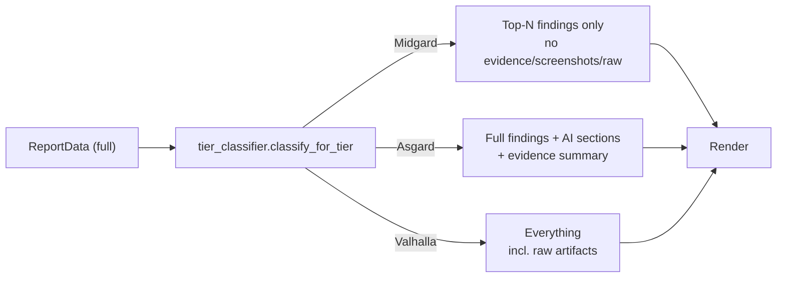

# ReportService — ARG-024 (Tier 1 / Midgard + machine-readable formats)

> Companion to [`reporting.md`](./reporting.md). This document scopes the
> **ARG-024** unified `ReportService` entry-point: tier × format
> generation through a single async coroutine, with byte-stable outputs
> aimed at **CI/CD pipelines** (SARIF, JUnit, JSON, CSV) and human
> consumers (HTML/PDF — Asgard, ARG-025).

**Code root:** `backend/src/reports/`
**Public symbol:** `from src.reports import ReportService, ReportTier, ReportFormat`

---

## Why this exists

The legacy `ReportGenerator` (RPT-003 → RPT-010) renders reports through
the Celery `argus.generate_report` pipeline and persists artifacts to
MinIO. That flow is great for batched, end-of-scan generation, but the
backlog (`Backlog/dev1_.md` §15) demands a **synchronous, on-demand**
surface that:

1. Returns rendered bytes directly to the API caller (no MinIO round-trip
   when the client just wants to download once).
2. Guarantees **byte-identical** output across runs for the same input
   (CI gates fail on noisy diffs).
3. Strips audience-inappropriate data (Midgard never leaks evidence /
   raw artifacts / screenshots).
4. Speaks the **3rd-party-tool dialects** that DevSecOps already wires up
   — SARIF v2.1.0 for GitHub code-scanning / Sonar / DefectDojo and
   JUnit XML for Jenkins / GitLab CI / Azure DevOps.

`ReportService` is that surface. The legacy pipeline still exists for
batched MinIO persistence; both call into the **same** generators
(`generators.py`, `sarif_generator.py`, `junit_generator.py`).

---

## Three tiers — one classifier



| Tier | Audience | Strips | Keeps top-N findings? |
|------|----------|--------|------------------------|
| **Midgard** (Tier 1) | CI/CD, SOC, ticket bots | evidence, screenshots, raw artifacts, HIBP details, timeline | **Yes — 10** (priority order) |
| **Asgard** (Tier 2) | Stakeholders, IT, dev leads | raw artifacts, internal HIBP rows | No (all) |
| **Valhalla** (Tier 3) | Internal red team, executives, multi-engagement | nothing | No (all) |

The cap at **10** Midgard findings is a hard `MIDGARD_TOP_FINDINGS`
constant in `src/reports/tier_classifier.py` and is intentionally
visible in tests so any change must update the snapshot fixture
`backend/tests/snapshots/reports/midgard_canonical.json` and friends.

Priority order: severity (`critical > high > medium > low > info`)
followed by deterministic title/CWE tie-break.

---

## Six formats

| Format | MIME type | File ext | Generator |
|--------|-----------|----------|-----------|
| `HTML` | `text/html; charset=utf-8` | `.html` | `generators.generate_html` (Jinja) |
| `PDF` | `application/pdf` | `.pdf` | `generators.generate_pdf` (WeasyPrint — native libs required) |
| `JSON` | `application/json; charset=utf-8` | `.json` | `generators.generate_json` |
| `CSV` | `text/csv; charset=utf-8` | `.csv` | `generators.generate_csv` |
| `SARIF` | `application/sarif+json` | `.sarif` | `sarif_generator.generate_sarif` |
| `JUNIT` | `application/xml; charset=utf-8` | `.xml` | `junit_generator.generate_junit` |

`ReportFormat` is a `StrEnum` so values round-trip transparently through
JSON request bodies (lower-case strings).

---

## Public API (Python)

### Render bytes for an arbitrary `ReportData`

```python
from src.reports import ReportService, ReportTier, ReportFormat

service = ReportService(tool_version="1.4.2")  # tool version embedded in SARIF/JUnit
bundle = service.render_bundle(
    data,
    tier=ReportTier.MIDGARD,
    fmt=ReportFormat.SARIF,
)

bundle.content        # raw bytes (sarif json)
bundle.sha256         # 64-hex SHA-256 over content (tamper evidence)
bundle.size_bytes     # == len(bundle.content)
bundle.mime_type      # "application/sarif+json"
bundle.file_extension()  # "sarif"
bundle.filename(stem="acme-prod-2026-04-19")  # "acme-prod-2026-04-19.sarif"
bundle.verify_sha256()   # True — recomputes and compares
```

`ReportBundle` is a Pydantic model with `frozen=True`; the response is
immutable.

### Render from PostgreSQL (tenant-scoped)

```python
bundle = await service.generate(
    tenant_id="t-acme",
    scan_id="scan-2026-04-19-001",          # OR report_id="...", but not both
    tier=ReportTier.MIDGARD,
    fmt=ReportFormat.JUNIT,
)
```

`generate()` enforces:
- `tenant_id` non-empty (defense-in-depth alongside RLS).
- exactly one of `scan_id` / `report_id` provided.
- failure modes raise `ReportNotFoundError` (HTTP 404 maps cleanly) or
  `ReportGenerationError` (HTTP 503 — e.g. WeasyPrint native libs
  missing on the host).

---

## Public API (HTTP)

`backend/src/api/routers/reports.py` exposes:

| Method | Path | Body | Response |
|--------|------|------|----------|
| `POST` | `/api/v1/reports/generate` | `GenerateReportRequest` | `StreamingResponse` (raw bytes + headers) |
| `GET`  | `/api/v1/reports/scans/{scan_id}` | — | List of stored `ReportSummary` rows (legacy MinIO pipeline) |
| `GET`  | `/api/v1/reports/scans/{scan_id}/{report_id}` | — | Download a stored report (legacy) |

The `POST /generate` endpoint is the **ARG-024 surface** — synchronous,
no MinIO involvement, always tenant-scoped.

### `GenerateReportRequest`

```jsonc
{
  "scan_id": "scan-2026-04-19-001",   // OR report_id; tenant comes from JWT
  "tier": "midgard",                   // midgard | asgard | valhalla
  "format": "sarif"                    // html | pdf | json | csv | sarif | junit
}
```

### Response headers

| Header | Value |
|--------|-------|
| `Content-Type` | `bundle.mime_type` |
| `Content-Length` | `bundle.size_bytes` |
| `Content-Disposition` | `attachment; filename="<report-stem>.<ext>"` |
| `X-Argus-Report-Tier` | `midgard` / `asgard` / `valhalla` |
| `X-Argus-Report-Format` | `sarif` / `json` / `junit` / ... |
| `X-Argus-Report-Sha256` | 64-hex SHA-256 of body (tamper evidence) |

The SHA-256 header lets a CI step verify that the bytes it processed
match what the API generated, with zero replay surface — recompute
locally, compare to the header.

---

## Determinism contract

Identical inputs MUST produce **byte-identical** outputs. This is locked
down at three layers:

1. **Generator level** — JSON keys are sorted (`sort_keys=True`), CSV
   columns are statically ordered, SARIF results are appended in
   priority order then *content*-fingerprinted (not random UUIDs), JUnit
   `<testcase>` ordering follows finding priority.
2. **Tier classifier** — `MIDGARD_TOP_FINDINGS` cap + stable severity /
   title sort key (no Python `set` iteration leaks).
3. **Snapshot tests** — `backend/tests/integration/reports/test_midgard_tier_all_formats.py`
   asserts byte-equality against `backend/tests/snapshots/reports/midgard_canonical.{json,csv,sarif,xml}`.
   Refresh goldens with:
   ```powershell
   $env:ARGUS_SNAPSHOT_REFRESH = "1"
   pytest backend/tests/integration/reports/test_midgard_tier_all_formats.py
   Remove-Item Env:\ARGUS_SNAPSHOT_REFRESH
   ```

If a generator change is intentional, refresh the goldens **and** call
it out in the PR description so reviewers don't accept a silent
regression.

---

## Security & redaction guardrails

| Guardrail | Where it lives | Test |
|-----------|----------------|------|
| Tenant isolation on all DB reads | `ReportService._load_report_data` (every `select` filters by `tenant_id`) | `tests/test_report_service.py::test_generate_*_tenant_scoped` |
| Midgard never leaks evidence/screenshots/raw | `tier_classifier._project_midgard` | `tests/integration/reports/test_midgard_tier_all_formats.py::test_midgard_strips_evidence_from_machine_outputs` |
| No raw secrets in CI artifacts | Generators inherit `redaction.scrub_secrets` on title/description fields | `tests/test_sarif_generator.py::test_redacts_*` |
| XML safety in JUnit | `junit_generator._xml_safe` strips control bytes; no external entities | `tests/test_junit_generator.py::test_xml_safe_*` |
| No subprocess / no shell-out | Pure Python in every generator | grep audit + CI lint |
| Tamper evidence | `ReportBundle.sha256` + `X-Argus-Report-Sha256` header | `tests/test_report_bundle.py::test_verify_sha256` |

---

## CI/CD integration recipes

### GitHub Actions — SARIF upload (Code Scanning)

```yaml
- name: Generate SARIF report
  run: |
    curl -fsS -H "Authorization: Bearer ${{ secrets.ARGUS_TOKEN }}" \
         -H "Content-Type: application/json" \
         -d '{"scan_id":"'"${{ env.ARGUS_SCAN_ID }}"'","tier":"midgard","format":"sarif"}' \
         "https://argus.example.test/api/v1/reports/generate" \
         -o argus.sarif

- name: Upload SARIF
  uses: github/codeql-action/upload-sarif@v3
  with:
    sarif_file: argus.sarif
    category: argus-pentest
```

The result appears in the **Security → Code scanning** tab. Each finding
shows its CWE, CVSS, OWASP category, and message — driven by the
`properties` block emitted in `sarif_generator.build_sarif_payload`.

### Jenkins — JUnit gate

```groovy
pipeline {
  stages {
    stage('ARGUS findings') {
      steps {
        sh '''
          curl -fsS -H "Authorization: Bearer $ARGUS_TOKEN" \
               -H "Content-Type: application/json" \
               -d "{\\"scan_id\\":\\"$ARGUS_SCAN_ID\\",\\"tier\\":\\"midgard\\",\\"format\\":\\"junit\\"}" \
               "https://argus.example.test/api/v1/reports/generate" \
               -o argus-junit.xml
        '''
        junit testResults: 'argus-junit.xml', allowEmptyResults: false
      }
    }
  }
}
```

Critical / High / Medium findings render as `<failure>` and fail the
build by default (Low / Info render as `<system-out>` so CI stays
green for informational findings — tune via the Jenkins JUnit plugin).

### GitLab CI — JUnit + JSON archives

```yaml
argus-pentest:
  stage: security
  script:
    - |
      curl -fsS -H "Authorization: Bearer $ARGUS_TOKEN" \
           -H "Content-Type: application/json" \
           -d "{\"scan_id\":\"$ARGUS_SCAN_ID\",\"tier\":\"midgard\",\"format\":\"junit\"}" \
           "https://argus.example.test/api/v1/reports/generate" \
           -o argus-junit.xml
    - |
      curl -fsS -H "Authorization: Bearer $ARGUS_TOKEN" \
           -H "Content-Type: application/json" \
           -d "{\"scan_id\":\"$ARGUS_SCAN_ID\",\"tier\":\"midgard\",\"format\":\"json\"}" \
           "https://argus.example.test/api/v1/reports/generate" \
           -o argus-findings.json
  artifacts:
    when: always
    reports:
      junit: argus-junit.xml
    paths:
      - argus-findings.json
```

### Excel / Sheets — CSV ingestion

```powershell
Invoke-RestMethod -Uri "https://argus.example.test/api/v1/reports/generate" `
  -Method Post `
  -Headers @{ Authorization = "Bearer $env:ARGUS_TOKEN"; "Content-Type" = "application/json" } `
  -Body '{"scan_id":"scan-2026-04-19-001","tier":"midgard","format":"csv"}' `
  -OutFile argus-midgard.csv

Start-Process .\argus-midgard.csv  # opens in Excel
```

CSV columns are stable across runs (severity ordering enforced by
`tier_classifier`). Leading row is the header — safe for direct
PivotTable / Power BI import.

### Defect tracker import (DefectDojo / ServiceNow)

DefectDojo's **Generic Findings Import** parser eats the JSON output
unchanged. Map fields:

| ARGUS JSON field | DefectDojo field |
|------------------|------------------|
| `severity` | `severity` |
| `title` | `title` |
| `description` | `description` |
| `cwe` (`CWE-89`) | `cwe` (`89`) |
| `cvss` | `cvss_v3` (parse score only) |
| `owasp_category` | `tags` |

The same mapping works for any tracker that consumes
`application/json`.

---

## Local development cheatsheet

```powershell
cd D:/Developer/Pentest_test/ARGUS/backend

# Unit tests for the ARG-024 modules
pytest tests/test_report_bundle.py tests/test_tier_classifier.py `
       tests/test_sarif_generator.py tests/test_junit_generator.py `
       tests/test_report_service.py -q

# Integration + snapshot tests
pytest tests/integration/reports -q

# Lint + types (scoped to ARG-024 modules)
ruff check src/reports
mypy --strict src/reports/report_service.py `
              src/reports/sarif_generator.py `
              src/reports/junit_generator.py `
              src/reports/tier_classifier.py `
              src/reports/report_bundle.py
```

---

## ARG-025 — Asgard tier (sanitised reproducer + presigned evidence)

ARG-025 layers the **Asgard** projection on top of the ARG-024
`ReportService` plumbing. The contract:

* **Audience:** the security team (red / blue / dev-leads). They get the
  *full* finding catalogue plus the reproducer commands they need to
  validate fixes — but with **zero raw secret material**.
* **No legacy rewrites:** the existing `generators.generate_html` /
  `generate_pdf` / `generate_json` / `generate_csv` are wired through
  the same `_render_format` dispatcher; we only add a thin
  `AsgardSectionAssembly` that lives in `jinja_context["asgard_report"]`
  and a `replay_command_sanitizer` that scrubs PoC reproducers in the
  tier classifier.

### Tier diff table (Midgard → Asgard delta)

| Section | Midgard | Asgard |
|---------|---------|--------|
| Top-N findings only | yes (≤10) | **no — full list** |
| Full finding objects | stripped | **kept** (+ remediation block) |
| `proof_of_concept.replay_command` | dropped | **kept, sanitised** |
| `proof_of_concept.reproducer` | dropped | **kept, sanitised** |
| Remediation block | dropped | **kept** (per-finding + program-level) |
| Timeline | dropped | **kept** |
| Phase outputs | dropped | **kept** (artefact metadata only) |
| Evidence + presigned URLs | dropped | **kept** (`presigner` callback) |
| Screenshots (presigned) | dropped | **kept** (`presigner` callback) |
| AI insights | dropped | **kept** |
| Raw artefact dumps | dropped | **still dropped** (Valhalla-only) |
| HIBP password rows | dropped | **still dropped** (Valhalla-only) |

### `replay_command_sanitizer` guarantees

`backend/src/reports/replay_command_sanitizer.py` exposes a single pure
function and a frozen Pydantic context model:

```python
from src.reports.replay_command_sanitizer import (
    SanitizeContext,
    sanitize_replay_command,
)

ctx = SanitizeContext(
    target="https://acme.example.com",
    endpoints=("https://acme.example.com/api/users/42",),
    canaries=("CANARY-OBS-1",),
)
sanitize_replay_command(
    ["curl", "-H", "Authorization: Bearer eyJ...", "https://acme.example.com/r?token=CANARY-OBS-1"],
    ctx,
)
# → ['curl', '-H', 'Authorization: Bearer [REDACTED-BEARER]', '{ASSET}/r?token=CANARY-OBS-1']
```

**Contract (NIST SP 800-204D §5.1.4 / OWASP ASVS L2 §V8):**

* **Pure** — no I/O, no logging, no globals; idempotent (running the
  function on its own output is a no-op).
* **Zero-tolerance** — every span matched by a secret regex is replaced
  with a stable `[REDACTED-…]` placeholder, not just masked. ≥50 known
  secret / destructive patterns are sweep-tested in
  `backend/tests/security/test_report_no_secret_leak.py` against both
  the sanitiser **and** the end-to-end ReportBundle bytes for every
  output format.
* **Canary preservation** — operator-supplied `SanitizeContext.canaries`
  are exact-substring protected: any token that contains a canary is
  passed through verbatim (so OAST / blind-XSS markers stay legible).
* **Destructive flag stripping** — argv tokens whose lower-case form
  equals an entry of `_DENY_FLAGS` (`--rm`, `-rf`, `--force`,
  `--no-confirm`, `--insecure`, `--ignore-cert`, …) are dropped from
  the output; safer than trying to "neutralise" them in-place because
  pentest reports MUST never paste a one-shot destructive command.
* **Target / endpoint substitution** — `SanitizeContext.target` →
  `{ASSET}`; each `SanitizeContext.endpoints` entry → `{ENDPOINT}` so
  reports can be shared without leaking customer URLs.

Pattern catalogue (one-line view — see source for exact regex):

| Class | Examples |
|-------|----------|
| Bearer / JWT | `Bearer ey…`, three-segment JWT, `Cookie: session=ey…` |
| AWS | `AKIA…`, `ASIA…`, `aws_secret_access_key=…` |
| GCP / Azure | `AIza…`, `SharedAccessKey=…`, `azure_*_secret=…` |
| Source control | `ghp_…`, `ghs_…`, `gho_…`, `ghu_…`, `ghr_…`, `glpat-…` |
| SaaS | `xox[bpos]-…`, Stripe `sk_*` / `pk_*` keys, `AC<32 hex>`, `SG.<id>.<secret>`, `key-<32 hex>` |
| Generic kv | `api_key=…`, `token=…`, `authentication=…`, `secret=…`, `client_secret=…` |
| Password flags | `--password VALUE`, `--password=VALUE`, `-p=VALUE`, `--token VALUE` |
| NT / LM | `aad3b…:31d6c…`, `nt_hash=<32 hex>`, standalone `aad3b…` |
| Private keys | `-----BEGIN [RSA / EC / DSA / OPENSSH / ENCRYPTED] PRIVATE KEY-----` (full block or header + body fragment) |
| Reverse shells | `bash -i >& /dev/tcp/…`, `nc -e`, `import socket`, `pty.spawn`, `\| sh`, `\| bash`, `IEX (…)`, `Invoke-Expression`, `DownloadString(…)`, `mkfifo` |

### Asgard rendering API

```python
from src.reports import ReportService, ReportTier, ReportFormat
from src.reports.replay_command_sanitizer import SanitizeContext

service = ReportService(tool_version="2026.04.19")
ctx = SanitizeContext(target="https://acme.example.com")

def presign(object_key: str) -> str | None:
    return s3.generate_presigned_url("get_object",
        Params={"Bucket": "argus-evidence", "Key": object_key},
        ExpiresIn=900,
    )

bundle = service.render_bundle(
    data,
    tier=ReportTier.ASGARD,
    fmt=ReportFormat.HTML,
    sanitize_context=ctx,
    presigner=presign,
)
```

`presigner` is *optional*; when absent the assembly emits
`presigned_url=None` and the report still renders cleanly with the bare
object key. `sanitize_context` is also optional — the tier classifier
falls back to a minimal context built from `data.target`.

### Snapshot regen recipe (Asgard)

```powershell
cd D:/Developer/Pentest_test/ARGUS/backend
$env:ARGUS_SNAPSHOT_REFRESH = "1"
pytest tests/integration/reports/test_asgard_tier_all_formats.py -q
Remove-Item Env:\ARGUS_SNAPSHOT_REFRESH
```

Snapshots produced:

| File | What it locks |
|------|---------------|
| `asgard_canonical.html` | Bytewise stable Jinja output (template + context drift gate) |
| `asgard_canonical.json` | Includes `asgard_report` block + sanitised PoCs |
| `asgard_canonical.csv` | LF-terminated, severity-sorted rows |
| `asgard_canonical.sarif` | SARIF v2.1.0 — no PoC bodies (intentional) |
| `asgard_canonical.xml`  | JUnit XML — sanitised PoC in `<system-out>` |

PDF is not snapshotted byte-for-byte (WeasyPrint embeds a creation
timestamp); instead `test_asgard_pdf_structural_snapshot` asserts: PDF
magic header, ≥1 page, presence of "Asgard"/finding title in extracted
text, and presence of the `[REDACTED-BEARER]` placeholder.

### Security gate (must stay green)

`backend/tests/security/test_report_no_secret_leak.py` is the
zero-tolerance contract:

* `test_sanitiser_strips_pattern[*]` — every catalogue entry is fed to
  `sanitize_replay_command` and the high-entropy needle MUST be absent
  from the output.
* `test_no_pattern_leak_in_asgard_output[*-{html,json,csv,sarif,junit}]`
  — same patterns, but threaded through `ReportService.render_bundle`
  for the Asgard tier; no needle may survive in any output format.
* `test_canary_token_is_preserved` — operator-supplied canary is still
  visible in the rendered bundle.
* `test_destructive_flags_stripped_end_to_end` — `--rm`, `-rf`,
  `--force` never appear as quoted argv tokens in the JSON bundle.
* `test_defence_regexes_catch_nothing_in_clean_asgard_output` — a
  finding with no secret content produces no false positives.

When you add a new secret class to the sanitiser **you MUST also**
append a row to `SECRET_PATTERNS` so the catalogue stays in lockstep
with the regex set.

---

## ARG-031 — Valhalla tier (executive / CISO / Board lens)

`backend/src/reports/valhalla_tier_renderer.py` is the third (and final)
ReportService tier. It mirrors the Asgard structural pattern (frozen
Pydantic assembly + pure-function builder + Jinja projector) but
raises the audience to the **executive** layer:

* **Risk-quantification per asset** — composite score
  `max(cvss_v3) × business_value_weight × exploitability_factor`,
  sorted desc, capped at 50 rows.
* **OWASP Top-10 (2025) rollup matrix** — categories × severity bins
  (`A01..A10` plus an `A00` *Other / Unmapped* bucket for findings
  that have neither `owasp_category` nor a CWE → OWASP-2025 mapping).
* **Top-N findings by business impact** — composite score sort, capped
  at 25, every reproducer threaded through `sanitize_replay_command`.
* **Auto-generated executive summary paragraph** — deterministic
  template fill (no LLM by default; the LLM path would defeat the
  byte-stable snapshot contract).
* **Remediation roadmap** — four-phase bucketing
  (P0 ≤ 7d, P1 ≤ 30d, P2 ≤ 90d, P3 backlog) by severity.
* **Evidence references** — same `presigner` callback as Asgard.
* **Pipeline timeline** — chronological extract from
  `ReportData.timeline` for context.

### Tier diff matrix (Midgard ↔ Asgard ↔ Valhalla)

| Section | Midgard | Asgard | Valhalla |
|---------|---------|--------|----------|
| Top-N findings only | yes (≤10) | no — full list | top-25 by business impact |
| Sanitised reproducers | yes (defence-in-depth) | yes (primary surface) | yes (in `BusinessImpactFindingRow.sanitized_command`) |
| Per-finding remediation | dropped | kept | replaced by phased roadmap |
| Risk quantification per asset | dropped | dropped | **new (composite score)** |
| OWASP rollup matrix | dropped | dropped | **new (10+1 × 5 grid)** |
| Remediation roadmap (P0..P3) | dropped | dropped | **new** |
| Executive summary paragraph | summary text | summary text | **deterministic template fill** |
| Evidence + presigned URLs | dropped | kept (table) | kept (executive table) |
| Pipeline timeline | dropped | kept | kept (compact) |
| AI insights / raw artefacts | dropped | AI yes / raw no | preserved (legacy block) |
| HIBP password rows | dropped | dropped | preserved (legacy block) |

### Valhalla rendering API

```python
from src.reports import (
    ReportService,
    ReportTier,
    ReportFormat,
    BusinessContext,
)
from src.reports.replay_command_sanitizer import SanitizeContext

service = ReportService(tool_version="2026.04.19")
sanitize_ctx = SanitizeContext(target="https://acme.example.com")
business_ctx = BusinessContext(
    asset_business_values=(
        ("payments.acme.example.com", 5.0),
        ("app.acme.example.com", 3.0),
        ("www.acme.example.com", 1.0),
    ),
    default_business_value=1.0,
)

bundle = service.render_bundle(
    data,
    tier=ReportTier.VALHALLA,
    fmt=ReportFormat.HTML,
    sanitize_context=sanitize_ctx,
    business_context=business_ctx,
    presigner=presign,
)
```

`business_context` is *optional* — when omitted every asset defaults
to a business value of `1.0`, so the composite score collapses to
`max(cvss) × exploitability_factor`. Adding the operator's real
asset → business-value mapping is what gives the executive view its
risk-tiering signal.

### Branded template recipe

The executive section is rendered by a single partial:
`backend/src/reports/templates/reports/partials/valhalla/executive_report.html.j2`.
Inline CSS (gold `#c9a64a` on dark-grey `#1f1f24` / `#2a2a30`) is
scoped to `.valhalla-exec` so it never bleeds into the rest of the
Valhalla page. To re-brand:

1. Edit the `.valhalla-exec` block at the top of the partial — only
   colour variables and the executive header logo need to change.
2. To add an operator logo, drop a base64-encoded PNG into the
   `<dl class="meta-grid">` block near the top of the section.
3. Refresh the snapshots (see recipe below) — the bytewise gate will
   immediately catch any accidental drift.

### JSON contract

```jsonc
{
  "report_id": "…",
  "valhalla_report": { /* legacy operator view (preserved) */ },
  "valhalla_executive_report": {
    "title_meta": { "tenant_id": "…", "scan_id": "…", "report_id": "…",
                     "target": "…", "created_at": "…" },
    "executive_summary": "During scan … ARGUS identified N findings …",
    "executive_summary_counts": { "critical": 1, "high": 2, … },
    "risk_quantification_per_asset": [ { "asset": "…",
        "max_cvss": 9.8, "business_value": 5.0,
        "exploitability_factor": 1.0,
        "composite_score": 49.0, … } ],
    "owasp_rollup_matrix": [ { "category_id": "A05",
        "title": "Injection", "critical": 1, "high": 1, … } ],
    "top_findings_by_business_impact": [ { "rank": 1, "title": "…",
        "severity": "critical", "owasp_category": "A05",
        "composite_score": 49.0, "asset": "…",
        "sanitized_command": ["curl", "[REDACTED-BEARER]", …] } ],
    "remediation_roadmap": [ { "phase_id": "P0",
        "sla_days": 7, "severity_bucket": "critical",
        "finding_count": 1, "top_finding_titles": ["…"] } ],
    "evidence_refs": [ { "finding_id": "f1",
        "object_key": "evidence/sqli/dump.txt",
        "presigned_url": "https://signed.example/…" } ],
    "timeline_entries": [ { "order_index": 0,
        "phase": "recon", "snippet": "…",
        "created_at": "2026-04-19T10:00:00Z" } ]
  }
}
```

The legacy `valhalla_report` (operator view) and the new
`valhalla_executive_report` (executive lens) coexist intentionally —
back-compat with the pre-ARG-031 Valhalla payload is preserved.

### Snapshot regen recipe (Valhalla)

```powershell
cd D:/Developer/Pentest_test/ARGUS/backend
$env:ARGUS_SNAPSHOT_REFRESH = "1"
pytest tests/integration/reports/test_valhalla_tier_all_formats.py -q -m ""
Remove-Item Env:\ARGUS_SNAPSHOT_REFRESH
```

Snapshots produced (5 byte-stable files; PDF is structural-only):

| File | What it locks |
|------|---------------|
| `valhalla_canonical.html` | Bytewise stable Jinja output (template + executive context drift gate) |
| `valhalla_canonical.json` | Includes `valhalla_executive_report` blob + sanitised `top_findings_by_business_impact[].sanitized_command` |
| `valhalla_canonical.csv`  | LF-terminated, severity-sorted rows |
| `valhalla_canonical.sarif` | SARIF v2.1.0 — no PoC bodies (intentional) |
| `valhalla_canonical.xml`  | JUnit XML — sanitised PoC in `<system-out>` |

PDF is asserted via `test_valhalla_pdf_structural_snapshot` (PDF magic
header + ≥ 1 page) — the same approach as Asgard.

### Security gate (extended)

The `test_report_no_secret_leak` contract was extended in ARG-031 from
**Asgard-only** to the full tier matrix:

* parametrise grid: 3 tiers × 6 formats × 55 patterns = **990 cases**;
* `_project_midgard` now also runs the sanitiser over reproducer
  fields (defence-in-depth — additive change, idempotent;
  the Midgard JSON view still surfaces `proof_of_concept`);
* PDF rows skip gracefully when WeasyPrint is unavailable on the
  developer host; the CI WeasyPrint job runs them green.

---

## ARG-036 — PDF templating polish

ARG-036 promotes PDF reporting from a generic stub to a **production-grade,
branded, deterministic** surface. Three independent layers were added on
top of the existing tier × format dispatch:

* a thin **PDF backend abstraction** (`backend/src/reports/pdf_backend.py`)
  with a `Protocol` plus three concrete implementations — WeasyPrint (default),
  LaTeX (Phase-1 stub via `latexmk`), and Disabled (graceful no-op);
* **per-tier branded HTML/CSS templates** under `backend/templates/reports/<tier>/`
  with bundled WOFF2 fonts in `backend/templates/reports/_fonts/`;
* a deterministic **SHA-256 watermark** computed from
  `(tenant_id, scan_id, scan_completed_at)` so the same scan always yields
  the same watermark on the cover page.

### PDF Backends — WeasyPrint vs LaTeX trade-offs

| Concern | `WeasyPrintBackend` (default) | `LatexBackend` (fallback) | `DisabledBackend` |
|---------|-------------------------------|----------------------------|---------------------|
| **Native deps** | Pango, Cairo, GDK-PixBuf, Glib, Fontconfig (via GTK runtime on Windows) | TeX Live / MiKTeX with `latexmk` on PATH | none |
| **Render fidelity** | Full HTML + CSS3 (Grid, Flex, `@page`), bundled fonts, executable in pure Python | Phase-1: plain-text PDF (HTML stripped); Phase-2 (Cycle 5): per-tier `jinja2-latex` templates with parity to WeasyPrint | none — returns `False` |
| **Determinism** | Strong (creation date pinned to `scan.completed_at`, font subsets, no wall-clock metadata) | Strong (LaTeX is reproducible; we pin the same creation-date convention in the preamble) | n/a |
| **Cold-start speed** | ~80 ms per render (font config caches) | ~2–4 s (latexmk spawns LaTeX engine 2–3 times for refs/TOC) | <1 ms |
| **Build size** | 22 MB image (cairo/pango libs) | 350 MB image (TeX Live minimal) — recommended only on the dedicated CI lane | 0 MB |
| **Failure mode** | `ImportError` / `OSError` on missing native libs → `RuntimeError` (HTTP 503) | `subprocess.TimeoutExpired` / non-zero exit → `RuntimeError` (HTTP 503) | always `RuntimeError` (HTTP 503 by design) |
| **When to use** | Default for every API host that ships the GTK runtime | Air-gapped customer install where Pango/Cairo are blocked but TeX Live is approved | Operator override for hosts that intentionally never produce PDFs (PDF format is hidden from the bundle) |

The backend is selected by the `REPORT_PDF_BACKEND` env var (case-insensitive,
default `weasyprint`). When the requested backend reports `is_available() ==
False` we walk the fallback chain `weasyprint → latex → disabled`. The chain
**never raises** — `DisabledBackend.is_available()` is always `True` and
its `render()` returns `False`, which the API layer maps to HTTP 503 (or
silently drops PDF from the multi-format bundle).

```powershell
# Force the LaTeX backend (assumes latexmk is on PATH)
$env:REPORT_PDF_BACKEND = "latex"
pytest backend/tests/integration/reports/test_pdf_branded.py::test_latex_backend_renders_minimal_pdf -m "" -q

# Disable PDF entirely (operator hardening — useful in airgapped tenants)
$env:REPORT_PDF_BACKEND = "disabled"
```

> **Phase-1 LaTeX caveat (historical).** The Cycle-4 `LatexBackend`
> only proved the dispatch chain works: it stripped HTML to plain text,
> escaped LaTeX special characters, wrapped in a minimal preamble, and
> ran `latexmk -pdf -interaction=nonstopmode`. Tier-specific layouts
> were scaffolded in
> `backend/templates/reports/_latex/{midgard,asgard,valhalla}/main.tex.j2`
> ready for the Cycle-5 `jinja2-latex` wiring (plan §3 ARG-036 Phase-2).
> ARG-048 (this section) closes that gap.

#### LaTeX Phase-2 backend (ARG-048)

ARG-048 wires the per-tier templates through a Jinja2 environment
configured for LaTeX safety:

* `src.reports.pdf_backend.render_latex_template(tier, context)` loads
  `backend/templates/reports/_latex/<tier>/main.tex.j2`, registers two
  custom filters (`latex_escape`, `latex_truncate`) and renders a
  full LaTeX source string.
* `LatexBackend.render(..., latex_template_content=<source>)` writes
  that source verbatim to a tempdir and runs `latexmk` with
  `-pdfxe` when `xelatex` is on PATH (preferred — best UTF-8 + fontspec
  support) and `-pdf` (pdflatex) otherwise. The detection happens once
  per render in `LatexBackend._engine_flag()`.
* The Phase-1 fallback (HTML stripped → minimal preamble) remains in
  place: `LatexBackend.render(..., latex_template_content=None)` still
  works, so any caller that does not pass a pre-rendered template
  string keeps the Cycle-4 behaviour.
* Templates use **vanilla** Jinja2 (not `jinja2-latex`'s alternate
  block syntax) so the rendering pipeline stays obvious to future
  maintainers. Every user-controlled placeholder MUST go through the
  `latex_escape` filter — see the in-template `{# ... #}` comments at
  the top of `midgard/main.tex.j2` for the canonical contract.

When to enable
^^^^^^^^^^^^^^

Enable LaTeX Phase-2 when **either** of:

1. The deployment cannot install Pango / Cairo (e.g. air-gapped Windows
   tenants where the GTK runtime is blocked but TeX Live is approved).
2. The tenant requires LaTeX-grade typography (full hyphenation,
   booktabs, longtable continuation rows) that WeasyPrint cannot match.

The default (`REPORT_PDF_BACKEND=weasyprint`) is still recommended for
every cloud / managed deployment because cold-start is ~50× faster
(~80 ms vs ~2–4 s).

Parity guarantee
^^^^^^^^^^^^^^^^

`backend/tests/integration/reports/test_latex_phase2_parity.py` enforces:

1. Both backends emit non-empty `%PDF-` prefixed bytes for every tier.
2. Tenant id, scan id and target string survive into both PDFs verbatim.
3. Severity headlines (`Critical`, `High`, …) appear in both outputs
   case-insensitively.
4. Critical-severity finding titles (e.g. *SQL Injection*, *Remote Code
   Execution*) survive into the Asgard / Valhalla rendering of both
   backends.
5. The redaction pipeline behaves no worse on LaTeX than on WeasyPrint
   — if WeasyPrint successfully redacted a secret, LaTeX MUST too.
   (The full 990-case redaction grid lives in
   `tests/security/test_report_no_secret_leak.py`.)

The parity job is gated by `@pytest.mark.requires_latex` and skipped
on hosts without `xelatex` / `latexmk`. CI runs the LaTeX lane
separately (the dedicated `requires_latex` GitHub Actions job).

```powershell
# Verify Phase-2 plumbing locally (Windows + MiKTeX or TeX Live)
$env:REPORT_PDF_BACKEND = "latex"
pytest backend/tests/integration/reports/test_latex_phase2_parity.py `
    -m "requires_latex" -q
```

### Branded Templates — designer customisation guide

The branded templates are **self-contained** — they do **not** extend
`base.html.j2` (which is screen-oriented and would conflict with PDF
`@page` rules). Each tier has its own directory:

```
backend/templates/reports/
├── _fonts/                       ← bundled WOFF2 fonts (Inter + DejaVu Sans)
│   ├── Inter-Regular.woff2
│   ├── Inter-Bold.woff2
│   ├── Inter-Italic.woff2
│   ├── DejaVuSans.woff2
│   └── README.md                 ← font sources + licences
├── midgard/
│   ├── pdf_layout.html           ← cover → exec summary → top findings
│   └── pdf_styles.css            ← #1a3a8c blue brand
├── asgard/
│   ├── pdf_layout.html           ← cover → TOC → exec summary → full findings → remediation
│   └── pdf_styles.css            ← #c46410 orange brand
└── valhalla/
    ├── pdf_layout.html           ← cover → TOC → risk-quant → OWASP rollup → roadmap
    └── pdf_styles.css            ← #c9a64a gold-on-charcoal brand
```

`generators._render_branded_pdf_html` loads each tier directory through
its own `FileSystemLoader` so the `<link rel="stylesheet" href="pdf_styles.css">`
and `@font-face` `url("../_fonts/...")` references resolve relative to the
HTML's `base_url`. WeasyPrint receives `base_url=str(template.parent)` —
**no absolute paths anywhere**, which keeps the layout portable across
container builds.

**To rebrand for a customer:**

1. Copy the source-of-truth tier directory to a new location (e.g. an
   `acme/midgard/` overlay) — keep the `pdf_layout.html` /
   `pdf_styles.css` filenames so the renderer finds them.
2. Edit only the CSS variables in `pdf_styles.css` (`--argus-primary`,
   `--argus-primary-dark`, `--argus-accent`, `--argus-surface`, …).
   The HTML structure does not need touching for a colour rebrand.
3. Drop the new logo SVG into the `<svg>` block at the top of
   `pdf_layout.html` (inline SVG keeps the cover page deterministic —
   no remote asset fetches).
4. (Optional) Replace the WOFF2 fonts in `_fonts/` — keep the same file
   names so the CSS does not need patching, **or** patch the
   `@font-face src` URLs.
5. Refresh snapshots — WeasyPrint embeds font subset hashes that change
   when fonts are swapped:

   ```powershell
   $env:ARGUS_SNAPSHOT_REFRESH = "1"
   pytest backend/tests/integration/reports/test_pdf_branded.py -m "" -q
   Remove-Item Env:\ARGUS_SNAPSHOT_REFRESH
   ```

The Jinja context shape is **identical** to the screen templates —
`tenant_id`, `scan_id`, `scan_completed_at`, `severity_counts`,
`findings`, `valhalla_executive_report`, `asgard_report`, etc. plus
two ARG-036 additions:

* `pdf_watermark` — 16-hex SHA-256 of `(tenant_id, scan_id, scan_completed_at)`;
* `scan_completed_at` — ISO-8601 timestamp (mirrors `data.created_at`),
  used for the cover-page "Issued" row and the PDF `CreationDate`
  metadata.

### PDF determinism guarantees

The same `ReportData` MUST produce a PDF whose **extracted text** is
byte-identical across renders. Three layers enforce that contract:

1. **Pinned PDF metadata** (`pdf_backend.WeasyPrintBackend.render`):
   `Creator = "ARGUS Cycle 4"`, `Title = "ARGUS Security Report"`,
   `Author = ["ARGUS"]`, `CreationDate = ModDate = scan.completed_at`.
   No `datetime.now()` calls anywhere on the PDF path — that would
   break snapshot diffs across CI runs.
2. **Deterministic watermark** (`generators._compute_pdf_watermark`):
   `SHA-256(tenant_id | scan_id | scan_completed_at)[:16]`. We hash the
   *input* tuple, not the rendered bytes — hashing the bytes would be
   circular (the hash would change every render).
3. **Bundled WOFF2 fonts** in `backend/templates/reports/_fonts/` —
   prevents host-font drift between dev / CI / prod containers.

The Cycle-4 snapshot contract for PDFs is **textual + structural**, not
byte-for-byte. WeasyPrint embeds font-subset hashes that vary across
upstream releases, so the integration test
(`tests/integration/reports/test_pdf_branded.py::test_weasyprint_branded_pdf_text_is_deterministic`)
asserts that two consecutive renders produce identical extracted text
across all pages. Adopting strict byte-equality would falsely fail on
every WeasyPrint upgrade.

### System package requirements

| Backend | Linux (Debian/Ubuntu) | macOS (Homebrew) | Windows |
|---------|------------------------|-------------------|---------|
| `weasyprint` | `apt-get install -y libpango-1.0-0 libpangoft2-1.0-0 libcairo2 libgdk-pixbuf2.0-0 libffi-dev` | `brew install pango cairo gdk-pixbuf libffi` | install [GTK 3 for Windows runtime](https://github.com/tschoonj/GTK-for-Windows-Runtime-Environment-Installer/releases) **then** add `C:\Program Files\GTK3-Runtime Win64\bin` to `PATH` |
| `latex` | `apt-get install -y texlive-latex-extra texlive-fonts-recommended latexmk` | `brew install --cask mactex` *or* `brew install mactex-no-gui` | install [MiKTeX](https://miktex.org/download), then add `C:\Users\<you>\AppData\Local\Programs\MiKTeX\miktex\bin\x64` to `PATH`; install `latexmk` via `mpm --install=latexmk` |
| `disabled` | none | none | none |

**CI lanes** (`.github/workflows/ci.yml`):

* The default backend job installs the WeasyPrint native libs and runs
  the full `pytest` matrix.
* A dedicated `pdf-latex` job installs `texlive-latex-extra` +
  `latexmk` and runs `pytest -m requires_latex` so the LaTeX backend
  ships with green test coverage even when WeasyPrint is unavailable.
* The dev `pytest` defaults skip both classes of test
  (`-m "not requires_docker"` and the `requires_latex` marker is
  evaluated lazily by `LatexBackend.is_available()`), so a developer
  with neither toolchain installed sees a clean pass.

To verify locally:

```powershell
cd D:/Developer/Pentest_test/ARGUS/backend

# Default WeasyPrint path (skips on missing GTK runtime)
pytest tests/integration/reports/test_pdf_branded.py -m "" -q

# Force the LaTeX path (requires latexmk on PATH)
$env:REPORT_PDF_BACKEND = "latex"
pytest tests/integration/reports/test_pdf_branded.py::test_latex_backend_renders_minimal_pdf -m "" -q
Remove-Item Env:\REPORT_PDF_BACKEND
```

---

## Related docs

- [`docs/reporting.md`](./reporting.md) — legacy RPT-003 → RPT-010 batched
  pipeline (Celery + MinIO persistence); still the path for
  end-of-scan auto-generation.
- [`docs/scan-state-machine.md`](./scan-state-machine.md) — six-phase
  lifecycle; `reporting` is phase 6.
- [`docs/api-contracts.md`](./api-contracts.md) — full OpenAPI catalog;
  `POST /api/v1/reports/generate` is the ARG-024 contract entry.
- [`docs/security.md`](./security.md) — tenant isolation, RLS,
  redaction baseline.
- [`backend/templates/reports/_fonts/README.md`](../backend/templates/reports/_fonts/README.md)
  — bundled font inventory, licences, and replacement procedure.
