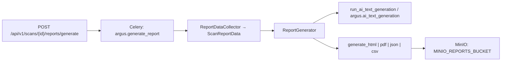

# Reporting (ARGUS) — RPT-010

End-to-end **stage 5 — `reporting` phase** in the [6-phase scan lifecycle](./scan-state-machine.md): recon → threat_modeling → vuln_analysis → exploitation → post_exploitation → **reporting**. Tracks **RPT-003 … RPT-010** (data collection, AI sections, Celery, templates, PDF, API, docs).

**Code root:** `ARGUS/backend/` — Python modules below are `backend/src/...`.

---

## Architecture overview



| Component | Module | Role |
|-----------|--------|------|
| **ReportDataCollector** | `src/reports/data_collector.py` | Async load: scan, optional report row, timeline, phase I/O, findings; optional MinIO stage1–4 artifacts into `ScanReportData`. |
| **ScanReportData** | `src/reports/data_collector.py` | Pydantic aggregate: DB slices + `StageArtifactsBundle` per stage (no raw secrets in public API responses). |
| **ReportGenerator** | `src/services/reporting.py` | Orchestrates collect → AI sections by tier → Jinja context → `ReportData` for byte generators. |
| **Report pipeline** | `src/reports/report_pipeline.py` | `run_generate_report_pipeline`: `generation_status` `processing` → render → upload → `ReportObject` rows → `ready` / `failed`. |
| **Generators** | `src/reports/generators.py` | `generate_html`, `generate_pdf`, `generate_json`, `generate_csv`; `build_report_data_from_scan_report` bridges RPT-003 → export model. |
| **Jinja** | `src/reports/jinja_minimal_context.py`, `template_env.py` | Tiered templates (RPT-008); minimal context when only `ReportData` is available (e.g. download regenerate path). |

---

## Celery tasks

| Task name | Queue | Definition | Purpose |
|-----------|-------|------------|---------|
| **`argus.generate_report`** | `argus.reports` | `src/tasks.py` → `generate_report_task` | Full pipeline: `run_generate_report_pipeline` (sync AI, configured formats, MinIO upload). |
| **`argus.generate_all_reports`** | `argus.reports` | `src/tasks.py` → `generate_all_reports_task` | Bulk generate: one DB row per **tier × format** (default **3 tiers × 4 formats = 12** rows). Runs `run_generate_report_pipeline` once per `report_id` (bounded concurrency). If the client supplies `formats` with length **M**, there are **3×M** rows and the HTTP response’s `report_ids` / `count` match that total. |
| **`argus.ai_text_generation`** | `argus.reports` | `src/tasks.py` → `ai_text_generation_task` | One RPT-004 section; used when `ReportGenerator.build_context(..., sync_ai=False)` enqueues per-section work (or future parallel AI). |

Routes: `src/celery_app.py` (`task_routes`). Legacy alias `generate_report` may still map to the same handler — see `tasks.py`.

**Parallelism note** (`argus.generate_all_reports`): The API enqueues **one** Celery task with the full `report_ids` list; inside the task, `run_generate_report_pipeline` runs for each id with bounded concurrency (semaphore, e.g. 4 at a time).

### Automatic generate-all after a full scan (RPT-001–RPT-004)

When the scan state machine finishes **successfully** (all phases through `reporting`, scan status `completed`), the backend enqueues the same bundle as `POST /scans/{scan_id}/reports/generate-all` with **default formats** (3 tiers × 4 formats = **12** `Report` rows) without a separate API call.

- **Hook:** `src/orchestration/state_machine.py` — immediately before the final `commit` that marks the scan complete, `enqueue_generate_all_bundle(..., set_post_scan_idempotency_flag=True)` creates the rows and sets `Scan.options["_argus_post_scan_generate_all_bundle_id"]` to the new `bundle_id`. After `commit`, `schedule_generate_all_reports_task_safe` calls `generate_all_reports_task.delay(...)`.
- **Shared logic:** `src/reports/bundle_enqueue.py` — used by both the HTTP endpoint (`src/api/routers/scans.py`) and the completion hook so row shape, metadata (`bundle_id`, `generate_all`, optional `source: post_scan_complete`), and Celery payload stay aligned.
- **Idempotency:** If `_argus_post_scan_generate_all_bundle_id` is already set (e.g. retry or duplicate completion path), a second bundle is **not** created and the task is **not** scheduled again.
- **MinIO keys:** Unchanged — `{tenant_id}/{scan_id}/reports/{tier}/{report_id}.{fmt}` via `build_report_object_key` / `upload_report_artifact` inside `run_generate_report_pipeline`.

---

## Tiers: Midgard / Asgard / Valhalla

Defined in `src/services/reporting.py`: `REPORT_TIERS`, `report_tier_sections`, `normalize_report_tier`. API: `POST .../reports/generate` body field **`type`**: `midgard` \| `asgard` \| `valhalla`.

| Tier | Section keys (prompt registry) | Focus |
|------|-------------------------------|--------|
| **Midgard** | `executive_summary`, `vulnerability_description` | Short executive + vuln narrative. |
| **Asgard** | Midgard + `remediation_step`, `business_risk`, `compliance_check` | Technical depth + risk/compliance. |
| **Valhalla** | `executive_summary_valhalla` (replaces plain executive in tier map) + Asgard set + `prioritization_roadmap`, `hardening_recommendations` | Leadership + technical roadmap. |

`prepare_template_context` exposes `jinja.{tier}.slots` and `tier_stubs` (Valhalla: `focus: leadership_technical`).

---

## Prompts (RPT-004) — section keys

Constants in `src/orchestration/prompt_registry.py` (see also [prompt-registry.md](./prompt-registry.md)):

| Section key | Typical constant prefix |
|-------------|-------------------------|
| `executive_summary` | `REPORT_AI_SECTION_EXECUTIVE_SUMMARY` |
| `executive_summary_valhalla` | `REPORT_AI_SECTION_EXECUTIVE_SUMMARY_VALHALLA` |
| `vulnerability_description` | `REPORT_AI_SECTION_VULNERABILITY_DESCRIPTION` |
| `remediation_step` | `REPORT_AI_SECTION_REMEDIATION_STEP` |
| `business_risk` | `REPORT_AI_SECTION_BUSINESS_RISK` |
| `compliance_check` | `REPORT_AI_SECTION_COMPLIANCE_CHECK` |
| `prioritization_roadmap` | `REPORT_AI_SECTION_PRIORITIZATION_ROADMAP` |
| `hardening_recommendations` | `REPORT_AI_SECTION_HARDENING_RECOMMENDATIONS` |

Prompt bodies and versions: `REPORT_AI_PROMPT_VERSIONS`, `get_prompt` / reporting helpers in the same registry. Runtime: `run_ai_text_generation` (`src/reports/ai_text_generation.py`) resolves by section key and caches in Redis under prefix **`argus:ai_text:`** (see `build_ai_text_cache_key`).

---

## Export formats

| Format | Content-Type | Notes |
|--------|--------------|--------|
| `html` | `text/html; charset=utf-8` | Tiered Jinja (RPT-008), `template_env.render_tier_report_html`. |
| `pdf` | `application/pdf` | WeasyPrint (RPT-009); HTML → PDF. |
| `json` | `application/json; charset=utf-8` | Stable ordering in `generators.py`. |
| `csv` | `text/csv; charset=utf-8` | Tabular export. |

Default when explicit/requested list is empty after validation: `html`, `json`, `csv`, `pdf` (`report_pipeline.DEFAULT_REPORT_FORMATS`).

---

## HTTP API (prefix `/api/v1`)

| Method | Path | Status | Description |
|--------|------|--------|-------------|
| POST | `/scans/{scan_id}/reports/generate` | **202** | Body: `type` (tier), `formats[]`. Creates `Report` (`generation_status=pending`), enqueues `argus.generate_report`. Response: `report_id`, `task_id`. |
| POST | `/scans/{scan_id}/reports/generate-all` | **202** | Creates one `Report` per tier × requested format (default formats: `html`, `json`, `csv`, `pdf` → **12** rows). Optional body: `{ "formats": [...] }` (length **M** → **3×M** rows). Response: `bundle_id`, `report_ids[]` (**12** UUIDs by default), `task_id`, `count` (**12** by default, equals `len(report_ids)`). The same row + task pattern runs automatically once when a scan reaches **completed** (see *Automatic generate-all* above). |
| GET | `/reports` | 200 | List reports; optional `?target=`. Includes `generation_status`, `tier`, `requested_formats` for UI polling. |
| GET | `/reports/{report_id}` | 200 | Detail + same lifecycle fields. |
| GET | `/reports/{report_id}/download?format=pdf|html|json|csv` | 200 / 302 | Stream or presigned redirect (`redirect=true`). |
| GET | `/scans/{scan_id}/findings` | 200 | Findings (reporting UX). |

**Generate-all response example** (default formats — twelve report rows):
```json
{
  "bundle_id": "bundle_uuid_v4",
  "report_ids": [
    "uuid_tier0_fmt0", "uuid_tier0_fmt1", "uuid_tier0_fmt2", "uuid_tier0_fmt3",
    "uuid_tier1_fmt0", "uuid_tier1_fmt1", "uuid_tier1_fmt2", "uuid_tier1_fmt3",
    "uuid_tier2_fmt0", "uuid_tier2_fmt1", "uuid_tier2_fmt2", "uuid_tier2_fmt3"
  ],
  "task_id": "celery_task_uuid",
  "count": 12
}
```

Tenant: `X-Tenant-ID` / auth-derived tenant (`get_current_tenant_id`). See [frontend-api-contract.md](./frontend-api-contract.md).

---

## MinIO / S3

- **Reports bucket:** `settings.minio_reports_bucket` — env **`MINIO_REPORTS_BUCKET`** (default `argus-reports`). Distinct from stage artifacts **`MINIO_BUCKET`** (e.g. `argus`).
- **Object type:** `reports` → `OBJECT_TYPE_REPORTS` in `src/storage/s3.py`.
- **Key layout:** `{tenant_id}/{scan_id}/reports/{tier}/{report_id}.{fmt}` where `tier` ∈ {`midgard`, `asgard`, `valhalla`} and `fmt` ∈ {`html`, `pdf`, `json`, `csv`}.
  - Example: `tenant-123/scan-456/reports/asgard/report-789.pdf`
  - Single-report key pattern (legacy/single generate): `{tenant_id}/{scan_id}/reports/{filename}` (e.g. `report.pdf`).
- **Helpers:** `src/reports/storage.py` — re-exports `upload`, `download`, `exists`, `get_presigned_url`, `ensure_bucket()`.

---

## Environment variables (reporting-relevant)

| Variable | Purpose |
|----------|---------|
| `MINIO_ENDPOINT`, `MINIO_ACCESS_KEY`, `MINIO_SECRET_KEY`, `MINIO_SECURE` | S3-compatible client. |
| `MINIO_BUCKET` | Default bucket for stage scan artifacts. |
| **`MINIO_REPORTS_BUCKET`** | Bucket for generated report files. |
| **`AI_TEXT_CACHE_TTL_SECONDS`** (`settings.ai_text_cache_ttl_seconds`) | Redis TTL for AI section text cache. |
| Redis URL (if configured) | Used by `run_ai_text_generation` for cache get/set. |
| `ARGUS_SKIP_WEASYPRINT_PDF` | Skip heavy PDF tests when set. |

---

## Valhalla — follow-up scan scheduling (stub / future)

**Not implemented** as a production API. Intent: Valhalla-tier output may suggest a **follow-up** scan (deeper scope or post-remediation re-test).

- **Option A (planned):** `POST /api/v1/scans/{scan_id}/follow-up` — body with scope/options → **202** + new `scan_id` / task id.
- **Option B:** Extend report metadata with `suggested_follow_up` and create scans via existing `POST /scans`.

Until then, UIs should treat follow-up as a **manual** new scan for the same target.

---

## Artifacts in HTML Reports

HTML reports include embedded artifact references and presigned download links for raw scan outputs from each phase.

### Artifact Section Structure

In tiered HTML reports (Midgard, Asgard, Valhalla), the **Artifacts** section:
- Lists raw artifacts by phase (recon, threat_modeling, vuln_analysis, exploitation, post_exploitation)
- Provides artifact metadata: filename, size, timestamp, phase
- Includes **presigned download links** for direct browser download (valid for 1 hour)
- Shows artifact type (log, JSON, CSV, binary)

### Example HTML Artifact Block

```html
<section class="artifacts">
  <h2>Scan Artifacts</h2>
  <div class="artifact-phase">
    <h3>Recon Phase</h3>
    <table>
      <tr>
        <th>Artifact</th>
        <th>Type</th>
        <th>Size</th>
        <th>Action</th>
      </tr>
      <tr>
        <td>nmap_output.xml</td>
        <td>XML</td>
        <td>245 KB</td>
        <td><a href="https://minio.../presigned-url?token=...">Download</a></td>
      </tr>
    </table>
  </div>
</section>
```

### Raw Artifacts API

Access raw artifacts programmatically via:

```
GET /api/v1/scans/{id}/artifacts
```

**Query Parameters:**

| Parameter | Type | Description | Example |
|-----------|------|-------------|---------|
| `phase` | string | Filter by phase (optional) | `recon`, `threat_modeling`, `vuln_analysis`, `exploitation`, `post_exploitation` |
| `raw` | boolean | Include raw artifact data (default: false) | `true` / `false` |
| `presigned` | boolean | Generate presigned URLs (default: true) | `true` / `false` |

**Response Example** (with presigned URLs):

```json
{
  "scan_id": "scan-123",
  "tenant_id": "tenant-456",
  "artifacts": [
    {
      "phase": "recon",
      "filename": "nmap_output.xml",
      "type": "xml",
      "size": 245120,
      "created_at": "2026-03-23T10:15:32Z",
      "minio_key": "tenant-456/scan-123/recon/raw/nmap_output.xml",
      "download_url": "https://minio.../presigned-url?token=...",
      "download_expires_in_seconds": 3600
    },
    {
      "phase": "threat_modeling",
      "filename": "threat_model.json",
      "type": "json",
      "size": 18560,
      "created_at": "2026-03-23T10:22:15Z",
      "minio_key": "tenant-456/scan-123/threat_modeling/raw/threat_model.json",
      "download_url": "https://minio.../presigned-url?token=...",
      "download_expires_in_seconds": 3600
    }
  ],
  "total_artifacts": 2,
  "total_size_bytes": 263680
}
```

**Response Example** (raw=true, presigned=false):

```json
{
  "scan_id": "scan-123",
  "artifacts": [
    {
      "phase": "recon",
      "filename": "nmap_output.xml",
      "type": "xml",
      "size": 245120,
      "created_at": "2026-03-23T10:15:32Z",
      "minio_key": "tenant-456/scan-123/recon/raw/nmap_output.xml"
    }
  ]
}
```

**Error Responses:**

```json
{
  "error": "scan_not_found",
  "code": 404,
  "details": "Scan with ID 'scan-999' does not exist"
}
```

### Implementation Notes

- **MinIO key layout:** `{tenant_id}/{scan_id}/{phase}/raw/{filename}`
- **Presigned URL TTL:** Configurable via `ARTIFACT_PRESIGNED_URL_TTL_SECONDS` (default: 3600)
- **Tenant isolation:** All artifact access validated via `X-Tenant-ID` header / auth context
- **Raw data size limit:** Large artifacts (>100MB) streamed rather than buffered
- **Audit logging:** All artifact downloads logged via `GET /api/v1/scans/{id}/artifacts` access

---

## Артефакты этапов (Stage Artifacts)

Все 6 фаз сканирования сохраняют необработанные данные (raw artifacts) в MinIO для полного аудита, forensics и программного доступа. Артефакты организованы по фазам и содержат исходные выходы инструментов, logs, промежуточные анализы и JSON/CSV экспорты.

### Структура артефактов по фазам

| Фаза | MinIO path | Формат артефактов | Примеры |
|------|-----------|------------------|---------|
| **recon** | `{tenant}/{scan}/recon/raw/` | logs, XML, JSON | nmap_output.xml, subfinder_domains.txt, nuclei_results.json |
| **threat_modeling** | `{tenant}/{scan}/threat_modeling/raw/` | JSON, markdown | threat_model.json, ai_analysis.md, scenario_list.json |
| **vuln_analysis** | `{tenant}/{scan}/vuln_analysis/raw/` | JSON, CSV | evidence_bundles.json, finding_confirmation_matrix.csv, xss_payloads.json, sqlmap_output.json |
| **exploitation** | `{tenant}/{scan}/exploitation/raw/` | JSON, logs, binary | exploit_attempts.json, proof_of_concept.bin, post_exploit_logs.txt |
| **post_exploitation** | `{tenant}/{scan}/post_exploitation/raw/` | JSON, CSV | lateral_movement_map.json, persistence_mechanisms.csv, session_data.json |
| **reporting** | `{tenant}/{scan}/reports/{tier}/` | HTML, PDF, JSON, CSV | report_asgard.html, report_midgard.pdf, report_valhalla.json |

### Raw Tool Outputs (подсекция)

Каждый инструмент, запущенный во время скана, оставляет исходные выходы в `raw/` подпапке соответствующей фазы.

#### Сырые выводы инструментов (HTML-отчёт)

В шаблоне `partials/artifacts.html.j2` блок с заголовком **«Сырые выводы инструментов»** (якорь `id="raw-tool-outputs"`) показывает таблицу файлов из `scan_artifacts.phase_blocks[].tool_output_rows` — те же объекты, что в `ScanReportData.raw_artifacts` при сборе отчёта (`ReportDataCollector` / `build_scan_artifacts_section_context`). Смысл: **raw CLI / stdout** по фазам MinIO.

#### Примеры layout по фазам

##### recon phase
```
{tenant}/{scan}/recon/raw/
├── nmap_summary.xml         — Полный сканс портов (XML формат nmap)
├── nmap_service_scan.txt    — Описания сервисов (–sV output)
├── subfinder_discovered.txt — Перечень обнаруженных субдоменов
├── nikto_output.json        — Результаты веб-скана (JSON)
├── nuclei_templates.json    — Результаты template-based сканирования
├── crt_sh_certificates.json — Сертификаты из crt.sh (OSINT)
└── host_alive_validation.csv — Живые хосты (IP, hostname, timestamp)
```

##### threat_modeling phase
```
{tenant}/{scan}/threat_modeling/raw/
├── threat_model.json        — Структурированная модель (JSON)
├── ai_response_raw.txt      — Исходный ответ LLM (raw text)
├── threat_scenarios.json    — Сценарии атак (trust boundaries, actors)
├── asset_inventory.csv      — Активы и их критичность
└── risk_matrix.csv          — Matrix(asset, threat, impact)
```

##### vuln_analysis phase
```
{tenant}/{scan}/vuln_analysis/raw/
├── findings_raw.json        — Исходные findings (до AI анализа)
├── evidence_bundles.json    — Ссылки на доказательства per finding
├── evidence_sufficiency.json — Статус достаточности (sufficient|marginal|insufficient)
├── finding_confirmation_matrix.csv — Matrix (finding_id, status, evidence_count, confidence, contradictions)
├── contradiction_analysis.json — Conflicting evidence pairs
├── duplicate_finding_clusters.csv — Grouped & deduplicated findings
├── xss_payloads.json        — XSS payload templates & results (dalfox, xsstrike)
├── sqlmap_output.json       — SQL injection findings (policy-gated)
├── web_findings.csv         — Summary (endpoint, type, severity)
└── next_phase_gate.json     — Gate status + blocking conditions
```

##### exploitation phase
```
{tenant}/{scan}/exploitation/raw/
├── exploit_attempts.json    — Попытки эксплуатации (tool, params, result)
├── proof_of_concept.bin     — PoC файлы (executables, payloads)
├── post_exploit_logs.txt    — Shell output (стандартизированно)
└── evidence_collected.csv   — Proof-of-execution (files written, credentials, etc)
```

##### post_exploitation phase
```
{tenant}/{scan}/post_exploitation/raw/
├── lateral_movement_map.json — Сетевые пути к другим активам
├── persistence_mechanisms.csv — Установленные backdoors/agents
├── session_data.json        — Active sessions & credentials (redacted)
└── system_enumeration.txt   — System info, patches, users
```

### JSON / CSV Export Structures

#### ai_sections (структурированные AI output)

Для каждого tier × format (Midgard/Asgard/Valhalla × HTML/PDF/JSON/CSV) сохраняются JSON объекты AI-generated sections:

```json
{
  "scan_id": "scan-123",
  "tier": "asgard",
  "sections": [
    {
      "key": "executive_summary",
      "content": "Summary text...",
      "tokens_used": 450,
      "cache_hit": false,
      "generated_at": "2026-03-24T10:15:32Z"
    },
    {
      "key": "vulnerability_description",
      "content": "Description text...",
      "tokens_used": 820,
      "cache_hit": true,
      "generated_at": "2026-03-24T10:16:01Z"
    }
  ],
  "total_tokens": 1270,
  "redis_cache_key": "argus:ai_text:scan-123:asgard"
}
```

**Расположение:** `{tenant}/{scan}/reports/{tier}/ai_sections_{tier}.json`

#### scan_artifacts (метаданные + links)

Список всех артефактов с метаданными для UI и API:

```json
{
  "scan_id": "scan-123",
  "scan_status": "completed",
  "phases": [
    {
      "phase": "recon",
      "status": "completed",
      "artifacts": [
        {
          "filename": "nmap_summary.xml",
          "type": "xml",
          "size_bytes": 245120,
          "minio_key": "tenant-123/scan-123/recon/raw/nmap_summary.xml",
          "created_at": "2026-03-24T10:05:00Z",
          "presigned_url": "https://minio.../presigned-token",
          "presigned_expires_in_seconds": 3600,
          "tool": "nmap",
          "description": "Full port scan results"
        }
      ],
      "total_artifacts": 7,
      "total_size_bytes": 1847293
    }
  ],
  "total_artifacts": 32,
  "total_size_bytes": 8920184,
  "timestamp": "2026-03-24T11:30:00Z"
}
```

**Расположение:** `{tenant}/{scan}/artifacts/scan_artifacts.json` или доступно через API endpoint `GET /api/v1/scans/{id}/artifacts`

### CSV Export Структуры

Для табличного экспорта данных используются стандартизированные CSV форматы:

#### finding_confirmation_matrix.csv

```csv
finding_id,finding_title,cwe_id,severity,status,evidence_count,direct_evidence,confidence,contradictions,duplicate_of,scenario_linked,asset_linked,lineage_complete,remediation_priority
FND-001,SQL Injection in login form,CWE-89,High,confirmed,3,2,0.95,0,none,true,true,true,1
FND-002,XSS in comment field,CWE-79,Medium,partially_confirmed,1,1,0.72,0,FND-003,true,true,false,2
FND-003,Stored XSS in profile,CWE-79,Medium,confirmed,2,1,0.88,1,none,true,true,true,2
```

#### evidence_sufficiency.csv

```csv
finding_id,title,required_evidence,actual_evidence,min_direct,actual_direct,sufficiency_status,confidence_level
FND-001,SQL Injection,≥2,3,≥1,2,sufficient,high
FND-002,XSS,≥2,1,≥1,1,insufficient,low
FND-003,Authentication Bypass,≥2,2,≥1,1,sufficient,medium
```

#### web_findings.csv

```csv
endpoint,http_method,parameter,vulnerability_type,severity,payload_sample,response_code,confidence,tool,timestamp
/api/users,GET,id,SQL Injection,High,"1 UNION SELECT NULL--",200,0.95,sqlmap,2026-03-24T10:15:32Z
/comment,POST,text,XSS,Medium,"",200,0.88,xsstrike,2026-03-24T10:20:15Z
```

---

## RPT-009 — PDF

- Engine: [WeasyPrint](https://weasyprint.org/) — tiered HTML → PDF (`src/reports/generators.py`, pipeline, download router).
- Docker: system libs in `Dockerfile`; Python package in requirements.
- Tests: `tests/test_rpt009_pdf.py`; integration marker `@pytest.mark.weasyprint_pdf`; skips via `tests/weasyprint_skips.py`.

---

## Phase Artifacts — Raw Data (Артефакты этапов)

Each scan phase stores raw tool outputs and AI traces in MinIO. Reports include an
**«Артефакты этапов / Phase Artifacts»** section with presigned download URLs (valid 1 hour).

### Artifact types

| Type | Description | Format |
|------|-------------|--------|
| Tool stdout/stderr | Raw output from security tools (nmap, dalfox, sqlmap, xsstrike, nuclei, etc.) | `.txt` |
| AI prompts/responses | LLM request/response pairs and reasoning traces | `.json` |
| HTTP stubs | Reconstructed HTTP request for reproducibility | `.txt` |
| Scan plans | JSON plans generated by the active scan planner | `.json` |
| Heuristic results | SSRF/CSRF/IDOR/open redirect heuristic output | `.json` |
| Active scan findings | Normalized findings from active scan tools | `.json` |

### Storage path format

```
{tenant_id}/{scan_id}/{phase}/raw/{timestamp}_{artifact_type}.{ext}
```

Example: `tenant-abc/scan-123/vuln_analysis/raw/20260324T120000_tool_dalfox_scan_0_stdout.txt`

### Report integration

All report tiers (Midgard, Asgard, Valhalla) include an artifacts section in the HTML/PDF output.
The `ScanReportData.raw_artifacts` field is populated during `ReportDataCollector.collect_async()`
when `include_minio=True`. Each artifact entry contains:

| Field | Description |
|-------|-------------|
| `key` | MinIO object key |
| `phase` | Scan phase (recon, vuln_analysis, etc.) |
| `artifact_type` | Parsed artifact type (tool name, trace type) |
| `size_bytes` | Object size |
| `url` | Presigned download URL (1h expiry) |

JSON report export also includes the `raw_artifacts` list.

### Implementation

- **Listing:** `list_raw_artifacts()` in `data_collector.py` — calls `list_scan_artifacts()` from `storage/s3.py`
- **Presigned URLs:** `get_presigned_url_by_key()` from `storage/s3.py`
- **Jinja context:** `_build_scan_artifacts_from_raw()` in `jinja_minimal_context.py`
- **Template:** `reports/partials/artifacts.html.j2`

---

## Related docs

- [frontend-api-contract.md](./frontend-api-contract.md) — generate / list / download for the Next.js client.
- [scan-state-machine.md](./scan-state-machine.md) — phase `reporting`.
- `backend/docs/reporting.md` — short pointer to this file.
