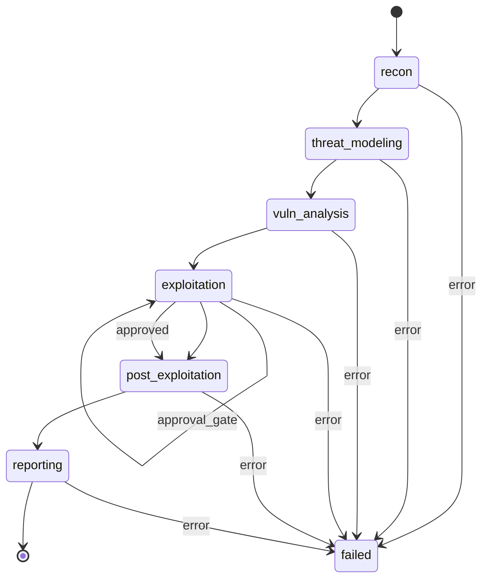

# ARGUS Scan State Machine

**Version:** 0.1  
**Phases:** 6 sequential phases  
**Source:** TZ.md, src/orchestration/state_machine.py, phases.py

---

## 1. Overview

Scan lifecycle реализован как state machine из 6 последовательных фаз:
1. **recon** — разведка
2. **threat_modeling** — моделирование угроз
3. **vuln_analysis** — анализ уязвимостей
4. **exploitation** — эксплуатация (с approval gates)
5. **post_exploitation** — пост-эксплуатация
6. **reporting** — формирование отчёта

---

## 2. Phase Diagram (Mermaid)



---

## 3. Phase Order

| Order | Phase | Progress % |
|-------|-------|------------|
| 0 | recon | ~17 |
| 1 | threat_modeling | ~33 |
| 2 | vuln_analysis | ~50 |
| 3 | exploitation | ~67 |
| 4 | post_exploitation | ~83 |
| 5 | reporting | 100 |

---

## 4. Phase Definitions

### 4.1 recon

**Input:** `target`, `options`  
**Output:** `assets`, `subdomains`, `ports`  
**DB:** `phase_inputs`, `phase_outputs`, `scan_timeline`, `assets`  
**Events:** `phase_start`, `progress`, `phase_complete`, `tool_run`  
**Failure:** Scan → `failed`, `scan_events` → `error`, re-raise

**Tools:** nmap, subfinder, nikto, nuclei (read-only); guardrails: IP/domain validation.

---

### 4.2 threat_modeling

**Input:** `assets` (from recon)  
**Output:** `threat_model` (dict)  
**DB:** `phase_inputs`, `phase_outputs`, `scan_timeline`  
**AI:** LLM prompt для threat model; strict JSON schema.  
**Failure:** Scan → `failed`, re-raise

---

### 4.3 vuln_analysis

**Input:** `threat_model`, `assets`  
**Output:** `findings` (list of dict)  
**DB:** `phase_inputs`, `phase_outputs`, `scan_timeline`  
**AI:** LLM prompt для анализа; strict JSON schema; retry/fixer prompt.  
**Failure:** Scan → `failed`, re-raise

---

### 4.4 exploitation

**Input:** `findings` (from vuln_analysis)  
**Output:** `exploits`, `evidence`  
**Sub-phases:** `exploit_attempt` → `exploit_verify`  
**Policy:** Approval gate для destructive/exploit actions.  
**DB:** `phase_inputs`, `phase_outputs`, `scan_timeline`, `tool_runs`, `evidence`  
**Failure:** Scan → `failed`, re-raise

**Approval gate:** Если policy требует approval — scan переходит в `awaiting_approval`; после approve — продолжение.

---

### 4.5 post_exploitation

**Input:** `exploits` (from exploitation)  
**Output:** `lateral`, `persistence`  
**DB:** `phase_inputs`, `phase_outputs`, `scan_timeline`  
**AI:** LLM prompt для post-exploit analysis.  
**Failure:** Scan → `failed`, re-raise

---

### 4.6 reporting

**Input:** `target`, `recon`, `threat_model`, `vuln_analysis`, `exploitation`, `post_exploitation`  
**Output:** `report` (dict: summary, findings, technologies, ai_insights)  
**DB:** `reports`, `findings`, `report_objects`, `phase_outputs`  
**Events:** `finding`, `complete`  
**Failure:** Scan → `failed`, re-raise

---

## 5. Transitions

| From | To | Condition |
|------|------|-----------|
| init | recon | Scan created |

| recon | threat_modeling | recon completed |
| threat_modeling | vuln_analysis | threat_modeling completed |
| vuln_analysis | exploitation | vuln_analysis completed |
| exploitation | post_exploitation | exploitation completed (or approval granted) |
| post_exploitation | reporting | post_exploitation completed |
| reporting | complete | reporting completed |

**Any phase** → **failed** | Exception raised

---

## 6. Failure Handling

| Event | Action |
|-------|--------|
| Phase exception | `scan_step.status = "failed"`; `scan_events` → `error`; `scan.status = "failed"`; `scan.phase = current_phase` |
| Re-raise | Celery task fails; retry policy (configurable) |
| User-facing | No stack trace; generic error; structured log only |

---

## 7. Policy / Approval Gates

| Gate | Phase | When | Behavior |
|------|-------|------|----------|
| **Exploit approval** | exploitation | Policy requires approval for destructive actions | Scan → `awaiting_approval`; admin must approve |
| **Scope check** | All phases | Target out of scope | Block phase; record event |
| **Rate limit** | All phases | Tenant usage exceeded | Block phase; return error |

**Policy config:** `policies` table; `policy_type = 'exploit_approval'`, `config = { "require_approval": true }`.

---

## 8. Events (SSE)

| Event | Payload | When |
|-------|---------|------|
| `phase_start` | phase, progress, message | Start of each phase |
| `progress` | phase, progress, message | Progress update |
| `tool_run` | phase, tool, data | Tool execution |
| `phase_complete` | phase, progress, data (output) | Phase finished |
| `finding` | severity, title, cwe, cvss | Finding added (reporting) |
| `complete` | phase=complete, progress=100 | Scan finished |
| `error` | phase, error, error message | Phase failed |

---

## 9. Text Diagram (Simplified)

```
[init] → recon → threat_modeling → vuln_analysis → exploitation → post_exploitation → reporting → [complete]
         │              │              │              │                    │              │
         └──────────────┴──────────────┴──────────────┴────────────────────┴──────────────┘
                                                    │
                                                    ▼
                                              [failed]
```

---

## 10. Related Documents

- [backend-architecture.md](./backend-architecture.md)
- [erd.md](./erd.md)
- [frontend-api-contract.md](./frontend-api-contract.md)
