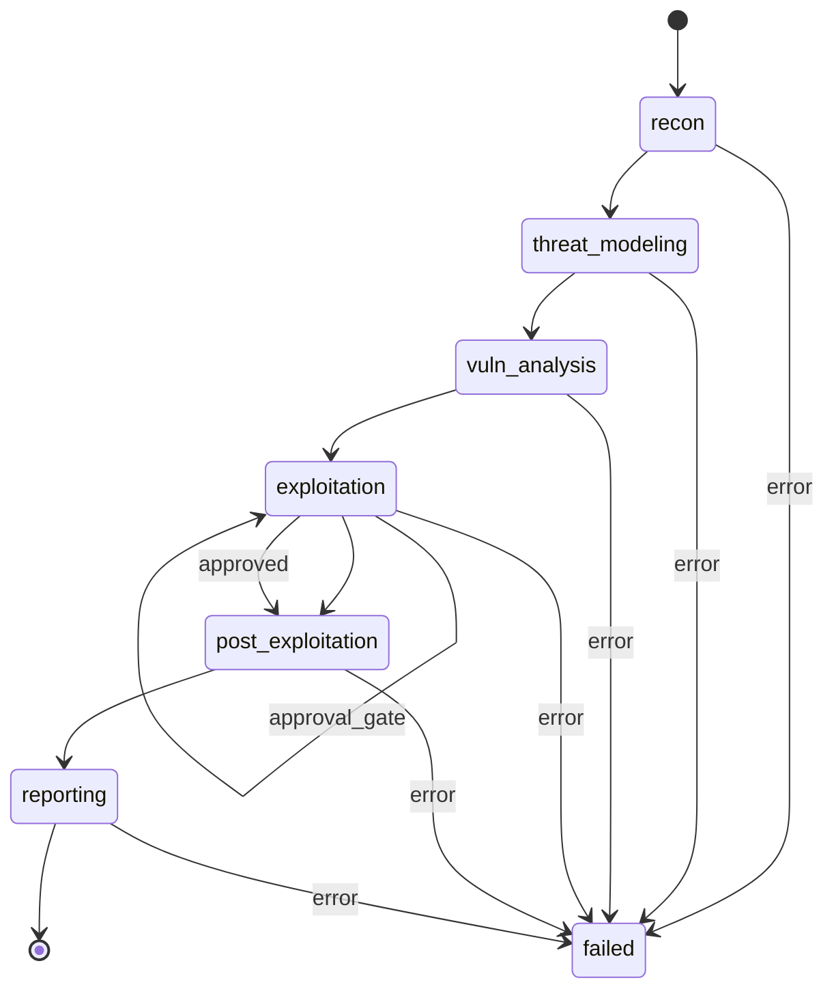

# ARGUS Scan State Machine

**Version:** 0.1  
**Phases:** 6 sequential phases  
**Source:** TZ.md, src/orchestration/state_machine.py, phases.py

---

## 1. Overview

Scan lifecycle реализован как state machine из 6 последовательных фаз:
1. **recon** — разведка
2. **threat_modeling** — моделирование угроз
3. **vuln_analysis** — анализ уязвимостей
4. **exploitation** — эксплуатация (с approval gates)
5. **post_exploitation** — пост-эксплуатация
6. **reporting** — формирование отчёта

---

## 2. Phase Diagram (Mermaid)



---

## 3. Phase Order

| Order | Phase | Progress % |
|-------|-------|------------|
| 0 | recon | ~17 |
| 1 | threat_modeling | ~33 |
| 2 | vuln_analysis | ~50 |
| 3 | exploitation | ~67 |
| 4 | post_exploitation | ~83 |
| 5 | reporting | 100 |

---

## 4. Phase Definitions

### 4.1 recon

**Input:** `target`, `options`  
**Output:** `assets`, `subdomains`, `ports`  
**DB:** `phase_inputs`, `phase_outputs`, `scan_timeline`, `assets`  
**Events:** `phase_start`, `progress`, `phase_complete`, `tool_run`  
**Failure:** Scan → `failed`, `scan_events` → `error`, re-raise

**Tools (baseline):** nmap, subfinder, nuclei и др.; guardrails: IP/domain validation. Ниже — расширения KAL (песочница + политики).

#### KAL-003 — многофазный цикл nmap (recon)

При **`SANDBOX_ENABLED=true`**, **`NMAP_RECON_CYCLE=true`** (по умолчанию) и разрешении KAL-политики категории `network_scanning` для базового argv выполняется **`run_nmap_recon_for_recon`** (`src/recon/nmap_recon_cycle.py`) вместо одного «legacy»-запуска `nmap -sV -sC` на хосте API.

| Фаза (имя в structured) | Условие | Суть |
|-------------------------|---------|------|
| `discover_sn` | цель похожа на CIDR | `nmap -sn` (обнаружение хостов) |
| `tcp_top1000` | всегда в цикле | SYN, top 1000 TCP, `-oX -` |
| `tcp_full_sv_os` | `NMAP_FULL_TCP=true` или `scan.options.nmap_full_tcp` | `-p- -sV -O` (долго, тяжёлая фаза) |
| `udp_top50` | `NMAP_UDP_TOP50=true` или `scan.options.nmap_udp_top50` | UDP top 50 портов |
| `nse_default_safe` | есть открытые TCP (до 256 портов) | `-sV --script "default and safe"` на собранных портах |

Таймаут фазы: **`NMAP_RECON_PHASE_TIMEOUT_SEC`** (см. [deployment.md](./deployment.md)). При отказе политики по baseline-argv цикл откатывается к legacy-режиму. Артефакты: `nmap_<phase>_stdout` (XML), stderr, JSON `nmap_recon_structured` в raw recon.

#### KAL-005 — DNS recon в sandbox

Опционально при **`recon_dns_enumeration_opt_in`** в `scan.options` / вложенном `kal` (см. `scan_kal_flags`): **dnsrecon** (`-t std`), **fierce**, **amass enum -passive** для одного apex-домена (`src/recon/recon_dns_sandbox.py`). Лимиты: **`KAL_RECON_DNS_MAX_DOMAINS`**, **`KAL_RECON_DNS_MAX_LINES`**. Вывод нормализуется в intel поддоменов.

#### KAL-004 / KAL-005 — VA: whatweb, nikto, testssl, feroxbuster

В **`run_va_active_scan_phase`** (фаза **vuln_analysis**, не отдельный шаг state machine) при политике VA могут выполняться:

| Инструмент | Назначение | Таймауты (env) |
|------------|------------|----------------|
| **whatweb** | отпечаток веб-стека (KAL-004) | `VA_WHATWEB_TIMEOUT_SEC` |
| **nikto** | сканер веб-уязвимостей (KAL-004) | `VA_NIKTO_TIMEOUT_SEC` |
| **feroxbuster** | content discovery (KAL-005) | `VA_FEROX_TIME_LIMIT_SEC`, `VA_FEROX_WORDLIST_MAX_LINES` |
| **testssl.sh** | проверка TLS (KAL-004; fallback **sslscan**) | `VA_SSL_PROBE_TIMEOUT_SEC` |

Подробнее сетка VA — § 4.3a ниже.

#### KAL-006 — searchsploit, Trivy, HIBP (флаги backend)

| Переменная | По умолчанию | Назначение |
|------------|--------------|------------|
| `SEARCHSPLOIT_ENABLED` | `true` | Связка версий сервисов из recon с **searchsploit** (ограниченное число запросов) |
| `SEARCHSPLOIT_MAX_QUERIES` | `8` | Верхняя граница запросов за прогон |
| `TRIVY_ENABLED` | `false` | Опциональный **trivy** fs-scan при наличии собранных manifest'ов (requirements.txt / package.json и т.п.) |
| `HIBP_PASSWORD_CHECK_OPT_IN` | `false` | Только отчётность: k-anonymity **Pwned Passwords** (HIBP); пароли в логи не писать |

#### KAL MCP / HTTP API

Категорийные обёртки и **`POST /api/v1/tools/kal/run`** описаны в **[mcp-server.md](./mcp-server.md)** (инструменты `run_network_scan`, `run_web_scan`, `run_ssl_test`, `run_dns_enum`, `run_bruteforce`, `run_tool`).

**Raw Artifacts:** Phase persists raw artifacts to MinIO via `upload_raw_artifact` (handler in `state_machine/handlers`):
- Path: `{tenant_id}/{scan_id}/recon/raw/`
- Artifacts: tool logs, stdout/stderr, raw output files (e.g. nmap XML, nuclei JSON)

---

### 4.2 threat_modeling

**Input:** `assets` (from recon)  
**Output:** `threat_model` (dict)  
**DB:** `phase_inputs`, `phase_outputs`, `scan_timeline`  
**AI:** LLM prompt для threat model; strict JSON schema.  
**Failure:** Scan → `failed`, re-raise

**Raw Artifacts:** Phase persists raw artifacts to MinIO via pipeline execution:
- Path: `{tenant_id}/{scan_id}/threat_modeling/raw/`
- Artifacts: threat model JSON, LLM responses, intermediate analysis files

---

### 4.3 vuln_analysis

**Input:** `threat_model`, `assets`  
**Output:** `findings` (list of dict)  
**DB:** `phase_inputs`, `phase_outputs`, `scan_timeline`  
**AI:** LLM prompt для анализа; strict JSON schema; retry/fixer prompt.  
**Failure:** Scan → `failed`, re-raise

**Raw Artifacts:** Phase persists raw artifacts to MinIO via pipeline execution:
- Path: `{tenant_id}/{scan_id}/vuln_analysis/raw/`
- Artifacts: vulnerability scan outputs, evidence bundles, contradiction analysis, finding confirmation matrices

#### 4.3a — Active Web Scanning (OWASP)

> **State Machine Bridge** (WEB-001, 2026-03-24): state machine вызывает только `run_vuln_analysis()` (импорт из `src.orchestration.handlers`). **Active scan не вызывается из `state_machine.py` напрямую:** при `SANDBOX_ENABLED=true` внутри `run_vuln_analysis` выполняется полный pipeline `run_va_active_scan_phase`. При `SANDBOX_ENABLED=false` остаётся LLM-only VA. Ранее active-scan был доступен в основном из recon engagement flow.
>
> **Порядок выполнения в state machine vuln_analysis:**
> 1. Извлечение URL-параметров и HTML-форм из target URL (`_extract_url_params_and_forms`)
> 2. Построение `VulnerabilityAnalysisInputBundle` с `params_inventory` и `forms_inventory`
> 3. Запуск `run_va_active_scan_phase` (dalfox, xsstrike, ffuf, nuclei, gobuster, wfuzz, commix)
> 3b. Нормализация intel (`finding_normalizer`); при `VA_CUSTOM_XSS_POC_ENABLED=true` — доп. reflected XSS probe (`run_custom_xss_poc`, httpx на worker, payloads из `backend/data/payloads/`)
> 4. Запуск OWASP-эвристик (SSRF, CSRF, IDOR, open redirect) — `run_web_vuln_heuristics`
> 5. Нормализация находок, назначение CVSS, генерация PoC
> 5b. **PoC enrichment (additive):** адаптеры active scan заполняют опциональное поле `proof_of_concept` в intel (`poc_schema.build_proof_of_concept`: tool, payload, request/response с усечением `response` (1024) и `response_snippet` (500), curl, `javascript_code`, опционально `screenshot_key`). Dalfox: JSON + fallback stderr; Nuclei: `request`/`response` из JSONL при наличии; sqlmap/ffuf: эвристики stdout + curl из argv/FUZZ-URL; gobuster/wfuzz/commix/xsstrike — см. соответствующие `*_va_adapter`. При `VA_POC_PLAYWRIGHT_SCREENSHOT_ENABLED=true` (и не отключено `VA_POC_PLAYWRIGHT_SCREENSHOT`) — см. `poc_visual_enrichment.py` (Playwright PNG в MinIO + `response_snippet` вокруг payload).
> 6. Передача контекста в LLM для финального анализа
> 7. Мердж и дедупликация всех findings
> 8. Пост-обработка CVSS (floor для XSS >= 7.0, SQLi >= 8.0)
>
> **Fallback:** Если `SANDBOX_ENABLED=false`, выполняется только LLM-анализ (прежнее поведение).
>
> **Сеть Docker:** активное сканирование требует **`SANDBOX_ENABLED=true`**; процессы **backend** и **celery-worker** должны быть в **той же Docker-сети**, что и сервис **sandbox**, чтобы вызовы инструментов доходили до контейнера песочницы (типовой случай — `docker compose --profile tools up` из `infra/` без изоляции сервисов по кастомным сетям).
>
> **VA_AI_PLAN_ENABLED** (`va_ai_plan_enabled`, env `VA_AI_PLAN_ENABLED`): при `true` и наличии LLM-ключей после детерминированного плана вызывается `plan_active_scan_with_ai` — дополнительные шаги `{tool, args}` мержатся в active-scan plan (см. `active_scan_planner.py`, промпты `ACTIVE_SCAN_PLANNING_*` в [prompt-registry.md](./prompt-registry.md)).

#### OWASP Top 10:2025 Detection

- **Базовые эвристики (код):** `src/recon/vulnerability_analysis/owasp_category_map.py` — `resolve_owasp_category(cwe=..., finding_type_key=..., source_tool=...)`. Порядок: (1) номер CWE из строки `CWE-…` по карте `_CWE_TO_OWASP` → `A01`…`A10`; (2) если CWE не сопоставлен — подстроки в объединённом тексте типа/template (`_TYPE_HINTS_ORDERED`, например `xss` → `A05`, `csrf` → `A01`); (3) нормализованный `source_tool` (`_TOOL_EXACT` / `_SOURCE_TOOL_HINTS_ORDERED`, например `sqlmap` → `A05`). Неизвестные входы → `None` (колонка может остаться пустой).
- **Фаза VA:** при нормализации intel (`finding_normalizer`) для vulnerability-shaped записей вызывается `apply_owasp_category_to_intel_row`: если в строке уже задано валидное `owasp_category` (`parse_owasp_category`), оно не перезаписывается; иначе категория выводится из `data.cwe` / `data.type` / `template_id` и `source_tool`. В orchestration (`handlers`) перед персистом finding поле при необходимости уточняется тем же резолвером.
- **Персистентность:** `findings.owasp_category` (nullable, `A01`…`A10`), CHECK через `findings_owasp_category_check_sql()` в `src/owasp_top10_2025.py`. HTML-отчёты Asgard/Valhalla включают сводную таблицу соответствия OWASP Top 10:2025 по этим кодам.

#### Aggressive scan options

| Env / setting | Default | Назначение |
|---------------|---------|------------|
| `VA_AGGRESSIVE_SCAN` / `va_aggressive_scan` | `false` | Подмешивает `aggressive_args` из `backend/data/tool_configs.json` в argv dalfox, ffuf, xsstrike, sqlmap, nuclei (дедуп флагов). В **backend**-образе wordlists: `/app/data/payloads/`; в **sandbox**: `/opt/argus-payloads/` (см. `sandbox/Dockerfile`). Для более «шумного» XSS/SQLi в проде выставить `true`. |
| `VA_CUSTOM_XSS_POC_ENABLED` / `va_custom_xss_poc_enabled` | `true` | После active scan — reflected XSS check через httpx по curated payloads (`xss_custom.txt` / `xss_payloads.txt`). |

**Script-context XSS (custom PoC):** `run_custom_xss_poc` всегда перебирает короткие встроенные payloads (`alert(1)`, `</script><script>…`, breakout из строки в JS). Эвристика помечает отражение внутри/рядом с `<script>` как **high / CVSS 7.2** (CWE-79) и добавляет `poc_curl` с `shlex.quote`. При `VA_AGGRESSIVE_SCAN=true` поднимается лимит комбинаций param×payload (до 80) и подмешиваются оба файла `xss_custom.txt` + `xss_payloads.txt`. Находки из stderr Dalfox («Reflected» без JSON) и custom PoC с тем же host+path+param нормализуются в одну **подтверждённую** XSS (см. `finding_normalizer._merge_dalfox_hypothesis_with_custom_xss`).

**Запуск активного сканирования вебприложений с инструментами, ориентированными на OWASP Top 10:**

| Инструмент | Целевые уязвимости | Статус | Примечания |
|-----------|-------------------|--------|-----------|
| **dalfox** | XSS (reflected, stored, DOM-based), filter evasion | Доступен | WAF bypass detection, payload template library |
| **ffuf** | Directory traversal, hidden paths, parameter fuzzing | Доступен | Concurrent requests (customizable rate limiting) |
| **sqlmap** | SQL Injection (SQLi), database fingerprinting | Policy-gated | Requires approval gate (см. § 7 Policy); destructive operations disabled by default |
| **xsstrike** | XSS (advanced), context-aware payload generation | Доступен | Leverages DOM context analysis, bypass techniques |
| **nuclei** | Template-based VA (OWASP coverage, CWE mapping) | Read-only | Passive detection phase completion; integration in recon + vuln_analysis |
| **gobuster** | DNS enumeration, virtual host discovery | Доступен | Recon companion (phase 1); filtered for active scan scope |
| **feroxbuster** | Content discovery, recursive crawl | Доступен | Лимиты времени/словаря через `VA_FEROX_*` (KAL-005) |
| **whatweb** | Fingerprint CMS/стек | Доступен | `VA_WHATWEB_TIMEOUT_SEC` (KAL-004) |
| **nikto** | Веб-сканер известных проблем | Доступен | `VA_NIKTO_TIMEOUT_SEC` (KAL-004) |
| **testssl.sh** | TLS/SSL оценка | Доступен | Fallback **sslscan**; `VA_SSL_PROBE_TIMEOUT_SEC` (KAL-004) |

**Policy Integration** (`§ 7 Policy / Approval Gates`):
- **sqlmap** запуски требуют одобрения при `policy.exploit_approval = true` (destructive database queries)
- **dalfox**, **ffuf**, **xsstrike**, **nuclei** — автоматические (без approval) в пределах scope
- **Scope validation:** Target должен быть в разрешённом scope; out-of-scope запросы блокируются перед запуском

**Sandbox & Compliance**:
- **MCP allowlist** (см. `src/recon/mcp/policy.py`): `web_vulnerability_scanning`, `xss_testing`, `sql_injection_testing`, `directory_discovery`
- **Rate limiting:** Настраивается на уровне tenant через `policies.config` (default: 10 req/sec)
- **Log redaction:** Credentials, cookies, sensitive headers исключаются из raw artifacts
- **Evidence collection:** Payloads, responses, PoC сохраняются в `finding_confirmation_matrix.csv` для последующей валидации
- **Sandbox reference:** [deployment.md](./deployment.md#sandbox-environment) — контейнеризованное окружение с network isolation

**Raw Artifacts** (подфаза active_web_scan):
- `web_scan_requests.json` — dalfox/ffuf/nuclei запросы (без credentials)
- `web_scan_responses.json` — responses (без sensitive data)
- `xss_payloads.json` — xsstrike payload templates и результаты
- `sqlmap_output.json` — (policy-gated) SQLi findings; пустой если approval denied
- `web_findings.csv` — vulnerability summary (type, endpoint, severity, PoC link)

**Related Documentation**:
- [Policy gates](./deployment.md#policies-and-approval) — exploit approval workflow
- [Sandbox](./deployment.md#sandbox-environment) — isolated environment controls
- OWASP Top 10:2025 mapping в продукте: XSS/Injection → `A05`, path traversal / IDOR / CSRF → преимущественно `A01` (см. `owasp_category_map.py`)

---

### 4.4 exploitation

**Input:** `findings` (from vuln_analysis)  
**Output:** `exploits`, `evidence`  
**Sub-phases:** `exploit_attempt` → `exploit_verify`  
**Policy:** Approval gate для destructive/exploit actions.  
**DB:** `phase_inputs`, `phase_outputs`, `scan_timeline`, `tool_runs`, `evidence`  
**Failure:** Scan → `failed`, re-raise

**Approval gate:** Если policy требует approval — scan переходит в `awaiting_approval`; после approve — продолжение.

#### VA-007 — агрессивные VA-инструменты (Celery) в фазе exploitation

После прохождения approval gate и **до** `exploit_attempt` вызывается `maybe_run_aggressive_exploit_tools(findings, tenant_id, scan_id, target, scan_approval_flags=…)` (`src/orchestration/aggressive_exploit_tools.py`):

| Условие | Поведение |
|---------|-----------|
| `VA_EXPLOIT_AGGRESSIVE_ENABLED=false` (default) | No-op, обратная совместимость |
| `VA_EXPLOIT_AGGRESSIVE_ENABLED=true` | При эвристике SQLi в findings проверяется `evaluate_tool_approval_policy("sqlmap", scan_approval_flags=…)` |
| `scan.options["scan_approval_flags"]` | Словарь `{"sqlmap": true, ...}` — как в WEB-006; если ключа нет при переданном dict, sqlmap для destructive-ветки блокируется |
| `SQLMAP_VA_ENABLED=true` | Иначе задача не ставится в очередь (Celery task вернёт `sqlmap_va_disabled`) |
| Успех | `run_sqlmap.delay(tenant_id, scan_id, target, None)` — очередь `argus.va.run_sqlmap`, артефакты в `vuln_analysis/raw/` |

**Логи:** структурированные события `va_aggressive_exploit_*` без утечки тел запросов.

**Raw Artifacts:** Phase persists raw artifacts to MinIO via pipeline execution:
- Path: `{tenant_id}/{scan_id}/exploitation/raw/`
- Artifacts: exploit attempts, proof-of-concept evidence, tool outputs, post-exploit logs

---

### 4.5 post_exploitation

**Input:** `exploits` (from exploitation)  
**Output:** `lateral`, `persistence`  
**DB:** `phase_inputs`, `phase_outputs`, `scan_timeline`  
**AI:** LLM prompt для post-exploit analysis.  
**Failure:** Scan → `failed`, re-raise

**Raw Artifacts:** Phase persists raw artifacts to MinIO via handler (in `state_machine/handlers`):
- Path: `{tenant_id}/{scan_id}/post_exploitation/raw/`
- Artifacts: lateral movement evidence, persistence mechanisms, session data, reconnaissance within compromised systems

---

### 4.6 reporting

**Input:** `target`, `recon`, `threat_model`, `vuln_analysis`, `exploitation`, `post_exploitation`  
**Output:** `report` (dict: summary, findings, technologies, ai_insights)  
**DB:** `reports`, `findings`, `report_objects`, `phase_outputs`  
**Events:** `finding`, `complete`  
**Failure:** Scan → `failed`, re-raise

---

## 5. Transitions

| From | To | Condition |
|------|------|-----------|
| init | recon | Scan created |

| recon | threat_modeling | recon completed |
| threat_modeling | vuln_analysis | threat_modeling completed |
| vuln_analysis | exploitation | vuln_analysis completed |
| exploitation | post_exploitation | exploitation completed (or approval granted) |
| post_exploitation | reporting | post_exploitation completed |
| reporting | complete | reporting completed |

**Any phase** → **failed** | Exception raised

---

## 6. Failure Handling

| Event | Action |
|-------|--------|
| Phase exception | `scan_step.status = "failed"`; `scan_events` → `error`; `scan.status = "failed"`; `scan.phase = current_phase` |
| Re-raise | Celery task fails; retry policy (configurable) |
| User-facing | No stack trace; generic error; structured log only |

---

## 7. Policy / Approval Gates

| Gate | Phase | When | Behavior |
|------|-------|------|----------|
| **Exploit approval** | exploitation | Policy requires approval for destructive actions | Scan → `awaiting_approval`; admin must approve |
| **Scope check** | All phases | Target out of scope | Block phase; record event |
| **Rate limit** | All phases | Tenant usage exceeded | Block phase; return error |

**Policy config:** `policies` table; `policy_type = 'exploit_approval'`, `config = { "require_approval": true }`.

---

## 8. Events (SSE)

| Event | Payload | When |
|-------|---------|------|
| `phase_start` | phase, progress, message | Start of each phase |
| `progress` | phase, progress, message | Progress update |
| `tool_run` | phase, tool, data | Tool execution |
| `phase_complete` | phase, progress, data (output) | Phase finished |
| `finding` | severity, title, cwe, cvss | Finding added (reporting) |
| `complete` | phase=complete, progress=100 | Scan finished |
| `error` | phase, error, error message | Phase failed |

---

## 9. Text Diagram (Simplified)

```
[init] → recon → threat_modeling → vuln_analysis → exploitation → post_exploitation → reporting → [complete]
         │              │              │              │                    │              │
         └──────────────┴──────────────┴──────────────┴────────────────────┴──────────────┘
                                                    │
                                                    ▼
                                              [failed]
```

---

## 10. Raw Artifact Storage (MinIO)

All phases persist raw outputs to MinIO for audit trail, evidence preservation, and API access:

| Phase | MinIO Path | Handler/Pipeline | Artifacts |
|-------|-----------|-----------------|-----------|
| **recon** | `{tenant_id}/{scan_id}/recon/raw/` | `state_machine/handlers` | Tool logs, nmap XML, nuclei JSON, subdomain lists |
| **threat_modeling** | `{tenant_id}/{scan_id}/threat_modeling/raw/` | `pipelines/threat_modeling` | Threat model JSON, LLM responses, analysis files |
| **vuln_analysis** | `{tenant_id}/{scan_id}/vuln_analysis/raw/` | `pipelines/vulnerability_analysis` | Evidence bundles, contradiction analysis, confirmation matrices |
| **exploitation** | `{tenant_id}/{scan_id}/exploitation/raw/` | `pipelines/exploitation` | Exploit attempts, PoC evidence, tool outputs, logs |
| **post_exploitation** | `{tenant_id}/{scan_id}/post_exploitation/raw/` | `state_machine/handlers` | Lateral movement, persistence mechanisms, session data |

**API Access:** `GET /api/v1/scans/{id}/artifacts?phase={phase}&raw=true&presigned={bool}` — Returns presigned URLs or raw artifact metadata (see [reporting.md](./reporting.md#artifacts-in-html-reports)).

---

## 11. Related Documents

- [backend-architecture.md](./backend-architecture.md)
- [erd.md](./erd.md)
- [frontend-api-contract.md](./frontend-api-contract.md)
- [mcp-server.md](./mcp-server.md) — MCP KAL tools и `POST /api/v1/tools/kal/run`
